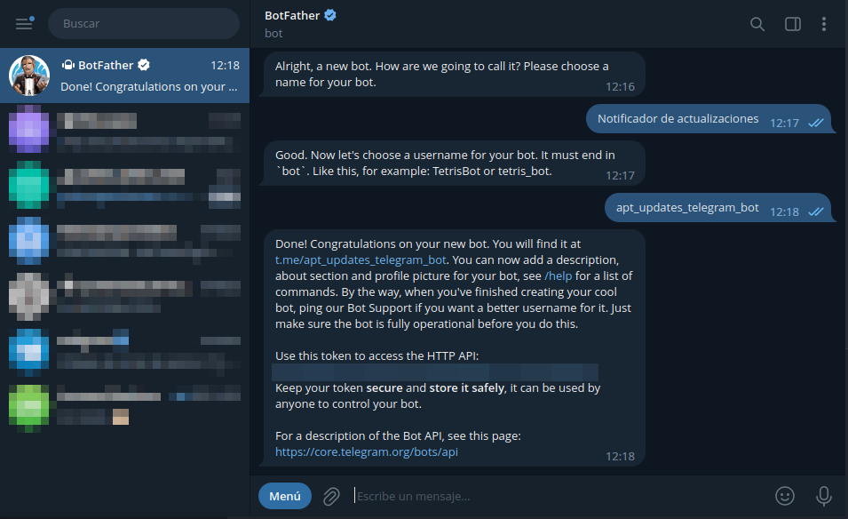
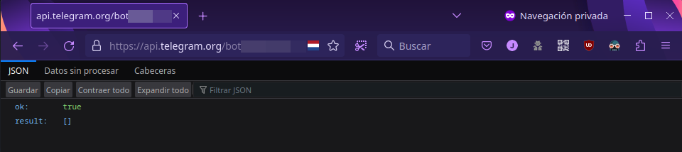
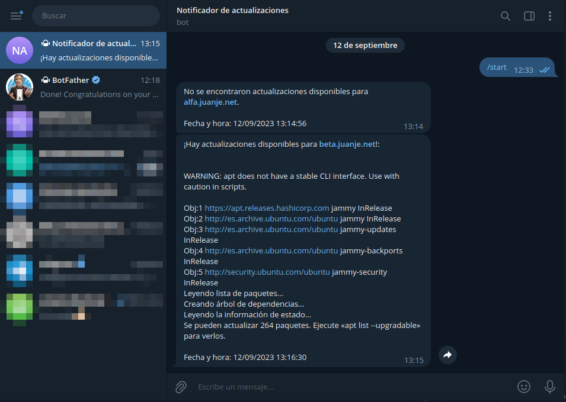

Today I am going to show you a very convenient and effective way to stay informed about pending updates on our servers.

We will be using a bash script along with a Telegram bot to receive the notifications.

The procedure is compatible with any distribution that uses `apt` as a package manager.

<!--more-->

> **⚠️ DISCLAIMER: Please note that this article is a manual translation of the Spanish version. The screenshots may have been originally taken in Spanish, and some words/names may not match completely. If you find any errors, please [report them to the author](#profile). ⚠️**

## **Requirements**

- A Telegram account. Otherwise, you will need to create one (phone number required).
- `apt` as the package manager on your system. If you use a different package manager, you'll have to adapt this script.
- `curl` installed.
- Being able to run commands as `root` (either as the `root` user directly, or with `sudo` or `doas`). I'll do it as `root` (through `su -`).

## **Creating the bot and obtaining its token**

Steps:

1. **Start a chat with BotFather:** [@BotFather](https://t.me/botfather) is an official Telegram bot that will help you create and manage your own bot. You can find it on Telegram using the search box:

    

> **We must not get confused and open the wrong one. The official one is the only one with the [@BotFather](https://t.me/botfather) alias, in addition to the verified account badge.**

2. **Create a new bot:** In the chat with BotFather, type `START` and then send the command `/newbot` to start the creation process. Follow BotFather's instructions.

    

    

3. **Assign a name and an alias (@) to your bot:** After creating the bot, BotFather will ask you to choose a name and alias for your bot. The alias must end in "bot".

    

4. **Save the token:** As we can see in the above screenshot, once the creation process is completed, BotFather will provide you with a *unique* access token for your bot. Be sure to copy this token and keep it in a safe place for two reasons: you will need it for the script to interact with the Telegram API, and anyone with the token will be able to send messages from your bot.

Ready! We now have our Telegram bot set up.

## **Obtaining the chat ID**

The last thing we need to be able to run the script is our chat ID (or the ID from the chat where we want the bot to send the messages).

To achieve it:

1. Open the following URL in a browser, replacing `<BOT_TOKEN>` with the token provided earlier by [@BotFather](https://t.me/botfather):

    ```
    https://api.telegram.org/bot<BOT_TOKEN>/getUpdates?offset=0
    ```

    

2. Start a fresh chat with your newly created bot. The link to its chat is in the same message where [@BotFather](https://t.me/botfather) sent us the token:

    

3. Reload the website opened in step 1:

    

4. After reloading the website, you can copy the bot's chat ID and write it down for use in the script.

## **Script configuration and usage**

The script we are going to use is available in my GitHub repository: [JuanJesusAlejoSillero/apt-updates-telegram](https://github.com/JuanJesusAlejoSillero/apt-updates-telegram)

To set it up, follow these steps:

1. Login as `root` and clone the repository:

    ```bash
    su -

    git clone https://github.com/JuanJesusAlejoSillero/apt-updates-telegram.git
    ```

2. Edit the file `apt-updates-telegram.sh` and replace the following variables with your values::

    - BOT_TOKEN: The token for your telegram bot.
    - CHAT_ID: The ID of the chat where you want to receive the notifications.

    ```bash
    nano -cl apt-updates-telegram/apt-updates-telegram.sh
    ```

3. Make the script executable:

    ```bash
    chmod +x apt-updates-telegram/apt-updates-telegram.sh
    ```

4. Test it by running it manually:

    ```bash
    ./apt-updates-telegram/apt-updates-telegram.sh
    ```

After running it, you will get a message informing you of the updates available, or failing that, the lack of updates:



> **⭐️ If you found the script useful, please consider starring the [GitHub repository](https://github.com/JuanJesusAlejoSillero/apt-updates-telegram) and/or sharing it so that more people can benefit from it: ⭐️**
>
> 

## **Schedule the execution of the script**

With the script up and running, we will proceed to create a *systemd timer* that will take care of running it periodically. I will configure it to run every 8 hours, for more information: [systemd.time(7) — Arch manual pages](https://man.archlinux.org/man/systemd.time.7)

1. Log in as `root` if you are not already, and create the *unit* file for `systemd`:

    ```bash
    su -

    nano -cl /etc/systemd/system/apt-updates-telegram.service
    ```

2. Populate it with the following configuration, assuming the path to the script is `/root/apt-updates-telegram/apt-updates-telegram.sh`:

    ```systemd.unit
    [Unit]
    Description=Run the apt-updates-telegram.sh script

    [Service]
    Type=simple
    ExecStart=/root/apt-updates-telegram/apt-updates-telegram.sh
    Restart=on-failure

    [Install]
    WantedBy=multi-user.target
    ```

3. Create el *timer*:

    ```bash
    nano -cl /etc/systemd/system/apt-updates-telegram.timer
    ```

    Content:

    ```systemd.timer
    [Unit]
    Description=Run apt-updates-telegram.service every 8 hours.

    [Timer]
    OnCalendar=00/8:00
    Unit=apt-updates-telegram.service

    [Install]
    WantedBy=timers.target
    ```

4. Reload the systemd *daemons*:

    ```bash
    systemctl daemon-reload
    ```

5. Enable and run the *timer*:

    ```bash
    systemctl enable --now apt-updates-telegram.timer
    ```

6. We can test the correct execution of both with:

    ```bash
    systemctl status apt-updates-telegram.service

    systemctl status apt-updates-telegram.timer
    ```

    

## **Conclusion**

I hope this post is as useful as it has been for me.

In the future, I will continue to improve the script. If you believe you can help me improve it or include a feature you would like it to have, send me a *pull request* or contact me through my social networks or email.

Hub with my social networks and email: [https://hub.juanje.net](https://hub.juanje.net)

---

✒️ **Documentation written by Juan Jesús Alejo Sillero.**
