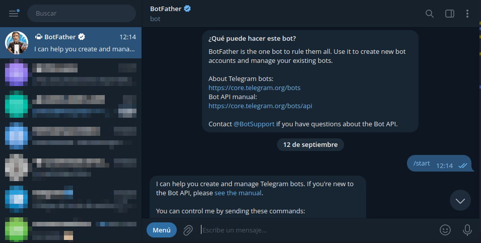
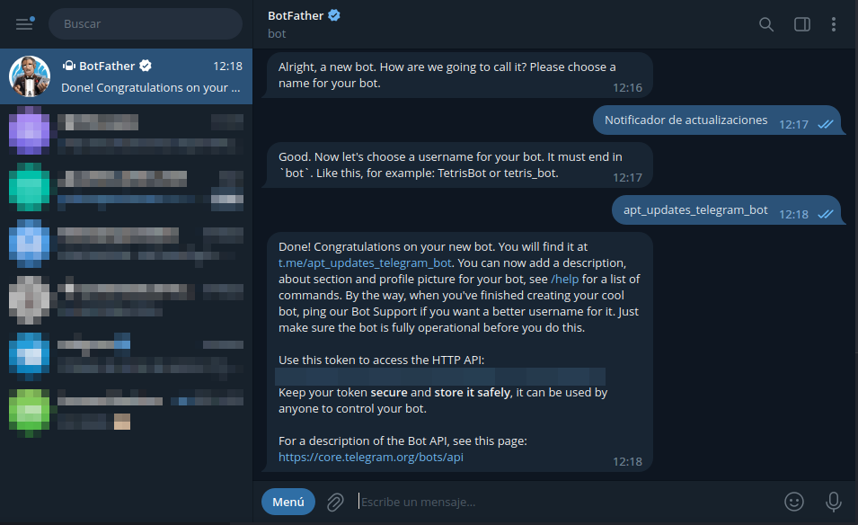
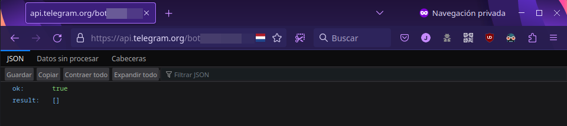
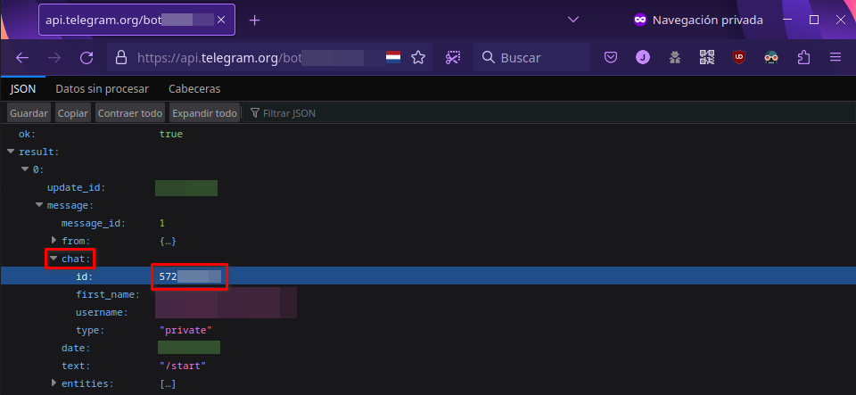
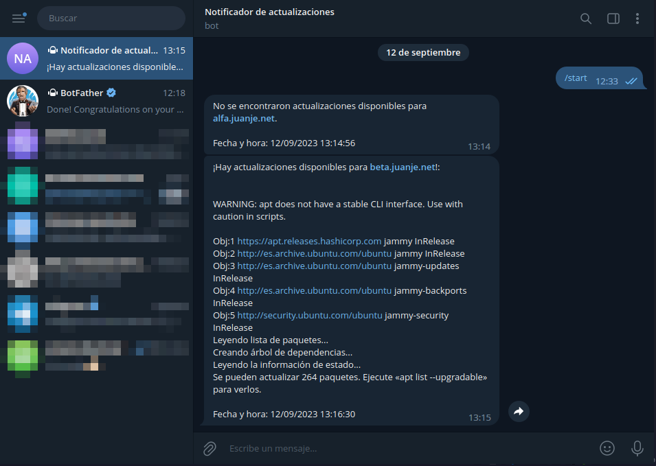
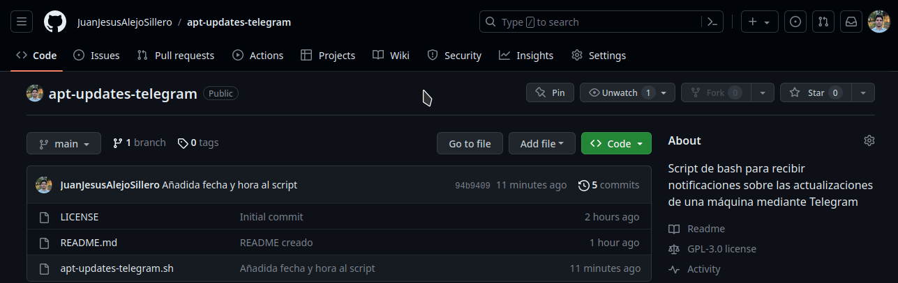
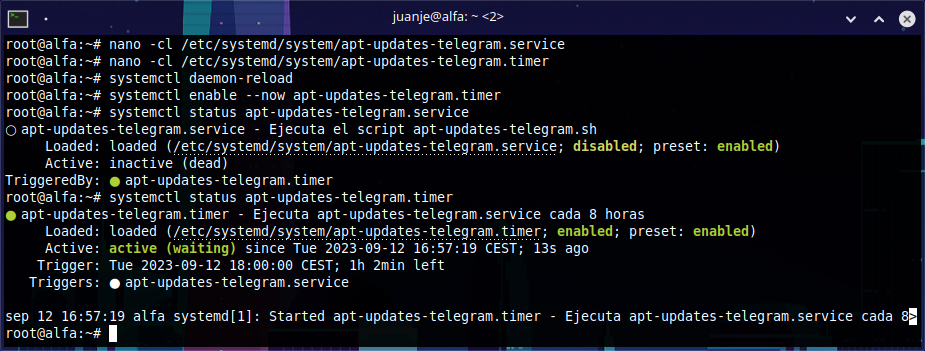

Hoy os voy a mostrar una forma muy cómoda y efectiva de mantenernos informados sobre las actualizaciones pendientes en nuestros servidores.

Utilizaremos un script de bash junto con un bot de Telegram para recibir las notificaciones.

El procedimiento es compatible con cualquier distribución que utilice `apt` como gestor de paquetes.

<!--more-->

## **Requisitos**

- Una cuenta de Telegram. De lo contrario, tendremos que crearla (es necesario número de teléfono).
- `apt` como gestor de paquetes en tu sistema. Si utilizas un gestor diferente, deberás adaptar este script.
- `curl` instalado.
- Poder ejecutar comandos como `root` (ya sea como usuario `root` directamente, o con `sudo` o `doas`). En mi caso lo haré como `root` (usando `su -`).

## **Creación del bot y obtención del token**

Procedimiento a seguir:

1. **Inicia un chat con BotFather:** [@BotFather](https://t.me/botfather) es un bot oficial de Telegram que te ayudará a crear y gestionar el tuyo. Puedes encontrarlo en Telegram utilizando el campo de búsqueda:

    

> **No debemos confundirnos y abrir el equivocado. El oficial es el único con el alias [@BotFather](https://t.me/botfather), además del sello de cuenta verificada.**

2. **Crea un nuevo bot:** En el chat con BotFather, toca `INICIAR` y luego envía el comando `/newbot` para iniciar el proceso de creación. Sigue las instrucciones de BotFather.

    

    

3. **Asigna un nombre y un alias (@) a tu bot:** Después de crear el bot, BotFather te pedirá que elijas un nombre y alias para tu bot. El alias debe terminar en "bot".

    

4. **Guarda el token:** Como podemos ver en la captura superior, una vez completado el proceso de creación, BotFather te proporcionará un token de acceso *único* para tu bot. Asegúrate de copiar este token y mantenerlo en un lugar seguro, por dos razones, porque lo necesitarás para que el script pueda interactuar con la API de Telegram y porque cualquiera que tenga el token podrá enviar mensajes desde tu bot.

¡Listo! Ya tenemos nuestro bot de Telegram disponible.

## **Obtención del ID de chat**

Lo último que necesitaremos para poder ejecutar el script será el ID de nuestro chat (o del chat donde queramos que el bot nos envíe los mensajes).

Para conseguirlo:

1. Abrimos en un navegador la siguiente URL, sustituyendo `<BOT_TOKEN>` por el token que nos dió antes [@BotFather](https://t.me/botfather):

    ```
    https://api.telegram.org/bot<BOT_TOKEN>/getUpdates?offset=0
    ```

    

2. Abrimos un chat nuevo con nuestro bot recién creado. Tenemos el enlace directo a su chat en el mismo mensaje donde [@BotFather](https://t.me/botfather) nos dio el token:

    

3. Refrescamos la página que abrimos en el paso 1 en nuestro navegador:

    

4. Tras refrescar la página podremos copiar el ID de nuestro chat con el bot y anotarlo para usarlo en el script.

## **Configuración y uso del script**

El script que utilizaremos está disponible en mi repositorio de GitHub: [JuanJesusAlejoSillero/apt-updates-telegram](https://github.com/JuanJesusAlejoSillero/apt-updates-telegram)

Sigue estos pasos para configurar el script:

1. Accede como `root` y clona este repositorio en tu sistema:

    ```bash
    su -

    git clone https://github.com/JuanJesusAlejoSillero/apt-updates-telegram.git
    ```

2. Edita el archivo `apt-updates-telegram.sh` y modifica las siguientes variables con tus valores:

    - BOT_TOKEN: El token de tu bot de Telegram.
    - CHAT_ID: El ID del chat donde deseas recibir las notificaciones.

    ```bash
    nano -cl apt-updates-telegram/apt-updates-telegram.sh
    ```

3. Dale permisos de ejecución al script:

    ```bash
    chmod +x apt-updates-telegram/apt-updates-telegram.sh
    ```

4. Prueba su funcionamiento ejecutándolo manualmente:

    ```bash
    ./apt-updates-telegram/apt-updates-telegram.sh
    ```

Tras la ejecución recibirás un mensaje informándote de las actualizaciones disponibles, o, en su defecto, de la ausencia de estas:



> **⭐️ Por favor, si te ha sido útil el script considera darle una estrella al [repositorio de GitHub](https://github.com/JuanJesusAlejoSillero/apt-updates-telegram) y/o compartirlo para que llegue a más gente: ⭐️**
>
> 

## **Programar la ejecución del script**

Con el script operativo, procederemos a crear un *timer de systemd* que se ocupe de ejecutarlo de forma periódica. Yo lo configuraré para que sea cada 8 horas concretamente, para más información: [systemd.time(7) — Arch manual pages](https://man.archlinux.org/man/systemd.time.7)

1. Accedemos como `root` si no lo somos y creamos el fichero de *unidad* para `systemd`:

    ```bash
    su -

    nano -cl /etc/systemd/system/apt-updates-telegram.service
    ```

2. Lo rellenamos con la siguiente configuración, asumiendo que la ruta al script es `/root/apt-updates-telegram/apt-updates-telegram.sh`:

    ```systemd.unit
    [Unit]
    Description=Ejecuta el script apt-updates-telegram.sh

    [Service]
    Type=simple
    ExecStart=/root/apt-updates-telegram/apt-updates-telegram.sh
    Restart=on-failure

    [Install]
    WantedBy=multi-user.target
    ```

3. Creamos el *timer*:

    ```bash
    nano -cl /etc/systemd/system/apt-updates-telegram.timer
    ```

    Contenido:

    ```systemd.timer
    [Unit]
    Description=Ejecuta apt-updates-telegram.service cada 8 horas

    [Timer]
    OnCalendar=00/8:00
    Unit=apt-updates-telegram.service

    [Install]
    WantedBy=timers.target
    ```

4. Recargamos los *demonios* de systemd:

    ```bash
    systemctl daemon-reload
    ```

5. Habilitamos e iniciamos el *timer*:

    ```bash
    systemctl enable --now apt-updates-telegram.timer
    ```

6. Podemos revisar el funcionamiento de ambos con:

    ```bash
    systemctl status apt-updates-telegram.service

    systemctl status apt-updates-telegram.timer
    ```

    

## **Cierre**

Espero que este post os sea tan útil como lo ha sido para mí.

En el futuro seguiré mejorando el script, si crees que puedes ayudarme a mejorarlo o incluir alguna función que te gustaría que tuviera, envíame una *pull request* o contacta conmigo a través de mis redes sociales o email.

Hub con mis redes sociales e email: [https://hub.juanje.net](https://hub.juanje.net)

---

✒️ **Documentación realizada por Juan Jesús Alejo Sillero.**
