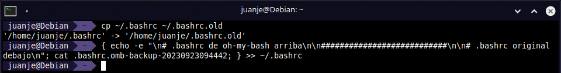

This time we are going to explore how to improve our workflow in Bash by installing and configuring a series of tools.

The general steps are compatible almost in their entirety with any Linux distribution, but here I will focus on the instructions for Debian, also applicable to its derivatives such as Ubuntu, Linux Mint, etc.

If you use another distribution, you will have to modify the `apt` commands to fit your package manager.

<!--more-->

> **⚠️ DISCLAIMER: Please note that this article is a manual translation of the Spanish version. The screenshots may have been originally taken in Spanish, and some words/names may not match completely. If you find any errors, please [report them to the author](#profile). ⚠️**

## **Requirements**

- Bash. It usually comes bundled with your distribution.
- `apt` as the package manager in your system. As I said earlier, if you use another distribution, you will have to modify the `apt` commands to fit your package manager.
- `curl` and `git` installed.
- Being able to run commands as `root` (either as `root` user directly, or with `sudo` or `doas`). In my case I will do it as `root` (using `su`).

## **Nerd Fonts**

> **If we are connected via SSH, the rendering of the icons will depend on our SSH client, so installing the fonts on the server will not be needed, but on the computer from which we connect. This is the only exception, the rest of the utilities in the post should be installed on the *server*.**

The first step is downloading and installing the fonts from [nerd-fonts](https://github.com/ryanoasis/nerd-fonts) to be able to show special icons and make the *prompt* look good. For this guide I will use the [Noto](https://fonts.google.com/noto) modification:

```bash
mkdir patched-fonts

cd patched-fonts

curl -OL https://github.com/ryanoasis/nerd-fonts/releases/latest/download/Noto.tar.xz

tar -xf Noto.tar.xz --one-top-level
```


If we want any other font, we can look for it in the [GitHub repository releases](https://github.com/ryanoasis/nerd-fonts/releases/latest) and replace its link. It is highly recommended to use the `.tar.xz` versions due to the difference in file size compared to the `.zip` versions.

After downloading and uncompressing the font/s, we prepare and run the installation script:

```bash
cd ..

curl -OL https://raw.githubusercontent.com/ryanoasis/nerd-fonts/master/install.sh

chmod +x install.sh
```


Now we get to choose:

- Option A: System-wide installation:

    ```bash
    su

    ./install.sh -S

    exit
    ```

- Option B: Installation for the current user:

    ```bash
    ./install.sh
    ```


After choosing and following one of the two options, the script will take care of doing everything for us. It is not hard to manually create the directories and copy the files, but since the contributors of [Nerd Fonts](https://github.com/ryanoasis/nerd-fonts) have gone the extra mile to create a script that works so well, we might as well take advantage of it.

With the fonts installed, we must select them in our desktop environment settings, terminal emulator or `tty`. I will leave to you the configuration of each one since it is not in the scope of this guide.

To check that it has worked, we can run the following command:

```bash
echo $'\uf115'
```


It should show us the icon of a folder, if not, we can try restarting the session or the system to apply the changes.

At this point, its safe to delete the script and the `patched-fonts` folder we created:

```bash
rm -rf patched-fonts install.sh
```

## **Oh My Bash**

[Oh My Bash](https://github.com/ohmybash/oh-my-bash) is, according to its [official website](https://ohmybash.nntoan.com/), an open source, community-driven framework for managing your Bash configuration. It comes bundled with a ton of helpful functions, helpers, plugins, themes, etc.

> **⚠️ When downloading and installing *Oh My Bash* with the following command, our `.bashrc` file will be renamed to something like `.bashrc.omb-backup-...`, the ellipsis (three dots) will actually be a set of numbers representing the exact time of the backup. ⚠️**

Installing *Oh My Bash*:

```bash
bash -c "$(curl -fsSL https://raw.githubusercontent.com/ohmybash/oh-my-bash/master/tools/install.sh)"

# Alternatively:
# bash -c "$(wget https://raw.githubusercontent.com/ohmybash/oh-my-bash/master/tools/install.sh -O -)"
```


After installing it, I will edit the `OSH_THEME=` line and put the `agnoster` theme, leaving it like: `OSH_THEME="agnoster"`, we can use a text editor or better, we can use `sed`:

```bash
sed -i 's/^OSH_THEME=.*/OSH_THEME="agnoster"/' ~/.bashrc
```

> All the available themes can be found at: [Themes · ohmybash/oh-my-bash Wiki](https://github.com/ohmybash/oh-my-bash/wiki/Themes).

We run `bash` again to see the changes:

```bash
exec bash
```


To finish with *Oh My Bash*, we must check the differences between the current `.bashrc` and the backup of our original file, choosing the lines we want to keep. Remember to replace the name of the `.bashrc.omb-backup-...` file in the commands.

First, we make a backup of the current `.bashrc` file:

```bash
cp ~/.bashrc ~/.bashrc.old
```

Now, before finishing with *OMB* I would like to keep certain configurations that I had for `bash`, so I will dump the original `.bashrc` over the new one created by *OMB*. I have added the `#` signs as a separator to make it easier to locate where one file ends and the other begins:

```bash
{ echo -e "\n# oh-my-bash .bashrc above\n\n###########################\n\n# original .bashrc below\n"; cat .bashrc.omb-backup-...; } >> ~/.bashrc
```



Finally, we would have to review the resulting `.bashrc` file to delete the lines we don't want and restart `bash`, or alternatively log out and log back in:

```bash
nano -cl ~/.bashrc

exec bash
```

And we should end up with a terminal similar to this one:


In addition, we not just have a prettier *prompt*, but we also have access to several quality of life improvements, such as indications when running `mv` or `cp`, if we have a command in progress and we press the up key, it will complete it with the last command that matches what we have written:


## **bat**

As stated in its [GitHub](https://github.com/sharkdp/bat), `bat` is a `cat` clone with syntax highlighting and Git integration.

Installing `bat`:

```bash
apt install bat
```


To run `bat` in Debian and derivative distributions, we must use the `batcat` command due to conflicts in the name of its files with another package.

To be able to run it with the `bat` command, we can add this alias to our `.bashrc` or, to `.bash_aliases` if we use it:

```bash
echo 'alias bat="batcat --paging=never"' >> ~/.bashrc
```

The `--paging=never` option tells `bat` not to use pagination, mimicking `cat`'s default behavior. If you want to see it in action, try running these two commands, the first one uses pagination and the second one doesn't:

```bash
man man

man man | batcat --paging=never
```

We could also add an alias for `cat`, this way, we won't have to work against our muscle memory. In the tests I have done, `bat` seems to be able to detect that its output is being redirected to a file, so we can be sure that it will not interfere with scripts or commands that depend on the `cat` binary:

```bash
echo 'alias cat="batcat --paging=never"' >> ~/.bashrc
```

After adding the aliases, we restart `bash` to activate the changes in the configurations:

```bash
exec bash
```

[](https://jaspervdj.be/lorem-markdownum/)

> **🗒 If we ever want to run the original `cat` command, we can do it by writing the full path to the binary or by adding a backslash (`\`) before:**
>
> ```bash
> /usr/bin/cat fichero.txt
>
> \cat fichero.txt
> ```
>
> 

## **fd**

[`fd`](https://github.com/sharkdp/fd) is an alternative to `find` with a more intuitive syntax, [faster](https://github.com/sharkdp/fd#benchmark), with colors by default to make reading the output easier, [supports parallel execution of commands on each result or in batch](https://github.com/sharkdp/fd#command-execution), "smart" case detection, etc. For a complete list of its features: <https://github.com/sharkdp/fd#features>.

In addition, by installing it, `fzf` (utility that we will install later), will be able to use it when searching for files.

Installing `fd`:

```bash
apt install fd-find
```


Similar to what happened with `bat` and `batcat`, the command to invoke `fd` is `fdfind`.

Instead of an alias, this time we can create a symbolic link and include the directory where we will place the link in our `$PATH` variable.

By default, in Debian when logging in, if the `~/.local/bin` directory exists, it will be automatically added to `$PATH`. This behavior is configured in the `~/.profile` file, in case you want to take a look. To create the symbolic link:

```bash
mkdir -p ~/.local/bin

ln -s $(which fdfind) ~/.local/bin/fd
```


Now we force the rereading of the file and we can check how the path appears in our `$PATH`:

```bash
source ~/.profile

echo $PATH | grep $HOME/.local/bin
```


If it doesn't appear, we must add the following to our `~/.profile` and force its rereading:

```bash
# Set $PATH so it includes user's private bin directory if it exists
if [ -d "$HOME/.local/bin" ] ; then
    PATH="$HOME/.local/bin:$PATH"
fi
```

> **🗒 Although in Debian this doesn't happen, depending on our distribution, the `~/.profile` file may not be being read, in this case, we can add the previous code directly to our `.bashrc`.**

After setting up `fd` as I have shown, we will be able to invoke it and get an output like this:


If we want to search also for the hidden files or those included in a `.gitignore` we will use the `-H` and `-I` flags respectively:


To check all the available options we can use:

```bash
fd -h # For a concise list of options

fd --help # For a complete list of options
```


## **fzf**

[`fzf`](https://github.com/junegunn/fzf) is a *fuzzy finder* for the command line that will allow us to search in the command history, in the files of a directory, in the running processes, etc.

And what is a *fuzzy finder*? Well, a finder that shows results that don't have to 100% match what we searched for, useful for example if we don't remember the exact name of what we want to find. E.g.:


When searching for `post.md` it shows us results that do not exactly match what we searched for, but that are similar, helping us to find the `post3.md` file.

Installing `fzf`:

```bash
apt install fzf
```


After installing it, the keyboard shortcuts to use it will not work, if we check the package information, it will tell us what to do:

```bash
apt show fzf
```


And if we read that file, we will get the instructions to configure it:

```bash
cat /usr/share/doc/fzf/README.Debian
```


So, following the instructions, we add the necessary lines to the `.bashrc` for its correct operation:

```bash
nano -cl ~/.bashrc
```

Lines to add:

```bash
source /usr/share/doc/fzf/examples/key-bindings.bash
FZF_DEFAULT_OPTS="--reverse --preview 'batcat --color=always {}'"
FZF_DEFAULT_COMMAND="fd -HI --type f"
```

And we restart `bash` to activate the changes:

```bash
exec bash
```

Actually, only `source ...` is needed, but since we have previously installed `bat` and `fd`, we can use them so that `fzf` shows a preview of the results and searches with `fd` instead of `find`. For more information on how to edit the options `FZF_DEFAULT_OPTS`, `FZF_DEFAULT_COMMAND`, and all others, we can check the `fzf` manual pages with:

```bash
man fzf
```

If we press `Ctrl + R`, `fzf` will search in the command history and show us the results:


With `Ctrl + T` we can search for files in the current directory and subdirectories:


And with `Alt + C` we can `cd` to any subdirectory:


## **lsd**

`lsd` is a rewrite of `ls` with lots of added features like colors, icons, tree-view, more formatting options, etc. For more information we can check its [GitHub](https://github.com/lsd-rs/lsd).

Installing `lsd`:

```bash
apt install lsd
```


And that's it, that simple, it accepts the same options as `ls` and more, so we can use it as if it were `ls` without problems. As recommended in the [documentation](https://github.com/lsd-rs/lsd#optional), we can add some aliases for `ls` and use `lsd` by default. This are the ones I am using:

```bash
alias ls='lsd'
alias l='lsd -l'
alias la='lsd -a'
alias lla='lsd -la'
alias lt='lsd --tree'
alias llt='lsd -l --tree'
alias llat='lsd -la --tree'
```

And we restart `bash` to activate the changes:

```bash
exec bash
```


## **Extra: Aliases for the `ip` command**

Since the post is about installing tools and configuring aliases, I take the opportunity to show you the aliases I use for the `ip` command:

```bash
alias ip='ip -c'
alias ipa='ip -c a'
alias ipr='ip -c r'
alias ipbr='ip -c -br'
```

We restart `bash` to activate the aliases:

```bash
exec bash
```


## **Conclusion**

I wrote this post since after several years using `zsh` on my personal computers, on my VPS I have decided to stay on `bash` for various reasons that I will not state here. After a few days, I missed some of the tools I usually use, so I decided to install them and take the opportunity to write it down.

Among all the tools shown, my favorite is `fzf`, it is worth installing just for the command history search alone. I invite you to take a look at the documentation of each of the tools in the post, you will surely find more information that will be interesting and very useful.

---

✒️ **Documentation written by Juan Jesús Alejo Sillero.**
