En esta ocasión vamos a explorar cómo mejorar nuestro flujo de trabajo en Bash mediante la instalación y configuración de una serie de herramientas.

Los pasos generales son compatibles casi en su totalidad con cualquier distribución de Linux, pero en este post me centraré en las instrucciones para Debian, aplicables también a sus derivadas como Ubuntu, Linux Mint, etc.

Si usas otra distribución, deberás adaptar los comandos con `apt` a tu gestor de paquetes.

<!--more-->

## **Requisitos**

- Bash. Lo normal es que venga instalado por defecto en tu distribución.
- `apt` como gestor de paquetes en tu sistema. Como he mencionado antes, si usas otra distribución, deberás adaptar los comandos con `apt` a tu gestor de paquetes.
- `curl` y `git` instalados.
- Poder ejecutar comandos como `root` (ya sea como usuario `root` directamente, o con `sudo` o `doas`). En mi caso lo haré como `root` (usando `su`).

## **Nerd Fonts**

> **Si estamos conectados por SSH, la renderización de los iconos dependerá de nuestro cliente SSH, por lo que no será necesario instalar las fuentes en el servidor, sino en el equipo desde el que nos conectamos. Esta es la única excepción, el resto de utilidades del post se instalan sobre el *servidor*.**

Comenzamos por descargar e instalar las fuentes de [nerd-fonts](https://github.com/ryanoasis/nerd-fonts) para poder mostrar iconos especiales y que el *prompt* se vea correctamente. Para esta guía usaré la modificación de [Noto](https://fonts.google.com/noto):

```bash
mkdir patched-fonts

cd patched-fonts

curl -OL https://github.com/ryanoasis/nerd-fonts/releases/latest/download/Noto.tar.xz

tar -xf Noto.tar.xz --one-top-level
```

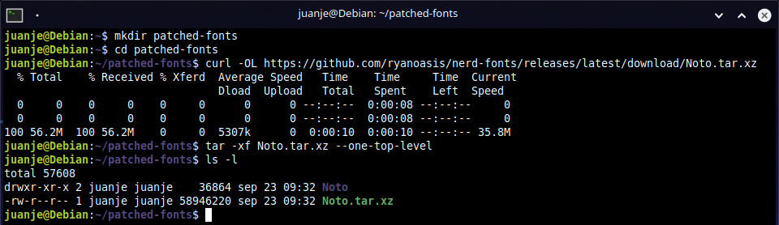

Si queremos otra fuente, la buscamos en las [releases del repositorio de GitHub](https://github.com/ryanoasis/nerd-fonts/releases/latest) y sustituimos su link. Es muy recomendable usar las versiones `.tar.xz` debido a la diferencia de peso en el fichero respecto a las versiones `.zip`.

Tras descargar y descomprimir la/s fuente/s, preparamos y ejecutamos el script de instalación:

```bash
cd ..

curl -OL https://raw.githubusercontent.com/ryanoasis/nerd-fonts/master/install.sh

chmod +x install.sh
```


Ahora nos toca elegir:

- Opción A: Instalación a nivel de sistema:

    ```bash
    su

    ./install.sh -S

    exit
    ```

- Opción B: Instalación para el usuario actual:

    ```bash
    ./install.sh
    ```


Tras elegir y ejecutar una de las dos opciones, el script se ocupará de realizar todo por nosotros. No es complicado crear los directorios y copiar los ficheros a mano, pero ya que los contribuidores de [Nerd Fonts](https://github.com/ryanoasis/nerd-fonts) se han tomado la molestia de crear un script que funciona tan bien, pues lo aprovechamos.

Con las fuentes instaladas, debemos seleccionarlas en los ajustes de nuestro entorno de escritorio, emulador de terminal o `tty`. Dejo a vuestra suerte la configuración de cada uno ya que no es el objetivo de esta guía.

Para comprobar que ha funcionado, podemos ejecutar el siguiente comando:

```bash
echo $'\uf115'
```

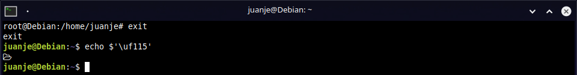

Debería mostrarnos el icono de una carpeta, si no es así, podemos probar reiniciar la sesión o el sistema para que se apliquen los cambios.

Podemos borrar la carpeta `patched-fonts` que hemos creado y el script si queremos:

```bash
rm -rf patched-fonts install.sh
```

## **Oh My Bash**

[Oh My Bash](https://github.com/ohmybash/oh-my-bash) es, según su [web oficial](https://ohmybash.nntoan.com/), un framework de código abierto para gestionar la configuración de Bash. Incorpora funciones, asistentes, plugins, temas, etc.

> **⚠️ Al descargar e instalar *Oh My Bash* con el siguiente comando, nuestro fichero `.bashrc` será renombrado a algo como `.bashrc.omb-backup-...`, los puntos suspensivos serán en realidad un conjunto de números que representan la hora exacta del backup. ⚠️**

Instalación de *Oh My Bash*:

```bash
bash -c "$(curl -fsSL https://raw.githubusercontent.com/ohmybash/oh-my-bash/master/tools/install.sh)"

# Alternativamente:
# bash -c "$(wget https://raw.githubusercontent.com/ohmybash/oh-my-bash/master/tools/install.sh -O -)"
```

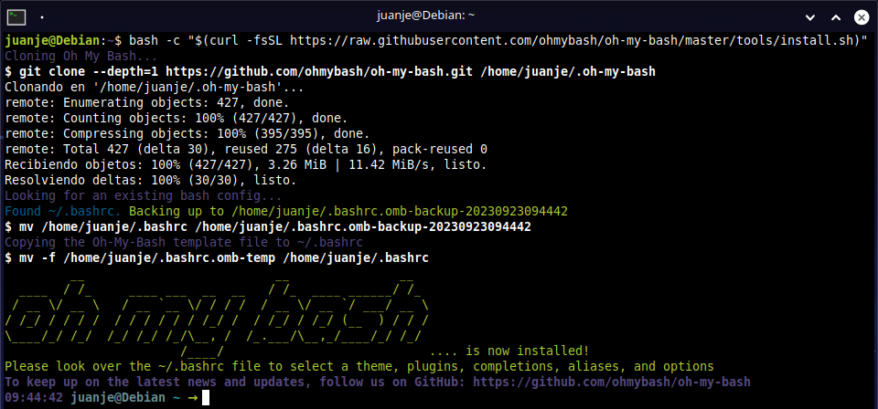

Tras instalarlo, yo editaré la línea `OSH_THEME=` y pondré el tema `agnoster`, quedando como: `OSH_THEME="agnoster"`, podemos usar un editor de texto o mejor, podemos usar `sed`:

```bash
sed -i 's/^OSH_THEME=.*/OSH_THEME="agnoster"/' ~/.bashrc
```

> Los temas disponibles podemos consultarlos en: [Themes · ohmybash/oh-my-bash Wiki](https://github.com/ohmybash/oh-my-bash/wiki/Themes).

Ejecutamos `bash` de nuevo para ver los cambios:

```bash
exec bash
```


Para finalizar con *Oh My Bash*, debemos revisar las diferencias entre el `.bashrc` actual y el backup de nuestro fichero original, eligiendo las líneas con las que nos quedaremos. Recuerda corregir el nombre del fichero `.bashrc.omb-backup-...` en los comandos.

Primero, hacemos el backup del fichero `.bashrc` actual:

```bash
cp ~/.bashrc ~/.bashrc.old
```

Ahora, antes de terminar con *OMB* a mí me gustaría mantener ciertas configuraciones que tenía para `bash`, por lo que volcaré el `.bashrc` original sobre el nuevo creado por *OMB*. He agregado las almohadillas `#` en forma de separador para que sea más sencillo localizar donde termina un fichero y comienza el otro:

```bash
{ echo -e "\n# .bashrc de oh-my-bash arriba\n\n###########################\n\n# .bashrc original debajo\n"; cat .bashrc.omb-backup-...; } >> ~/.bashrc
```


Finalmente, nos quedaría revisar el `.bashrc` resultante para borrar las líneas que no queramos y reiniciar `bash`, o alternativamente cerrar la sesión y reabrirla:

```bash
nano -cl ~/.bashrc

exec bash
```

Y deberíamos acabar con una terminal similar a esta:

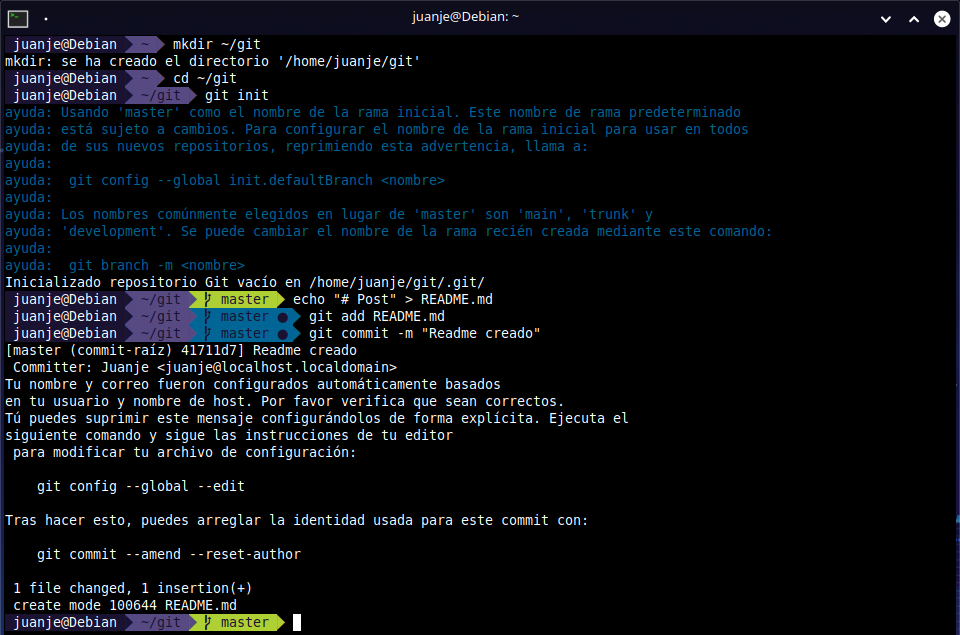

Además, no solo tenemos un *prompt* más bonito, sino que también tenemos acceso a una serie de funciones que nos facilitarán la vida, como por ejemplo, indicaciones al ejecutar `mv` o `cp`, si tenemos un comando a medias y pulsamos hacia arriba, nos lo completará con el último comando que coincida con lo que hemos escrito:


## **bat**

Como en su propio [GitHub](https://github.com/sharkdp/bat) indican, `bat` es un clon de `cat` pero con resaltado de sintaxis e integración con Git.

Instalamos `bat`:

```bash
apt install bat
```


Para usar `bat` en Debian y algunas distribuciones derivadas, debemos usar el comando `batcat` por conflictos en el nombre de sus ficheros con otro paquete.

Para poderlo ejecutar con el comando `bat`, podemos añadir este alias a nuestro fichero `.bashrc` o, a `.bash_aliases` si lo usamos:

```bash
echo 'alias bat="batcat --paging=never"' >> ~/.bashrc
```

La opción `--paging=never` indica a `bat` que no debe usar paginación, imitando el comportamiento por defecto de `cat`. Si quieres verlo más claro, prueba a ejecutar estos dos comandos, el primero usa paginación y el segundo no:

```bash
man man

man man | batcat --paging=never
```

También podríamos agregar un alias para `cat`, de este modo, no tendremos que ir en contra de nuestra memoria muscular. En las pruebas que he realizado, `bat` parece ser capaz de detectar que su salida está siendo redirigida hacia un fichero, por lo que podemos estar tranquilos de que no interferirá en los scripts o comandos que dependan del binario `cat`:

```bash
echo 'alias cat="batcat --paging=never"' >> ~/.bashrc
```

Tras agregar los alias, reiniciamos `bash` para que se activen los cambios en las configuraciones:

```bash
exec bash
```

[](https://jaspervdj.be/lorem-markdownum/)

> **🗒 Si alguna vez queremos ejecutar el comando `cat` original, podemos hacerlo escribiendo la ruta completa al binario o añadiendo una barra invertida (`\`) antes:**
>
> ```bash
> /usr/bin/cat fichero.txt
>
> \cat fichero.txt
> ```
>
> 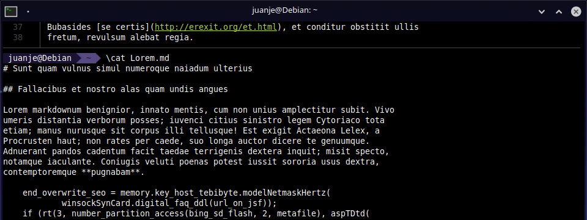

## **fd**

[`fd`](https://github.com/sharkdp/fd) es una alternativa a `find` con una sintaxis más intuitiva, [más rápida](https://github.com/sharkdp/fd#benchmark), con uso por defecto de colores para facilitar la lectura de los resultados, [soporta la ejecución paralela de comandos sobre cada resultado o en bloque](https://github.com/sharkdp/fd#command-execution), detección "inteligente" de mayúsculas, etc. Para una lista completa de sus características: <https://github.com/sharkdp/fd#features>.

Además, al instalarlo, `fzf` (utilidad que instalaremos más tarde), podrá hacer uso de él cuando busque archivos.

Instalamos `fd`:

```bash
apt install fd-find
```


Similar a lo que pasaba con `bat` y `batcat`, el comando para para invocar a `fd` es `fdfind`.

En lugar de un alias, esta vez podemos crear un enlace simbólico e incluir el directorio donde ubicaremos el enlace a nuestra variable `$PATH`.

Por defecto, en Debian al iniciar sesión, si existe el directorio `~/.local/bin`, será agregado de forma automática a `$PATH`. Este comportamiento está configurado en el fichero `~/.profile`, por si te apetece echarle un ojo. Para crear el enlace simbólico:

```bash
mkdir -p ~/.local/bin

ln -s $(which fdfind) ~/.local/bin/fd
```


Ahora forzamos la relectura del fichero y podemos comprobar que aparece la ruta en nuestra `$PATH`:

```bash
source ~/.profile

echo $PATH | grep $HOME/.local/bin
```


Si no aparece, debemos agregar a nuestro `~/.profile` lo siguiente y forzar su relectura:

```bash
# Agrega a $PATH el directorio bin del usuario si existe
if [ -d "$HOME/.local/bin" ] ; then
    PATH="$HOME/.local/bin:$PATH"
fi
```

> **🗒 Aunque en Debian no ocurra, según nuestra distribución, el fichero `~/.profile` podría no estar siendo leído, en este caso, podemos agregar el bloque anterior directamente a nuestro `.bashrc`.**

Tras configurar `fd` como he mostrado, podremos invocarlo con su propio nombre y obtendremos una salida como esta:

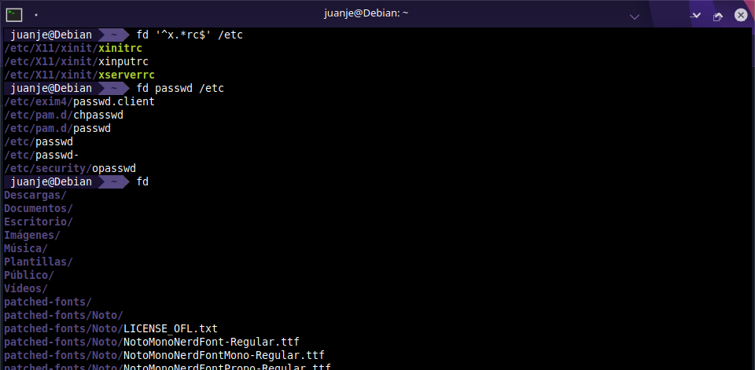

Si queremos buscar también los ficheros ocultos o incluidos en un `.gitignore` usaremos las opciones `-H` y `-I` respectivamente:


Para conocer todas las opciones disponibles podemos usar:

```bash
fd -h # Para una lista de opciones concisa

fd --help # Para una lista de opciones completa
```


## **fzf**

[`fzf`](https://github.com/junegunn/fzf) es un *buscador difuso* (*fuzzy finder*) para la línea de comandos que nos permitirá buscar en el historial de comandos, en los ficheros de un directorio, en los procesos en ejecución, etc.

쯏 qué es un *buscador difuso*? Pues un buscador que muestra resultados que no tienen que ser 100% coincidentes a lo que hemos buscado, útil por ejemplo si no recordamos el nombre exacto de lo que queremos encontrar. Ejemplo:

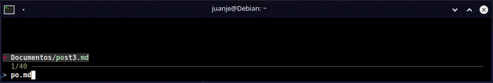

Vemos que al buscar `post.md` nos muestra resultados que no coinciden exactamente con lo que hemos buscado, pero que son similares, ayudándonos a encontrar el fichero `post3.md`.

Instalación de `fzf`:

```bash
apt install fzf
```

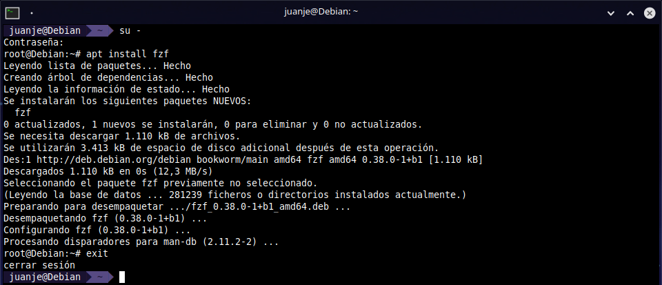

Tras instalarlo, los atajos de teclado para usarlo no funcionarán, si revisamos la información del paquete, veremos que nos indican que hacer:

```bash
apt show fzf
```

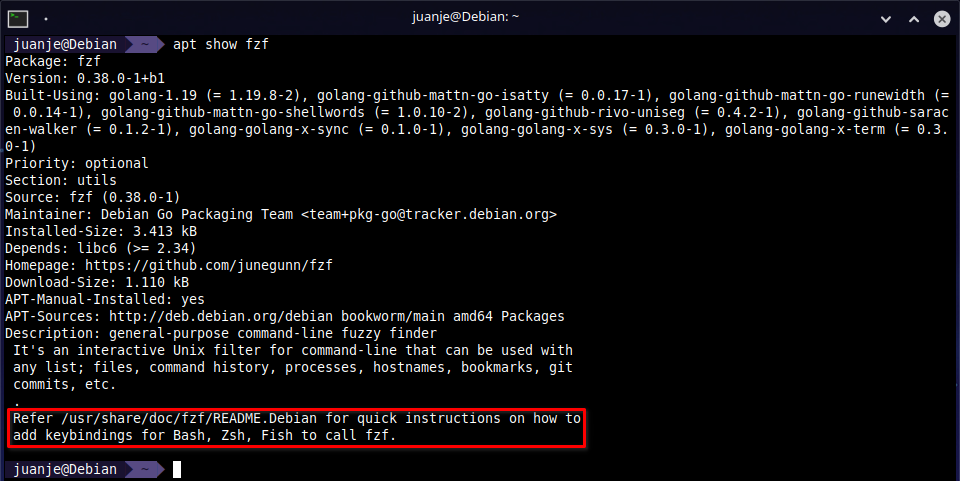

Y si leemos el fichero que nos indican obtendremos las instrucciones para configurarlo:

```bash
cat /usr/share/doc/fzf/README.Debian
```

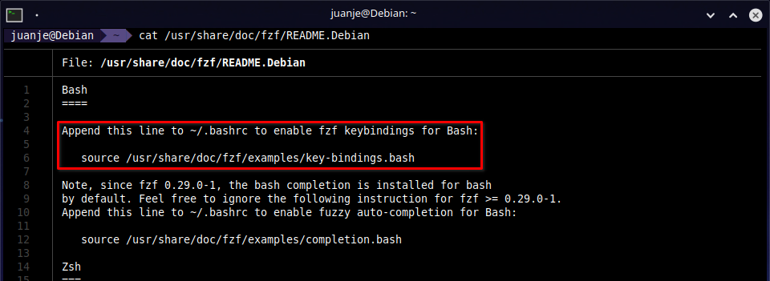

Así que, siguiendo las instrucciones, agregamos al `.bashrc` las líneas necesarias para su correcto funcionamiento:

```bash
nano -cl ~/.bashrc
```

Líneas a agregar:

```bash
source /usr/share/doc/fzf/examples/key-bindings.bash
FZF_DEFAULT_OPTS="--reverse --preview 'batcat --color=always {}'"
FZF_DEFAULT_COMMAND="fd -HI --type f"
```

Y reiniciamos `bash` para que se activen los cambios:

```bash
exec bash
```

Realmente solo es necesario el `source ...`, pero ya que hemos instalado antes `bat` y `fd`, podemos usarlos para que `fzf` muestre una vista previa de los resultados y para que busque con `fd` en lugar de `find`. Para más información sobre como editar las opciones `FZF_DEFAULT_OPTS`, `FZF_DEFAULT_COMMAND` y todas las demás, podemos consultar el manual de `fzf` con:

```bash
man fzf
```

Si pulsamos `Ctrl + R`, `fzf` buscará en el historial de comandos y nos mostrará los resultados:

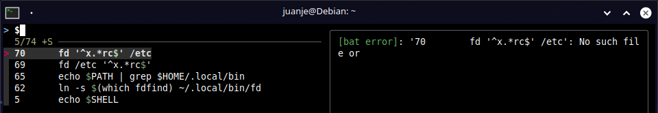

Con `Ctrl + T` podemos buscar ficheros en el directorio actual y subdirectorios:


Y con `Alt + C` podemos cambiar de directorio a cualquiera que se encuentre en niveles inferior al actual:

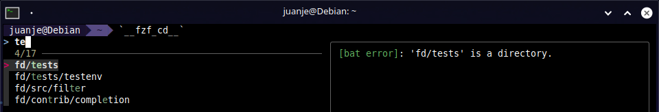

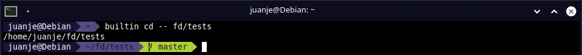

## **lsd**

`lsd` es un `ls` reescrito para tener soporte de colores, iconos, vista de árbol, etc. Para más información podemos consultar su [GitHub](https://github.com/lsd-rs/lsd).

Instalación de lsd:

```bash
apt install lsd
```

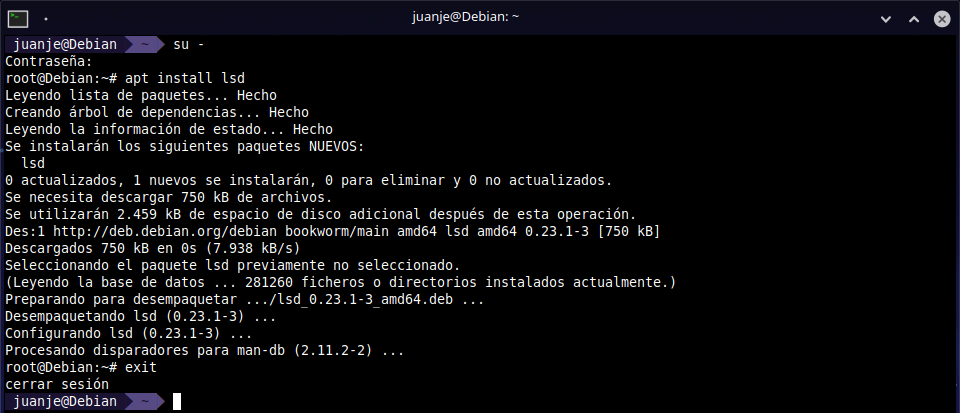

Y ya está, así de simple, acepta las mismas opciones que `ls` y más, por lo que podemos usarlo como si fuera `ls` sin problemas. Como recomienda la [documentación](https://github.com/lsd-rs/lsd#optional), podemos agregar unos alias para `ls` y así usar `lsd` por defecto. Estos son los que yo utilizo:

```bash
nano -cl ~/.bashrc
```

Alias que uso o he usado y os recomiendo:

```bash
alias ls='lsd'
alias l='lsd -l'
alias la='lsd -a'
alias lla='lsd -la'
alias lt='lsd --tree'
alias llt='lsd -l --tree'
alias llat='lsd -la --tree'
```

Y reiniciamos `bash` para que se activen los cambios:

```bash
exec bash
```

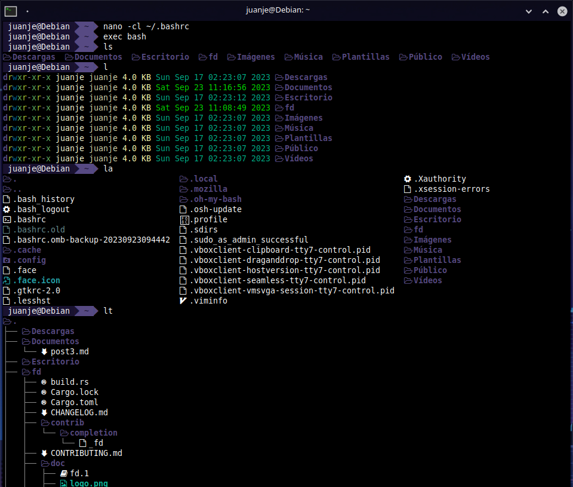

## **Extra: Alias para el comando `ip`**

Ya que el post va de instalar herramientas y configurar alias, aprovecho para mostraros los alias que yo uso para el comando `ip`:

```bash
alias ip='ip -c'
alias ipa='ip -c a'
alias ipr='ip -c r'
alias ipbr='ip -c -br'
```

Reiniciamos `bash` para activar los alias:

```bash
exec bash
```

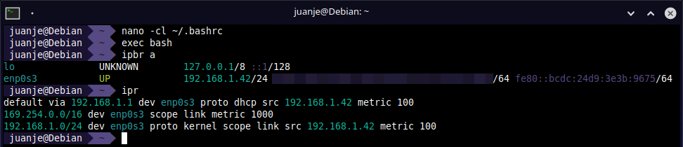

## **Cierre**

He escrito este post ya que tras bastantes años usando `zsh` en mis equipos personales, en mi VPS he decidido mantenerme en `bash` por motivos varios que no voy a detallar. Tras unos días, he echado en falta algunas de las herramientas que suelo usar, por lo que he decidido instalarlas y aprovechar para documentar el proceso.

De entre todas las mostradas, mi favorita es `fzf`, solo por la búsqueda en el historial de comandos ya merece bastante la pena pararse a instalarla. Os invito a que le echéis un ojo a la documentación de cada una de las herramientas del post, seguro que encontráis más información que os resultará interesante y muy útil.

---

✒️ **Documentación realizada por Juan Jesús Alejo Sillero.**
