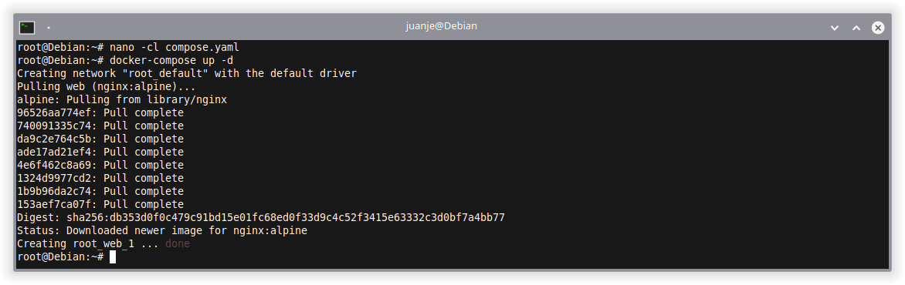
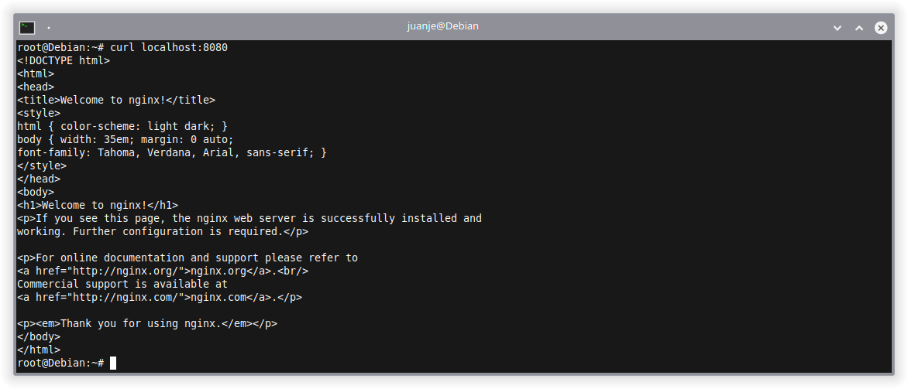
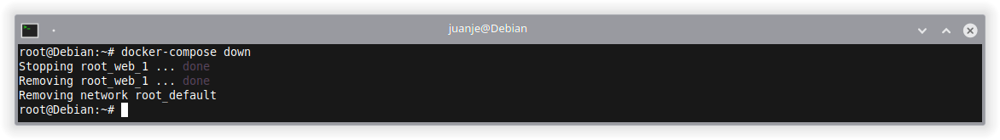
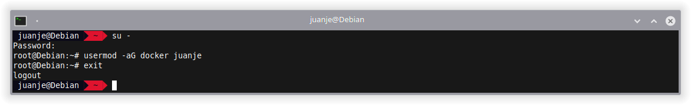

This post covers the installation and configuration of Docker and Docker Compose so that we can carry out our tests and projects comfortably using containers.

The general steps are compatible almost in their entirety with any Linux distribution, but here I will focus on the instructions for Debian, also applicable to its derivatives such as Ubuntu, Linux Mint, etc.

If you use another distribution, you will have to modify the `apt` commands to fit your package manager.

<!--more-->

> **⚠️ DISCLAIMER: Please note that this article is a manual translation of the Spanish version. The screenshots may have been originally taken in Spanish, and some words/names may not match completely. If you find any errors, please [report them to the author](#profile). ⚠️**

## **Requirements**

- 64 bits Debian (or derivatives).
- `apt` as the package manager in your system. As I said earlier, if you use another distribution, you will have to modify the `apt` commands to fit your package manager.
- Being able to run commands as `root` (either as `root` user directly, or with `sudo` or `doas`). In my case I will do it as `root` (using `su`).

## **Things to keep in mind**

1. If you use `ufw` or `firewalld` to manage firewall settings, be aware that when you expose container ports using Docker, these ports bypass your firewall rules. For more information, refer to [Docker and ufw](https://docs.docker.com/network/packet-filtering-firewalls/#docker-and-ufw).

2. In this post I will use the Docker and Docker Compose builds available in the official Debian repositories. If you want to use the official Docker builds, check its [documentation](https://docs.docker.com/engine/install/debian/).

## **Docker and Docker Compose installation**

Installation is pretty straightforward, we open a terminal, log in as `root`, update the package list from the repositories and install the two we need:

```bash
su -

apt update

apt install docker.io docker-compose
```


Once the install process is finished, we will have Docker and Docker Compose available for use.

To check Docker is working, we can use the `hello-world` container:

```bash
docker run hello-world
```


If we see the message in the previous image, Docker is working correctly.

To check Docker Compose is working correctly, we can create a `compose.yaml` or `docker-compose.yaml` file:

```bash
nano -cl compose.yaml
```

Populate it with the following content:

```yaml
version: "3"

services:
  web:
    image: nginx:alpine
    ports:
      - "8080:80"
```

Then, we invoke Docker Compose to create the scenario declared in the file:

```bash
docker-compose up -d
```



We can verify that `nginx` is working as it should with `curl`:

```bash
curl localhost:8080
```



To get information about running containers, we can use:

```bash
docker ps

docker-compose ps
```


Now that we are sure both Docker and Docker Compose are working correctly, we can stop and remove the containers:

```bash
docker-compose down
```



## **Run Docker without root**

By default, Docker can only be run as `root`, but in some cases running Docker as a unprivileged user can be useful.

In case you want to do this, there are 2 options, one simpler and one more secure.

### **Via the docker group**

To add the user to the `docker` group, follow the steps below (replace `<user>` with your username):

> **⚠️ If we choose this option we will be granting root-level privileges to the user, For details on how this impacts security in your system, see: [Docker security | Docker Docs](https://docs.docker.com/engine/security/#docker-daemon-attack-surface). ⚠️**

```bash
su -

usermod -aG docker <user>

exit
```



Then, we will have to log out and log back in for the changes to take effect.

Alternatively, we can run the following command to log in to the new group without logging out of the current session:

```bash
newgrp docker
```

In either case, in the end, the result will be the same, the user will be able to run Docker without the need for `sudo` (or `doas`):

```bash
docker run hello-world
```


If at some point we want to remove our user from the group, we can do so with:

```bash
su -

gpasswd -d <user> docker
```

### **Rootless mode**

*Rootless* allows us to run the Docker daemon and our containers as an unprivileged user, mitigating potential vulnerabilities in both the daemon and the containers.

For more information and steps to follow, please refer to the [official documentation](https://docs.docker.com/engine/security/rootless/).

## **Conclusion**

For the last two years I have been using Docker, Docker Compose, Kubernetes, Vagrant and Ansible for my projects, and I am very happy with such tools. They have allowed me to setup development and testing environments very comfortably, saving me time and headaches.

Regarding Kubernetes, Vagrant and Ansible, I will write about them in incoming posts. Once I do, I will add their links here.

---

✒️ **Documentation written by Juan Jesús Alejo Sillero.**
