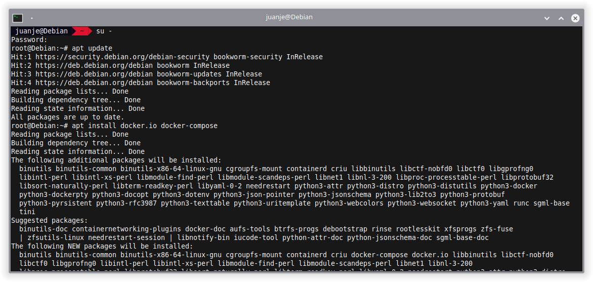
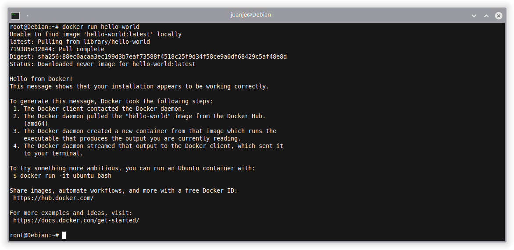
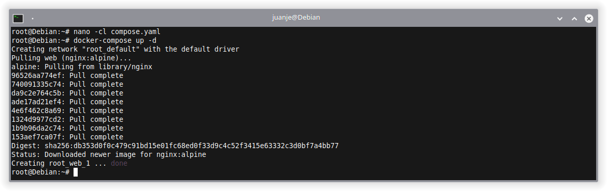
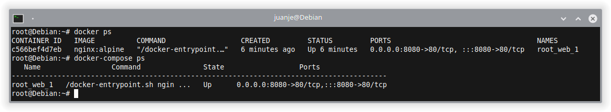
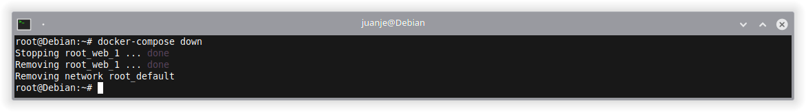
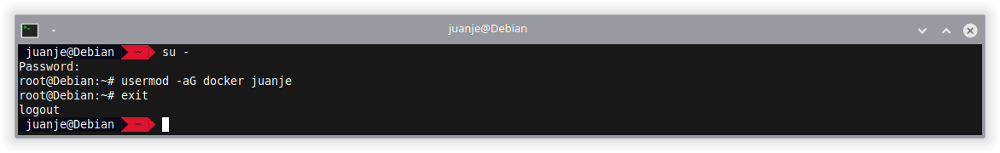
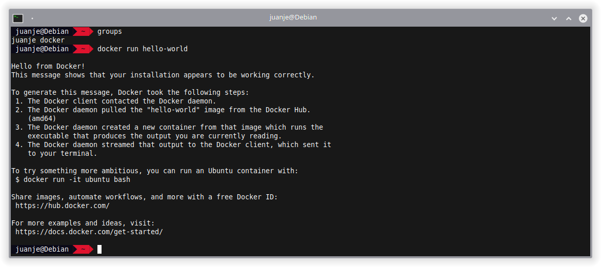

Este post cubre la instalación y configuración de Docker y Docker Compose para que podamos llevar a cabo nuestras pruebas y proyectos de forma cómoda usando contenedores.

Los pasos generales son compatibles casi en su totalidad con cualquier distribución de Linux, pero en este post me centraré en las instrucciones para Debian, aplicables también a sus derivadas como Ubuntu, Linux Mint, etc.

Si usas otra distribución, deberás adaptar los comandos con `apt` a tu gestor de paquetes, puede que los nombres de los paquetes sean diferentes.

<!--more-->

## **Requisitos**

- Debian (o distribuciones derivadas) de 64 bits.
- `apt` como gestor de paquetes en tu sistema. Si usas otra distribución, deberás adaptar los comandos con `apt` a tu gestor de paquetes.
- Poder ejecutar comandos como `root` (ya sea como usuario `root` directamente, o con `sudo` o `doas`). En mi caso lo haré como `root` (usando `su`).

## **Consideraciones a tener en cuenta**

1. Si usas `ufw` o `firewalld` para gestionar tu firewall, ten en cuenta que al exponer los puertos de los contenedores de Docker, dichos puertos se saltarán las reglas del firewall. Para más información, consulta la [documentación oficial](https://docs.docker.com/network/packet-filtering-firewalls/#docker-and-ufw).

2. En este post se usará la versión de Docker y Docker Compose disponible en los repositorios oficiales de Debian. Si quieres usar la versión de Docker oficial, consulta su [documentación](https://docs.docker.com/engine/install/debian/).

## **Instalación de Docker y Docker Compose**

La instalación es de lo más sencilla, abrimos una terminal, accedemos como `root`, actualizamos la lista de paquetes de los repositorios e instalamos los dos que necesitamos:

```bash
su -

apt update

apt install docker.io docker-compose
```



Tras esto, ya tendremos Docker y Docker Compose disponibles para su uso.

Para comprobar que Docker funciona, podemos usar el contenedor de `hello-world`:

```bash
docker run hello-world
```



Si vemos el mensaje de la imagen anterior, Docker funciona correctamente.

Para comprobar que Docker Compose funciona correctamente, podemos crear un archivo `compose.yaml` o `docker-compose.yaml`:

```bash
nano -cl compose.yaml
```

Y añadimos el siguiente contenido:

```yaml
version: "3"

services:
  web:
    image: nginx:alpine
    ports:
      - "8080:80"
```

Tras esto, invocamos a Docker Compose para que se ocupe de crear el escenario declarado en el archivo:

```bash
docker-compose up -d
```



Y con `curl` podemos ver que `nginx` está funcionando como debería:

```bash
curl localhost:8080
```


Para ver información sobre los contenedores que tenemos en ejecución, podemos usar:

```bash
docker ps

docker-compose ps
```



Ahora que sabemos que tanto Docker como Docker Compose funcionan correctamente, podemos parar los contenedores y eliminarlos:

```bash
docker-compose down
```



## **Ejecutar Docker sin root**

Por defecto y para mayor seguridad, Docker solo puede ser ejecutado por el usuario `root`. Esto no es obligatorio modificarlo, pero en algunos casos puede ser útil que Docker pueda ser ejecutado por un usuario normal.

En caso de querer hacerlo, tenemos 2 opciones, una más sencilla y otra más segura.

### **Usando el grupo docker**

Para añadir el usuario al grupo `docker` solo tendríamos que seguir los pasos a continuación (sustituir `<usuario>` por el nombre de nuestro usuario):

> **⚠️ Si elegimos esta opción estaremos dando privilegios a nivel de `root` al usuario, por lo que si este es comprometido, el atacante tendrá acceso a todo el sistema. Usar solo en entornos controlados y nunca en producción. Para más información: [Docker security | Docker Docs](https://docs.docker.com/engine/security/#docker-daemon-attack-surface). ⚠️**

```bash
su -

usermod -aG docker <usuario>
```



Tras esto, deberemos cerrar sesión y volver a iniciarla para que los cambios surtan efecto.

Alternativamente, podemos ejecutar el siguiente comando para iniciar sesión en el nuevo grupo sin necesidad de cerrar sesión:

```bash
newgrp docker
```

En cualquier caso, al final, el resultado será el mismo, el usuario podrá ejecutar Docker sin necesidad de usar `sudo` (o `doas`):

```bash
docker run hello-world
```



Si en algún momento queremos eliminar a nuestro usuario del grupo, podemos hacerlo con:

```bash
su -

gpasswd -d <usuario> docker

exit
```

### **Modo rootless**

El modo *rootless* nos permite ejecutar el demonio de Docker y nuestros contenedores como usuario sin privilegios, mitigando potenciales vulnerabilidades tanto en el demonio como en los contenedores.

Para más información y los pasos a seguir, por favor consulta la [documentación oficial](https://docs.docker.com/engine/security/rootless/).

## **Cierre**

Estos últimos dos años he estado usando Docker, Docker Compose, Kubernetes, Vagrant y Ansible para mis proyectos, y la verdad es que estoy muy contento con tales herramientas. Me han permitido tener entornos de desarrollo y pruebas muy cómodamente, ahorrándome tiempo y quebraderos de cabeza.

Respecto a Kubernetes, Vagrant y Ansible, en futuros posts hablaré sobre ellos. Cuando lo haga, añadiré aquí sus respectivos enlaces.

---

✒️ **Documentación realizada por Juan Jesús Alejo Sillero.**
