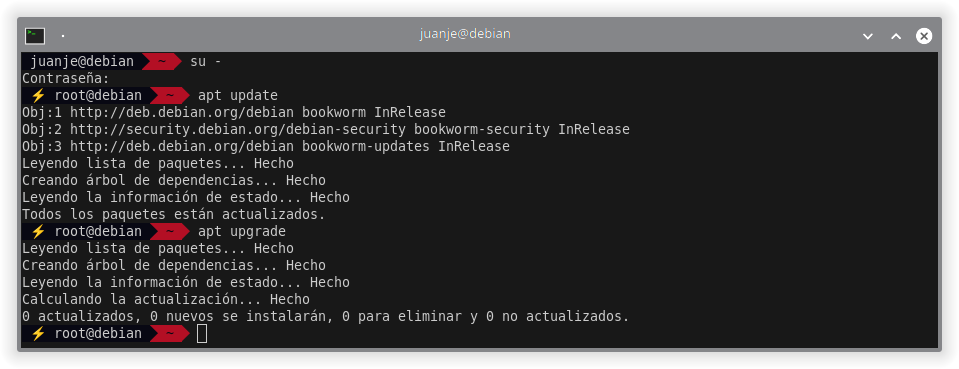
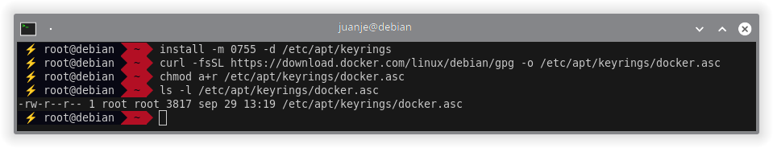
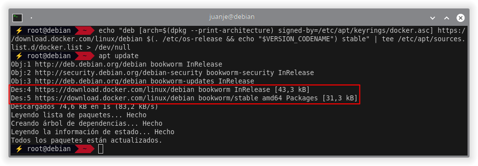
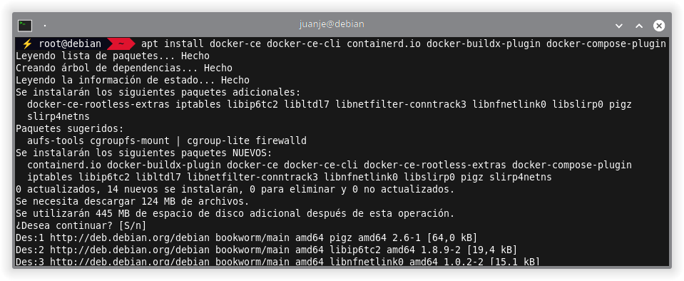
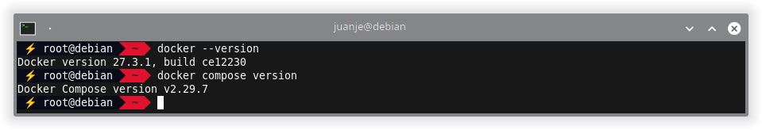
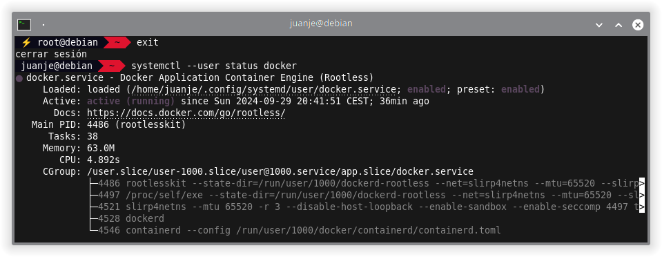
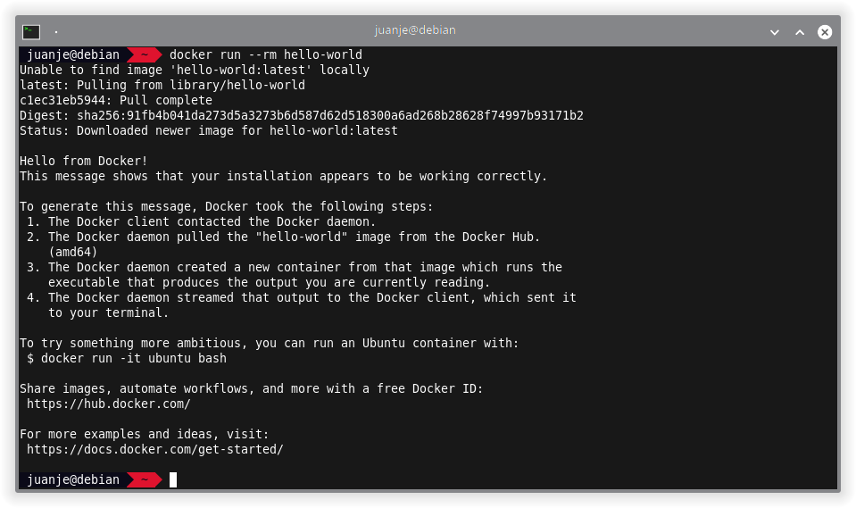
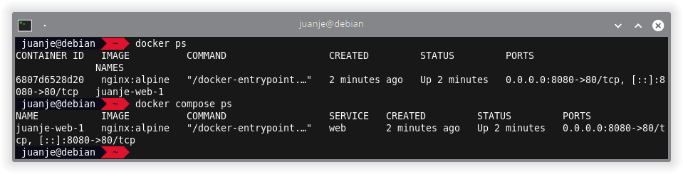
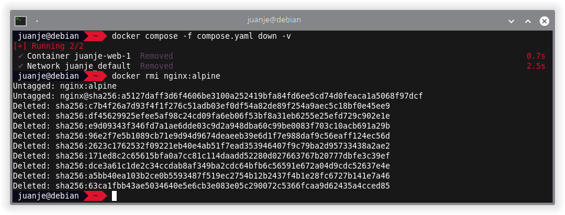

Almost a year ago I published [a post](https://blog.juanje.net/en/posts/debian-docker/) in which, I wrote about the installation of Docker and Docker Compose using the versions available in the Debian's repositories.

This time, I will describe the proper way to install Docker and Docker Compose in Debian according to its [official documentation](https://docs.docker.com/engine/install/debian/).

In addition, I will cover the configuration of the *rootless* mode so that containers can be run without `root` privileges.

Those of you who do not have Debian, should check the [official documentation](https://docs.docker.com/engine/install/) and follow the instructions for other systems.

<!--more-->

> **⚠️ DISCLAIMER: Please note that this article is a manual translation of the Spanish version. The screenshots may have been originally taken in Spanish, and some words/names may not match completely. If you find any errors, please [report them to the author](#profile). ⚠️**

## **Requirements**

- 64 bits Debian 12. Debian 11 also seems to be supported at the time of publication of this post.
- `apt` as the package manager in your system.
- Being able to run commands as `root` (either as `root` user directly, or with `sudo` or `doas`). In my case I will do it as `root` (using `su`).

## **Things to keep in mind**

- If you use `ufw` or `firewalld` to manage firewall settings, be aware that when you expose container ports using Docker, these ports bypass your firewall rules. For more information, refer to [Docker and ufw](https://docs.docker.com/network/packet-filtering-firewalls/#docker-and-ufw).

- In this post I will use the Docker and Docker Compose versions recommended by the official documentation, which involves adding the Docker GPG key and repository to `apt` sources file.

- With this method, Compose will be installed as a Docker plugin, so in order to run it we will not use `docker-compose`, but `docker compose`, that is, removing the hyphen `-`. If we do not do it this way, it will give us an error as the command will not be found.

## **Dependencies and preparations**

> **⚠️ Before proceeding, we must uninstall any non-official Docker version from the system. According to the documentation, this command will suffice: ⚠️**
>
> ```bash
> su -
>
> for pkg in docker.io docker-doc docker-compose podman-docker containerd runc; do apt remove $pkg; done
> ```

In the official documentation `sudo` is used to run the following commands, I will run them directly as `root` (using `su -`) since I do not have `sudo` installed on my systems, but you can use the option you prefer.

1. First, we update the list of available packages:

    ```bash
    su -

    apt update
    ```

    I recommend you to also update the system packages, this is not indicated in the official documentation, but I think it can save you from potential problems:

    ```bash
    apt upgrade
    ```

    

2. Then, we install the necessary dependencies:

    ```bash
    apt install ca-certificates curl
    ```

    

3. Add the Docker GPG key with its corresponding permissions:

    ```bash
    install -m 0755 -d /etc/apt/keyrings

    curl -fsSL https://download.docker.com/linux/debian/gpg -o /etc/apt/keyrings/docker.asc

    chmod a+r /etc/apt/keyrings/docker.asc

    ls -l /etc/apt/keyrings/docker.asc
    ```

    

4. Add the Docker repository to `apt` sources and update the database to include the packages from the new repository:

    ```bash
    echo \
      "deb [arch=$(dpkg --print-architecture) signed-by=/etc/apt/keyrings/docker.asc] https://download.docker.com/linux/debian \
      $(. /etc/os-release && echo "$VERSION_CODENAME") stable" | \
      tee /etc/apt/sources.list.d/docker.list > /dev/null

    apt update
    ```

    The backslashes `\` at the end of each line indicate that the command continues on the next line despite the line break.

    

## **Docker and Docker Compose installation**

Once the repository has been added and the database updated, we can install the main packages:

```bash
apt install docker-ce docker-ce-cli containerd.io docker-buildx-plugin docker-compose-plugin
```



We can check that they have been installed correctly with:

```bash
docker --version

docker compose version
```



At this point, we have Docker and Docker Compose installed and working correctly.

Next, we can choose between two options to run `docker` with our user without needing to act as `root`:

1. Through the `docker` group: this option is the simplest, but it will also give the containers `root` privileges. We can learn more about this option in [Manage Docker as a non-root user](https://docs.docker.com/engine/install/linux-postinstall/#manage-docker-as-a-non-root-user).

2. Using *rootless* mode: this option is safer, as the containers will not have `root` privileges on the host system. This is the option I will explain in the [next section](#rootless-mode). More information at [Rootless mode | Docker Docs](https://docs.docker.com/engine/security/rootless/).

Each of these options has its advantages, disadvantages, implications in terms of user permissions, network management, etc. So I recommend reading the official documentation before choosing one or the other.

## **Rootless mode**

*Rootless* mode allows us to run our containers as a non-privileged user, mitigating potential vulnerabilities in both the *daemon* and the containers.

We start by installing the `uidmap` package, which will provide us with the `newuidmap` and `newgidmap` commands. We should also include the `dbus-user-session` package, although in my experience, it was already present even in minimal Debian installations:

```bash
su -

apt install uidmap dbus-user-session
```


Once these two packages are installed, we exit the `root` session and run the script that will prepare Docker to be used in *rootless* mode. This script will be located at `/usr/bin/dockerd-rootless-setuptool.sh`, so we should have it available without specifying its full path (since `/usr/bin` is in the default `PATH`).

```bash
exit # Exit the root session

dockerd-rootless-setuptool.sh install
```


After the installation completes, we are given several things to keep in mind, including a couple of steps necessary for the correct operation of *rootless* mode:

1. Add the `DOCKER_HOST` variable at the end of `~/.bashrc`:

    ```bash
    echo '# Environment variable for Docker Rootless:' >> ~/.bashrc

    echo 'export DOCKER_HOST=unix://$XDG_RUNTIME_DIR/docker.sock' >> ~/.bashrc
    ```

    Re-execute bash so that changes take effect immediately:

    ```bash
    exec bash

    echo $DOCKER_HOST
    ```

    

2. Enable autostart of the Docker service in *rootless* mode, we will have to do it as `root`:

    ```bash
    su -

    loginctl enable-linger <user>
    ```

    If we want to disable it for any reason:

    ```bash
    su -

    loginctl disable-linger <user>
    ```

    We must replace `<user>` with our username.

    

3. In order to control the Docker service in *rootless* mode we will use the following commands, from our non-root user:

    ```bash
    systemctl --user status docker

    systemctl --user start docker

    systemctl --user stop docker

    systemctl --user restart docker
    ```

    

### **Checking Docker installation**

We can try to run the `hello-world` container from our non-root user:

```bash
docker run --rm hello-world
```



After checking the container execution, we can delete the downloaded image:

```bash
docker rmi hello-world
```

v

### **Checking Docker Compose installation**

To check if Docker Compose also works in *rootless* mode (it should not fail if `docker run` has worked), we can create a `compose.yaml` or `docker-compose.yaml` file:

```bash
nano -cl compose.yaml
```

And add the following content:

```yaml
services:
  web:
    image: nginx:alpine
    ports:
      - "8080:80"
```

In the latest Docker Compose versions, the `version` attribute should not be included, it is considered obsolete and if we include it, we will get a warning.

After creating the file, we start up the compose stack:

```bash
docker compose -f compose.yaml up -d
```


Verify that `nginx` is working correctly:

```bash
curl localhost:8080
```


To see information about the containers we have running:

```bash
docker ps
```

Or, to see only the containers we have started with the compose file located in the current path:

```bash
docker compose ps
```



To stop and remove created containers (and volumes):

```bash
docker compose -f compose.yaml down -v
```

We also delete the `nginx` image we downloaded:

```bash
docker rmi nginx:alpine
```



## **Wrapping up**

Shortly after publishing the [previous post](https://blog.juanje.net/en/posts/debian-docker/) in which I explained the installation using the packages available in the Debian repositories, I realized that this was not the recommended method according to the official Docker documentation.

Therefore, now that I am writing again, I wanted to start by fixing that mistake and providing a proper guide following the official documentation.

I use these types of posts as quick and easy to locate documentation, and at the same time, share them with you in case it is useful.

If you plan to use Docker in a production environment, it should not be necessary for me to say it, but use the official documentation and follow the security recommendations indicated there, not someone's blog on the Internet.

---

✒️ **Documentation written by Juan Jesús Alejo Sillero.**
