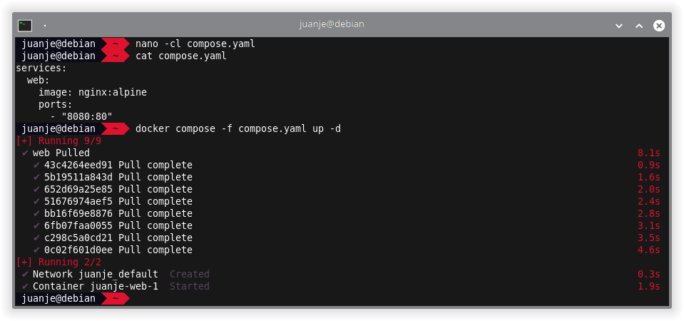

Hace casi un año publiqué [un post](https://blog.juanje.net/posts/debian-docker/) sobre la instalación de Docker y Docker Compose en el que utilizaba las versiones disponibles en los repositorios de Debian.

En esta ocasión, describiré la forma correcta de instalar Docker y Docker Compose en Debian según su [documentación oficial](https://docs.docker.com/engine/install/debian/).

Además, cubriré la configuración del modo *rootless* para que los contenedores puedan ser ejecutados sin privilegios de `root`.

Aquellos que no tengáis Debian, podéis consultar la [documentación oficial](https://docs.docker.com/engine/install/) y seguir las instrucciones para otros sistemas.

<!--more-->

## **Requisitos**

- Debian 12 de 64 bits. Debian 11 también parece estar soportado a fecha de publicación de este post.
- `apt` como gestor de paquetes en tu sistema.
- Poder ejecutar comandos como `root` (ya sea como usuario `root` directamente, o con `sudo` o `doas`). En mi caso lo haré como `root` (mediante `su`).

## **Consideraciones a tener en cuenta**

- Si usas `ufw` o `firewalld` para gestionar tu firewall, ten en cuenta que al exponer los puertos de los contenedores de Docker, dichos puertos se saltarán las reglas del firewall. Para más información, consulta la [documentación oficial](https://docs.docker.com/network/packet-filtering-firewalls/#docker-and-ufw).

- En este post se usará la versión de Docker y Docker Compose recomendada por la documentación oficial, lo cual implica agregar la clave GPG de Docker y su repositorio a las fuentes de `apt`.

- Con este método, Compose se instalará como un plugin de Docker, por lo que para invocarlo no usaremos `docker-compose`, sino `docker compose`, es decir, eliminando el guion medio `-`. Si no lo hiciéramos, nos daría error ya que no se encontrará el comando.

## **Dependencias y preparaciones previas**

> **⚠️ Antes de continuar debemos desinstalar cualquier versión no oficial de Docker que tengamos instalada en el sistema. Según la documentación, con este comando será suficiente: ⚠️**
>
> ```bash
> su -
>
> for pkg in docker.io docker-doc docker-compose podman-docker containerd runc; do apt remove $pkg; done
> ```

En la documentación oficial utilizan `sudo` para ejecutar los siguientes comandos, yo lo haré directamente como `root` (mediante `su -`) ya que no tengo `sudo` instalado en mis sistemas, pero puedes usar la opción que prefieras.

1. Actualizamos la lista de paquetes de los repositorios:

    ```bash
    su -

    apt update
    ```

    Por mi parte, os recomiendo que actualicéis también los paquetes del sistema, esto no se indica en la documentación oficial, pero creo que puede ahorrar problemas en ciertas situaciones:

    ```bash
    apt upgrade
    ```

    

2. Instalamos las dependencias necesarias:

    ```bash
    apt install ca-certificates curl
    ```

    

3. Añadimos la clave GPG de Docker con sus permisos correspondientes:

    ```bash
    install -m 0755 -d /etc/apt/keyrings

    curl -fsSL https://download.docker.com/linux/debian/gpg -o /etc/apt/keyrings/docker.asc

    chmod a+r /etc/apt/keyrings/docker.asc

    ls -l /etc/apt/keyrings/docker.asc
    ```

    

4. Agregamos el repositorio de Docker a las fuentes de `apt` y actualizamos la base de datos de paquetes:

    ```bash
    echo \
      "deb [arch=$(dpkg --print-architecture) signed-by=/etc/apt/keyrings/docker.asc] https://download.docker.com/linux/debian \
      $(. /etc/os-release && echo "$VERSION_CODENAME") stable" | \
      tee /etc/apt/sources.list.d/docker.list > /dev/null

    apt update
    ```

    Las barras invertidas `\` al final de las líneas indican que a pesar del salto de línea, el comando continúa en la siguiente.

    

    Observamos que ahora aparece el repositorio de Docker en la salida de `apt update`.

## **Instalación de Docker y Docker Compose**

Con el repositorio agregado y la base de datos actualizada, ya podemos instalar los paquetes principales:

```bash
apt install docker-ce docker-ce-cli containerd.io docker-buildx-plugin docker-compose-plugin
```


Podemos comprobar que se han instalado correctamente con:

```bash
docker --version

docker compose version
```


En este punto, ya tendríamos Docker y Docker Compose instalados y funcionando correctamente.

A continuación, podemos elegir entre dos opciones para ejecutar `docker` desde nuestro usuario sin necesidad de ser `root`:

1. Usando el grupo `docker`: esta opción es la más sencilla, pero también hará que los contenedores tengan privilegios de `root`. Podemos aprender más sobre esta opción en [Manage Docker as a non-root user](https://docs.docker.com/engine/install/linux-postinstall/#manage-docker-as-a-non-root-user).

2. Usando el modo *rootless*: esta opción es más segura, ya que los contenedores no tendrán privilegios de `root` en el sistema anfitrión. Esta será la opción que explicaré en el [siguiente apartado](#modo-rootless). Más información en [Rootless mode | Docker Docs](https://docs.docker.com/engine/security/rootless/).

Cada una de estas opciones tiene sus ventajas, desventajas, implicaciones a nivel de permisos de usuarios, gestión de redes, etc. Por lo que recomiendo leer la documentación oficial antes de elegir una u otra.

## **Modo rootless**

El modo *rootless* nos permite ejecutar nuestros contenedores como usuario sin privilegios, mitigando potenciales vulnerabilidades tanto en el *demonio* como en los contenedores.

Comenzamos con la instalación del paquete `uidmap`, que nos proporcionará los comandos `newuidmap` y `newgidmap`. Igualmente, incluimos el paquete `dbus-user-session`, aunque en mi experiencia, ya estaba presente incluso en instalaciones mínimas de Debian:

```bash
su -

apt install uidmap dbus-user-session
```


Tras esto, salimos de la sesión de `root` y ejecutamos el script que se ocupará de preparar docker para ser usado en modo *rootless*. Este script estará en `/usr/bin/dockerd-rootless-setuptool.sh`, por lo que deberíamos de tenerlo disponible sin especificar su ruta completa (ya que `/usr/bin` está en el `PATH` por defecto).

```bash
exit # Salimos de la sesión de root

dockerd-rootless-setuptool.sh install
```


Al final de la instalación, se nos indican varias cosas a tener en cuenta, incluyendo un par de pasos necesarios para el correcto funcionamiento del modo *rootless*:

1. Agregar la variable `DOCKER_HOST` al final de nuestro `~/.bashrc`:

    ```bash
    echo '# Variable de entorno para Docker Rootless:' >> ~/.bashrc

    echo 'export DOCKER_HOST=unix://$XDG_RUNTIME_DIR/docker.sock' >> ~/.bashrc
    ```

    Reejecutamos bash para que los cambios surtan efecto inmediatamente:

    ```bash
    exec bash

    echo $DOCKER_HOST
    ```

    

2. Habilitar el inicio automático del servicio de Docker en modo *rootless*, tendremos que hacerlo como `root`:

    ```bash
    su -

    loginctl enable-linger <usuario>
    ```

    Si queremos deshabilitarlo más adelante:

    ```bash
    su -

    loginctl disable-linger <usuario>
    ```

    Debemos sustituir `<usuario>` por el nombre del nuestro.

    

3. Para controlar el servicio de Docker en modo *rootless* usaremos los siguientes comandos, desde nuestro usuario no root:

    ```bash
    systemctl --user status docker

    systemctl --user start docker

    systemctl --user stop docker

    systemctl --user restart docker
    ```

    

### **Comprobación de Docker**

Podemos probar a ejecutar el contenedor de `hello-world` desde nuestro usuario no root:

```bash
docker run --rm hello-world
```


Tras comprobar la ejecución del contenedor, podemos borrar la imagen descargada:

```bash
docker rmi hello-world
```


### **Comprobación de Docker Compose**

Para comprobar que Docker Compose también funciona en modo *rootless* (no debería fallar si `docker run` ha funcionado), podemos crear un archivo `compose.yaml` o `docker-compose.yaml`:

```bash
nano -cl compose.yaml
```

Y añadir el siguiente contenido:

```yaml
services:
  web:
    image: nginx:alpine
    ports:
      - "8080:80"
```

En las versiones más recientes de Docker Compose no se debe incluir el atributo `version`, se considera obsoleto y si lo incluimos, obtendremos un warning.

Con el fichero creado, levantamos el escenario:

```bash
docker compose -f compose.yaml up -d
```



Verificamos que `nginx` está funcionando correctamente:

```bash
curl localhost:8080
```


Para ver información sobre los contenedores que tenemos en ejecución:

```bash
docker ps
```

O, para ver únicamente los contenedores que hemos levantado con el compose ubicado en la ruta actual:

```bash
docker compose ps
```


Para parar y eliminar los contenedores (y volúmenes) creados:

```bash
docker compose -f compose.yaml down -v
```

Eliminamos también la imagen de `nginx` que hemos descargado:

```bash
docker rmi nginx:alpine
```


## **Cierre**

Poco después de publicar el [post anterior](https://blog.juanje.net/posts/debian-docker/) en el que explicaba la instalación usando los paquetes disponibles en los repositorios de Debian, caí en la cuenta de que ese no era el método recomendado por la documentación oficial de Docker.

Por ello, ahora que vuelvo a escribir, he querido empezar por corregir ese error y proporcionar una guía correcta siguiendo la documentación oficial.

Este tipo de posts los utilizo como documentación que tener a mano de forma rápida y localizable, y de paso, compartir con vosotros por si os resulta de utilidad.

Si pretendes utilizar Docker en un entorno de producción, no debería ser necesario que lo mencione, pero utiliza la documentación oficial y sigue las recomendaciones de seguridad que allí se indican, no el blog de un desconocido en Internet.

---

✒️ **Documentación realizada por Juan Jesús Alejo Sillero.**
