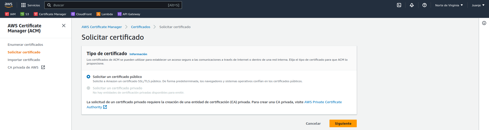
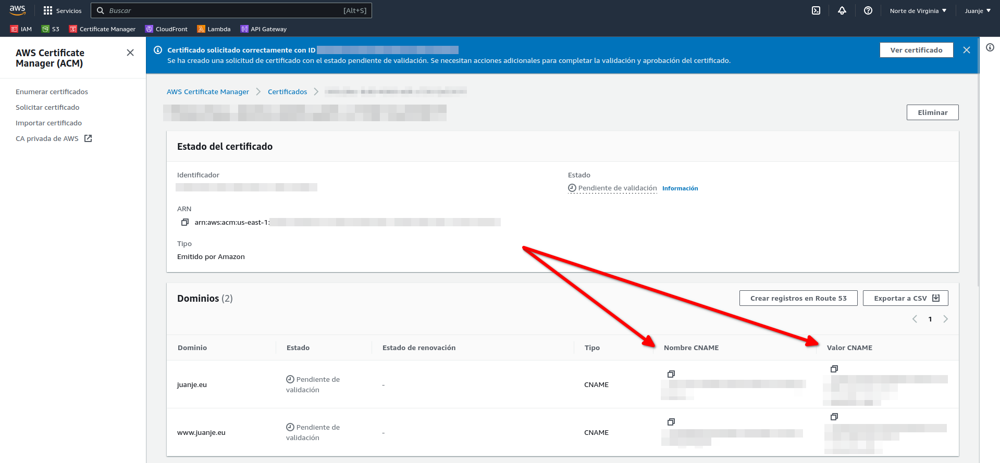
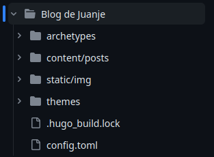

Documentation of ASIR's 2nd year final project by Juan Jesús Alejo Sillero.

<!--more-->

> **⚠️ DISCLAIMER: Please note that this article is a manual translation of the Spanish version. The screenshots may have been originally taken in Spanish, and some words/names may not match completely. If you find any errors, please [report them to the author](#profile). ⚠️**

## **Description**

The goal of the project is to implement a static website using a GitHub Actions CI/CD pipeline that automatically deploys the website on AWS from the markdown files that we will upload to the repository. Specifically, the static files will be located in an S3 bucket.

This type of configuration is known as *serverless* since we completely dispense with having an instance/machine serving the content 24/7.

The infrastructure will be managed using Terraform.

## **Technologies to be used**


### **Amazon Web Services (AWS)**

- [Amazon Web Services](https://aws.amazon.com/) is a cloud service provider, providing storage, computing, databases and much more in terms of cloud computing.

The following AWS services will be used throughout this project:

- **IAM**: [Identity and Access Management](https://aws.amazon.com/iam/) is a service that allows us to manage access to AWS resources in a secure way. It will allow us to create a user with permissions to manage the resources to be created, avoiding, as recommended by best practices, using the root user of the account.

- **ACM**: [Amazon Certificate Manager](https://aws.amazon.com/certificate-manager/) allows us to manage SSL/TLS certificates for our domains.

- **S3**: [Amazon Simple Storage Service](https://aws.amazon.com/s3/) is an object storage service that provides scalability, data availability, security and performance. I will use it to store static web files.

- **CloudFront**: [Amazon CloudFront](https://aws.amazon.com/cloudfront/) is a content delivery network (CDN) service that allows us to deliver content to users around the world with low latency and high transfer speeds. It will be useful to improve web performance and reduce loading time. Although its impact will not be as noticeable in this project due to the small amount of content to be served, it is worth investigating its operation for future, more complex projects.

- **AWS CLI**: [AWS Command Line Interface](https://aws.amazon.com/cli/) is a tool that allows us to interact with AWS services from the command line. To upload static files to S3.

> It is worth noting that AWS has different locations (regions) where resources can be deployed. My infrastructure will be located in the `us-east-1` region (Northern Virginia) as it offers the most services and integrations.

### **Terraform**

- [Terraform](https://www.terraform.io/) is an Infrastructure-as-Code (IaC) tool that allows us to create, modify and version infrastructure securely and efficiently across different cloud service providers. In this project it will be used to create the required infrastructure on AWS.

### **Hugo**

- [Hugo](https://gohugo.io/) is a static website builder framework (*the fastest in the world according to its own website*) written in Go. It allows me to generate the website from markdown files that I upload to the GitHub repository.

### **GitHub Actions**

- [GitHub Actions](https://github.com/features/actions) is a continuous integration and delivery (CI/CD) service that allows us to automate tasks. It will be responsible for detecting changes to the repository and performing the necessary steps to generate and deploy the web to AWS, calling Hugo, Terraform and AWS CLI in the process.

## **Expected results**

The goal of the project would be to automatically generate and deploy a website and its infrastructure from the files we upload to the GitHub repository.

Any changes we make to the repository will be automatically reflected in the website.

## **Price**

The project focuses on the ability to run a static (lightweight) website at no cost, so the free tiers of AWS will be used ([list of free services](https://aws.amazon.com/free/?all-free-tier.sort-by=item.additionalFields.SortRank&all-free-tier.sort-order=asc&awsf.Free%20Tier%20Types=*all&awsf.Free%20Tier%20Categories=*all)).

The only cost to consider is the cost of registering a domain, which can be less than €2 per year depending on the provider.

> We could get a domain from Route 53 and avoid leaving the AWS ecosystem, but this is usually more expensive than other providers (depending on availability and offers).

## **Why automate the deployment of a static website?**

Task automation is a widespread practice in the IT world, and especially in the DevOps philosophy. It allows us to save time and effort, as well as reducing the possibility of making mistakes.

For this reason, it is interesting to start learning with a smaller project like this one, which will allow us to familiarise ourselves with the technologies to be used and serve as a basis for more complex projects.

## **Preparing the environment**

Before you start setting up the infrastructure, you need to prepare your working environment.

If you do not already have an account on Amazon Web Services and GitHub, you will need to create one before proceeding.

### **Setting up MFA**

If you have not already done so, or if you have just created an account on [AWS] (https://aws.amazon.com/), it is advisable to configure multi-factor authentication (MFA). After all, AWS is a service that can cost you a lot of money, so any protection against credential theft is worth considering.

To do this, we will access the AWS (web) console and search for the IAM service. Once accessed, we will be warned that the account does not have MFA enabled. Follow the instructions and let it run.


In my case, as an Android user, I have and recommend the [Aegis](https://getaegis.app) application as it is open source and has worked very well for me (in addition to its many configuration options, which I will not go into here). For iOS users, [Raivo OTP](https://raivo-otp.com/) is an alternative.


With MFA enabled, the next step is to create an alternate user to the root user of the AWS account.

### **IAM user creation**

We will create a user with programmatic access. Log in to the AWS (web) console as root and locate the IAM service:


Navigate to the Users section and create a user:


We give it a name (*u.ProyectoIntegrado*):


In the next screen we select the *Attach Policies Directly* option and search for the *AdministratorAccess* policy:


Click *Next*, assign labels if necessary, check that everything is correct and create the user:


Once the user has been created, we need to generate some credentials. To do this, click on the user:


And select *Security credentials*:


Scroll down to the *Access Keys* section and select *Create Access Key*:


Select the use case:


In the next screen, we can give the key a description if we wish. After that, we have finished creating the key:


> **IMPORTANT**: At this point we will be shown the Access Key and the Secret Key. We must keep these in a safe place as we will not be able to access the secret key again.

### **Creating an SSL Certificate**

In order to use HTTPS on our website, we need an SSL certificate. To get one for free and easily, I will use AWS Certificate Manager (ACM).

We go to the AWS (web) console and look for the ACM service:


Select *Request a Certificate* and choose *Public*:




In the next screen we enter our domain (in my case `juanje.eu` and `www.juanje.eu`), the rest of the options can be left by default (DNS validation and RSA 2048):


When finished, we will see the certificate and a warning that it is pending validation:


To validate it, we need to create a DNS record, the data to be used can be seen if we open the certificate:



We copy the data and go to our domain provider, add the corresponding DNS records and wait for them to be validated:


After a few minutes (waiting time may vary) the certificate is validated:


Now that we have our SSL certificate, we can move on to creating the repository to upload all the code we are going to create next.

### **Creating the GitHub repository**

I will be using Git and GitHub to manage the code. First, I will create a repository on GitHub called `Proyecto-Integrado-ASIR`:


Then I create a local folder where I will put all the code I create and connect it to my remote repository:

```bash
mkdir Proyecto-Integrado-ASIR

cd Proyecto-Integrado-ASIR

echo "# Proyecto-Integrado-ASIR" >> README.md

git init

git add README.md

git commit -m "first commit"

git branch -M main

git remote add origin https://github.com/JuanJesusAlejoSillero/Proyecto-Integrado-ASIR.git

git push -u origin main
```

This will have created our repository and connected it to our local folder, ready to store code.

## **Terraform**

To set up the infrastructure I will be using Terraform, an open source tool developed by HashiCorp that allows us to create, modify and version it in a simple (**declarative**) way.

Terraform configuration files are written in HCL (HashiCorp Configuration Language).

Its operation is divided into 3 phases, which work as follows

- **terraform init**: Initialises the project, downloading the necessary plugins for the providers we have declared in its configuration (in our case, AWS).

  

- **terraform plan**: Shows the changes to be made based on the configuration files we have written.

  

- **terraform apply**: Applies the changes shown in the previous phase.

  

Each object managed by Terraform is called a resource, this can be an instance, a database, a certificate, etc.

The lifecycle of the resources is completely managed, from the moment they are created until they are destroyed. Terraform will take care of creating, modifying and deleting the resources we have defined in the configuration files.

If a resource is modified in parallel via the AWS Web Console or another tool, when executing a `terraform apply` later, Terraform will take care of restoring the resource to the state defined by us in the configuration files, reversing any changes that may have been made.

Terraform stores changes to the state of the infrastructure in a state file. This file can be stored locally or on a remote backend.

Due to the nature of this project, the state file will be stored in an S3 bucket (remote backend), so we need to create it before starting with the Terraform configuration.

### **Create the S3 bucket for the remote state**

We access the AWS (web) console and look for the S3 service:


Create a bucket:


We give it a name that must be unique (`juanje-terraform-state`) and select the region where we want the bucket to be created (`us-east-1`), we won't need to modify the other default options:


With the remote state bucket created, we can move on to the Terraform configuration.

### **Configuring Terraform**

To configure Terraform, I will create a folder called *Terraform* in the repository we created earlier. Now we have two options, create a configuration file for each resource or create one general configuration file for all resources. For ease of organisation I will use the first option, so I will create the following files (their names are not important, but the extension and content is):

- **remote-state.tf**: Remote state configuration file.

- **provider.tf**: Terraform providers configuration file. A provider is a plugin that allows us to interact with an infrastructure provider (in our case, AWS).

- **variables.tf**: File containing the variables we will use in the resource configuration files.

- **bucket-s3.tf**: S3 bucket configuration file.

- **cloudfront.tf**: Configuration file for the CloudFront distribution.

The first file to create is the remote state file:

```terraform
/*
  remote-state.tf
  Remote state configuration file for the Terraform + AWS project
*/

terraform {
  backend "s3" {
    bucket = "juanje-terraform-state"
    key    = "terraform.tfstate"
    region = "us-east-1"
  }
}
```

First, we specify that the backend we will use is S3 and pass it the name of the bucket we created earlier for this purpose, the name of the state file (we can also pass a path to it as `state/file.tfstate`) and the region where the bucket is located, it is quite simple.

Contents of *provider.tf*:

```terraform
/*
  providers.tf
  Providers file for the Terraform + AWS project
*/

terraform {
  required_providers {
    aws = {
      source  = "hashicorp/aws"
      version = "~> 5.0.0"
    }
  }
}

provider "aws" {
  region = var.aws_region
}
```

In this file we specify our requirement for the AWS provider (`hashicorp/aws`) with a version equal to or higher than 5.0.0 (but allowing only minor version changes to avoid future compatibility problems). Additionally, we will provide the region to be used as a variable, which will be defined in the *variables.tf* file.

The *variables.tf* file:

```terraform
/*
  variables.tf
  Variables file for the Terraform + AWS project

  Variables en uso en los ficheros:
    - providers.tf
    - bucket-s3.tf
    - cloudfront.tf
*/

variable "aws_region" {
  type = string
  default = "us-east-1"
}

variable "domain" {
  type = string
  default = "www.juanje.eu"
}

variable "aws_arn_certificado" {
  type = string
  default = "arn:aws:acm:us-east-1:540012000352:certificate/958c20ac-8c69-4809-adfc-c75812e3587f"
}
```

Here we define the AWS region we will be using, giving it the default value of `us-east-1` (Northern Virginia), the domain of our website, which we will use to name the S3 bucket that will hold the static files, and the ARN (Amazon Resource Name) of the SSL certificate we created earlier.

The file *bucket-s3.tf*:

```terraform
/*
  bucket-s3.tf
  S3 bucket configuration file that will hold the static web files for the Terraform + AWS project.
*/

// Create the S3 bucket with the variable name "domain":
resource "aws_s3_bucket" "bucket-s3" {
  bucket = var.domain
  force_destroy = true
}

// Configuration to enable the storage of static websites in the S3 bucket:
resource "aws_s3_bucket_website_configuration" "bucket-s3-static" {
  bucket = aws_s3_bucket.bucket-s3.id
  index_document {
    suffix = "index.html"
  }
  error_document {
    key = "404.html"
  }
}

// Settings to enable public access to the S3 bucket:
resource "aws_s3_bucket_public_access_block" "bucket-s3-public" {
  bucket = aws_s3_bucket.bucket-s3.id
  block_public_acls       = false
  block_public_policy     = false
  ignore_public_acls      = false
  restrict_public_buckets = false
}

resource "aws_s3_bucket_policy" "bucket-s3-policy" {
  bucket = aws_s3_bucket.bucket-s3.id
  policy = jsonencode({
    Version = "2012-10-17"
    Statement = [
      {
        Sid = "PublicReadGetObject"
        Effect = "Allow"
        Principal = "*"
        Action = [
          "s3:GetObject"
        ]
        Resource = [
          "${aws_s3_bucket.bucket-s3.arn}/*"
        ]
      }
    ]
  })
}
```

This one is a little denser than the previous ones, but not very complicated:

1. First, we create the S3 bucket with the variable name `domain` and tell it to be forcibly destroyed when the resource is deleted, otherwise the bucket could not be deleted if it had content.

2. Next, we configure the bucket to store static websites, specifying the name of the bucket and the names of the files that will be the main page and the error page.

3. Finally, we configure the bucket to be public and add a policy so that files can be read.

The final file, *cloudfront.tf*:

```terraform
/*
  cloudfront.tf
  CloudFront distribution configuration file for the Terraform + AWS project
*/

// Caching policy for CloudFront distribution:
data "aws_cloudfront_cache_policy" "Managed-CachingOptimized" {
  id = "658327ea-f89d-4fab-a63d-7e88639e58f6"
}

// Creating the CloudFront distribution:
resource "aws_cloudfront_distribution" "cloudfront" {
  enabled             = true
  is_ipv6_enabled     = false
  aliases = [var.domain]
  default_root_object = "index.html"

  origin {
    domain_name = aws_s3_bucket_website_configuration.bucket-s3-static.website_endpoint
    origin_id   = aws_s3_bucket_website_configuration.bucket-s3-static.website_endpoint
    custom_origin_config {
      http_port              = 80
      https_port             = 443
      origin_protocol_policy = "http-only"
      origin_ssl_protocols   = ["TLSv1.2"]
    }
  }

  default_cache_behavior {
    compress               = true
    viewer_protocol_policy = "redirect-to-https"
    allowed_methods  = ["GET", "HEAD"]
    cached_methods   = ["GET", "HEAD"]
    target_origin_id = aws_s3_bucket_website_configuration.bucket-s3-static.website_endpoint
    cache_policy_id = data.aws_cloudfront_cache_policy.Managed-CachingOptimized.id
  }

  price_class = "PriceClass_100"

  viewer_certificate {
    acm_certificate_arn = var.aws_arn_certificado
    ssl_support_method  = "sni-only"
    minimum_protocol_version = "TLSv1.2_2021"
  }

  restrictions {
    geo_restriction {
      restriction_type = "none"
    }
  }
}
```

In its syntax, it is specified that

1. We define the cache policy we will use by its ID, which is the one recommended by AWS for static websites.

2. Then, we create the CloudFront distribution, specifying that it is enabled, does not use IPv6, that the domain name is the one from the `domain` variable, and the default file is `index.html`.

3. In the second half, we indicate that the origin of the distribution will be the S3 bucket we defined earlier, it can compress files, redirect all HTTP connections to HTTPS, specify the pricing class (geographical locations of CloudFront CDN), the SSL certificate it will use, and that it doesn't impose any geographic restrictions.

With these 5 files, our entire infrastructure would be defined:


We upload them to GitHub:

```bash
git add .

git commit -m "Archivos Terraform"

git push
```


## **Hugo**

To create the static website, I will use Hugo (extended). On Ubuntu 22.04, I have installed it as follows ([instructions for other operating systems](https://gohugo.io/installation/)):

```bash
sudo apt update

sudo apt install hugo
```

We create the folder for the new site:

```bash
hugo new site "Blog de Juanje"

cd "Blog de Juanje"
```

We install the theme we want, in my case, [terminal](https://themes.gohugo.io/hugo-theme-terminal/):

```bash
git init

git submodule add -f https://github.com/panr/hugo-theme-terminal.git themes/terminal
```

To configure it, I edit the config.toml file with the content provided in the [documentation](https://themes.gohugo.io/themes/hugo-theme-terminal/#how-to-configure) and customize it to my liking.

> **IMPORTANT**: To avoid issues, as mentioned in [this GitHub issue](https://github.com/gohugoio/hugo/issues/8587#issuecomment-851018525), we must remove the `baseURL` parameter from the `config.toml` file. In my case, if I had it, the website didn't function correctly after uploading it to AWS.

To create a new post, we run:

```bash
hugo new posts/mi-entrada.md
```

After writing it, we can see the result with:

```bash
hugo server -D
```

And accessing the provided address (usually [http://localhost:1313/](http://localhost:1313/)).


After checking that it works correctly, we remove the `resources` folder created when running the previous command:

```bash
rm -rf resources
```

It would look like this:


And we upload the content to GitHub:

```bash
git add .

git commit -m "Archivos Hugo"

git push
```



## **GitHub**

### **GitHub Actions**

To automate the process of creating the static website and uploading it to S3, I will use a GitHub Actions *workflow*. *Workflows* are configuration files written in YAML that allow automation of processes on GitHub. In my case, I will create one that runs every time a *push* is made to the directories containing Terraform or Hugo files.

The file will be named `workflow.yaml` and must be located in the `.github/workflows` folder:

```bash
mkdir -p .github/workflows

touch .github/workflows/workflow.yaml
```

The content of the file will be as follows:

```yaml
#
# hugo-deploy.yaml
# GitHub Actions configuration file for:
# 1. Verifying and deploying the infrastructure with Terraform when a push is made to the "Terraform" or "Blog de Juanje" directories.
# 2. Building the website with Hugo and deploying it to S3 when a push is made to the "Blog de Juanje" directory.
#

name: "Workflow"

on:
  push:
    branches:
      - main
    paths:
      - "Terraform/**"
      - "Blog de Juanje/**"

env:
  AWS_REGION: "us-east-1"
  AWS_ACCESS_KEY_ID: ${{ secrets.AWS_ACCESS_KEY_ID }}
  AWS_SECRET_ACCESS_KEY: ${{ secrets.AWS_SECRET_ACCESS_KEY }}

jobs:
  terraform:
    name: "Terraform"
    runs-on: ubuntu-latest
    defaults:
      run:
        working-directory: "Terraform"
    steps:
      - name: "Clone repository"
        uses: actions/checkout@v3
      - name: "Setup Terraform"
        uses: hashicorp/setup-terraform@v2.0.3
      - name: "Terraform Init"
        timeout-minutes: 2
        run: terraform init -input=false
      - name: "Terraform Apply"
        run: terraform apply -auto-approve
  hugo-deploy:
    needs: terraform
    name: "Hugo + Deploy"
    runs-on: ubuntu-latest
    steps:
      - name: "Clone repository including submodules (for the theme)"
        uses: actions/checkout@v3
        with:
          submodules: recursive
      - name: "Configure AWS CLI credentials"
        uses: aws-actions/configure-aws-credentials@v1
        with:
          aws-access-key-id: ${{ secrets.AWS_ACCESS_KEY_ID }}
          aws-secret-access-key: ${{ secrets.AWS_SECRET_ACCESS_KEY }}
          aws-region: ${{ env.AWS_REGION }}
      - name: "Setup Hugo"
        uses: peaceiris/actions-hugo@v2.6.0
        with:
          hugo-version: "latest"
          extended: true
      - name: "Build"
        run: |
          cd "Blog de Juanje"
          hugo --minify
      - name: "Deploy to S3"
        run: |
          cd "Blog de Juanje/public"
          aws s3 sync \
            --delete \
            . s3://www.juanje.eu
      - name: "CloudFront Invalidation"
        run: |
          aws cloudfront create-invalidation \
            --distribution-id ${{ secrets.CLOUDFRONT_DISTRIBUTION_ID }} \
            --paths "/*"
```

It's a fairly straightforward file, but I'll detail some parts:

1. First, the name of the *workflow* and when it should run are specified. In this case, it will run when a *push* is made to the `main` branch and any file in the `Terraform` or `Blog de Juanje` directories is modified.

2. Next, the environment variables to be used in the *workflow* are defined. In this case, the AWS credentials and the region.

3. Then, the *jobs* to be executed are defined. Two in this case:

   - `terraform`: It will run on an Ubuntu virtual machine and will be responsible for verifying and deploying the infrastructure with Terraform if necessary. To do this, it will first clone the repository, install Terraform, initialize it, and apply the plan.

   - `hugo-deploy`: It will run on another Ubuntu virtual machine and will be responsible for building the website with Hugo and deploying it to S3, but it will only execute if the terraform *job* completes successfully, thus avoiding any attempt to upload the website files if the infrastructure is not ready. To achieve this, it will first clone the repository including the theme submodule, configure AWS CLI credentials, install Hugo, create the website files, sync them with our S3 bucket, and invalidate CloudFront cache to have the changes available immediately.

### **Secrets**

For the *workflow* to run successfully, we need to create some *secrets* in our repository. To do this, on the GitHub website, go to `Settings > Secrets and variables > Actions > New repository secret`, and create the following secrets with their respective values:


## **Testing**

At this point, we can now *push* to one of the directories specified in the *workflow* (`Terraform` or `Blog de Juanje`) and verify that everything runs correctly:



As we can see, the entire CI/CD pipeline has run successfully, and we now have our static website deployed, serverless, without worrying about managing the infrastructure or the HTML/CSS/JS code.

## **Useful links**

In addition to the bibliography listed below, it's important to mention that all the code for Terraform, Hugo, and GitHub Actions can be found in [the GitHub repository of this project](https://github.com/JuanJesusAlejoSillero/Proyecto-Integrado-ASIR), in the `Terraform`, `Blog de Juanje` and `.github/workflows` directories respectively.

The full project documentation is this very post you are reading.

## **Bibliography**

In order to carry out this project, I have collected and used bits from many, many sources, as I have not been able to find one that I could follow from start to finish without encountering a myriad of issues (outdated configurations, errors in the documentation, lack of clarity in the explanations, infrastructures that are too complex or incompatible with my project, etc.). I classify them below to try and facilitate the search for information.

### **Official documentation**

#### **Amazon Web Services**

- [Interfaz de la línea de comandos - AWS CLI - AWS](https://aws.amazon.com/es/cli/)

- [Choosing the price class for a CloudFront distribution - Amazon CloudFront](https://docs.aws.amazon.com/AmazonCloudFront/latest/DeveloperGuide/PriceClass.html?icmpid=docs_cf_help_panel)

- [Setting permissions for website access - Amazon Simple Storage Service](https://docs.aws.amazon.com/AmazonS3/latest/userguide/WebsiteAccessPermissionsReqd.html)

- [Hosting a static website using Amazon S3 - Amazon Simple Storage Service](https://docs.aws.amazon.com/AmazonS3/latest/userguide/WebsiteHosting.html)

- [Regiones y zonas de disponibilidad de la infraestructura global](https://aws.amazon.com/es/about-aws/global-infrastructure/regions_az/)

- [Regions, Availability Zones, and Local Zones - Amazon Relational Database Service](https://docs.aws.amazon.com/AmazonRDS/latest/UserGuide/Concepts.RegionsAndAvailabilityZones.html)

- [Regions and Zones - Amazon Elastic Compute Cloud](https://docs.aws.amazon.com/AWSEC2/latest/UserGuide/using-regions-availability-zones.html)

- [Installing or updating the latest version of the AWS CLI - AWS Command Line Interface](https://docs.aws.amazon.com/cli/latest/userguide/getting-started-install.html#cliv2-linux-install)

- [Uso de la capa gratuita de AWS - Facturación de AWS](https://docs.aws.amazon.com/es_es/awsaccountbilling/latest/aboutv2/billing-free-tier.html#avoid-charges-after-free-tier)

- [Automate static website deployment to Amazon S3 - AWS Prescriptive Guidance](https://docs.aws.amazon.com/prescriptive-guidance/latest/patterns/automate-static-website-deployment-to-amazon-s3.html)

#### **Terraform**

- [Terraform CLI: Commands - Terraform by HashiCorp](https://developer.hashicorp.com/terraform/cli/commands/init)

- [Terraform CLI: Meta-arguments - Terraform by HashiCorp](https://developer.hashicorp.com/terraform/language/meta-arguments/depends_on)

- [Provider Configuration - Configuration Language | Terraform | HashiCorp Developer](https://developer.hashicorp.com/terraform/language/providers/configuration)

- [Syntax - Configuration Language | Terraform | HashiCorp Developer](https://developer.hashicorp.com/terraform/language/syntax/configuration)

- [Variables - Configuration Language | Terraform | HashiCorp Developer](https://developer.hashicorp.com/terraform/language/values/variables)

- [Command: init | Terraform | HashiCorp Developer](https://developer.hashicorp.com/terraform/cli/commands/init)

- [The depends_on Meta-Argument - Configuration Language | Terraform | HashiCorp Developer](https://developer.hashicorp.com/terraform/language/meta-arguments/depends_on)

- [Backend Type: s3 | Terraform | HashiCorp Developer](https://developer.hashicorp.com/terraform/language/settings/backends/s3)

- [Input Variables - Configuration Language | Terraform | HashiCorp Developer](https://developer.hashicorp.com/terraform/language/values/variables)

- [Host a Static Website with S3 and Cloudflare | Terraform | HashiCorp Developer](https://developer.hashicorp.com/terraform/tutorials/applications/cloudflare-static-website)

- [Automate Terraform with GitHub Actions | Terraform | HashiCorp Developer](https://developer.hashicorp.com/terraform/tutorials/automation/github-actions)

- [Build Infrastructure | Terraform | HashiCorp Developer](https://developer.hashicorp.com/terraform/tutorials/aws-get-started/aws-build)

- [Docs overview | hashicorp/aws | Terraform Registry](https://registry.terraform.io/providers/hashicorp/aws/latest/docs)

- [aws_cloudfront_cache_policy | Data Sources | hashicorp/aws | Terraform Registry](https://registry.terraform.io/providers/hashicorp/aws/latest/docs/data-sources/cloudfront_cache_policy)

- [aws_iam_policy_document | Data Sources | hashicorp/aws | Terraform Registry](https://registry.terraform.io/providers/hashicorp/aws/latest/docs/data-sources/iam_policy_document)

- [aws_cloudfront_distribution | Resources | hashicorp/aws | Terraform Registry](https://registry.terraform.io/providers/hashicorp/aws/latest/docs/resources/cloudfront_distribution)

- [aws_cloudfront_origin_access_identity | Resources | hashicorp/aws | Terraform Registry](https://registry.terraform.io/providers/hashicorp/aws/latest/docs/resources/cloudfront_origin_access_identity)

- [aws_s3_bucket | Resources | hashicorp/aws | Terraform Registry](https://registry.terraform.io/providers/hashicorp/aws/latest/docs/resources/s3_bucket)

- [aws_s3_bucket_policy | Resources | hashicorp/aws | Terraform Registry](https://registry.terraform.io/providers/hashicorp/aws/latest/docs/resources/s3_bucket_policy)

- [aws_s3_bucket_public_access_block | Resources | hashicorp/aws | Terraform Registry](https://registry.terraform.io/providers/hashicorp/aws/latest/docs/resources/s3_bucket_public_access_block.html)

- [aws_cloudfront_distribution | Resources | hashicorp/aws | Terraform Registry](https://registry.terraform.io/providers/hashicorp/aws/latest/docs/resources/cloudfront_distribution#price_class)

- [aws_s3_bucket_website_configuration | Resources | hashicorp/aws | Terraform Registry](https://registry.terraform.io/providers/hashicorp/aws/latest/docs/resources/s3_bucket_website_configuration)

- [Automate Terraform with GitHub Actions | Terraform - HashiCorp Developer](https://developer.hashicorp.com/terraform/tutorials/automation/github-actions)

#### **Hugo**

- [Shortcodes | Hugo](https://gohugo.io/content-management/shortcodes/)

- [Quick Start | Hugo](https://gohugo.io/getting-started/quick-start/)

- [Basic usage | Hugo](https://gohugo.io/getting-started/usage/)

- [gohugoio/hugoBasicExample: Example site to use with Hugo & Hugo Themes](https://github.com/gohugoio/hugoBasicExample)

- [terminal | Hugo Themes](https://themes.gohugo.io/themes/hugo-theme-terminal/)

#### **Git, GitHub and GitHub Actions**

- [Contexts - GitHub Docs](https://docs.github.com/en/actions/learn-github-actions/contexts#context-availability)

- [Workflow syntax for GitHub Actions - GitHub Docs](https://docs.github.com/en/actions/using-workflows/workflow-syntax-for-github-actions#jobsjob_iddefaultsrun)

- [Workflow syntax for GitHub Actions - GitHub Docs](https://docs.github.com/en/actions/using-workflows/workflow-syntax-for-github-actions#jobsjob_idneeds)

- [Ignoring files - GitHub Docs](https://docs.github.com/en/get-started/getting-started-with-git/ignoring-files)

- [Set up Git - GitHub Docs](https://docs.github.com/en/get-started/quickstart/set-up-git)

- [Conectar a GitHub con SSH - Documentación de GitHub](https://docs.github.com/es/authentication/connecting-to-github-with-ssh)

- [Hugo setup · Actions · GitHub Marketplace](https://github.com/marketplace/actions/hugo-setup)

- [HashiCorp - Setup Terraform · Actions · GitHub Marketplace](https://github.com/marketplace/actions/hashicorp-setup-terraform)

### **Blogs, forums, discussions, and text-based websites**

- [AWS Breaking (Change) News: New S3 Buckets Blocked For Public Access | by Adam Fisher / fisher king (@therightstuff) | Apr, 2023 | AWS Tip](https://awstip.com/aws-breaking-change-news-new-s3-buckets-blocked-for-public-access-ad83d626afb4)

- [How was this "Hello there!" section done on the official website? · Issue #187 · panr/hugo-theme-terminal](https://github.com/panr/hugo-theme-terminal/issues/187)

- [Blogging With Hugo | Justin James](https://digitaldrummerj.me/series/blogging-with-hugo/)

- [foo-dogsquared/hugo-theme-arch-terminal-demo: Demo of the Hugo Terminal Plus-Minus theme](https://github.com/foo-dogsquared/hugo-theme-arch-terminal-demo)

- [Multi Host support - Allow BaseURL to generate dynamically at runtime - window.location.hostname · Issue #8587 · gohugoio/hugo](https://github.com/gohugoio/hugo/issues/8587#issuecomment-851018525)

- [How to Set Up a Remote Backend for Terraform State File with Amazon S3](https://sumanprasad.hashnode.dev/how-to-set-up-a-remote-backend-for-terraform-state-file-with-amazon-s3#heading-step-1-create-an-s3-bucket)

- [How To Upload File to S3 with the AWS CLI](https://adamtheautomator.com/upload-file-to-s3/)

- [What happened to github.event.head_commit.modified? · community · Discussion #25597](https://github.com/orgs/community/discussions/25597)

- [How to Host a Website on S3 Without Getting Lost in the Sea | by Kyle Galbraith | Medium](https://medium.com/@kyle.galbraith/how-to-host-a-website-on-s3-without-getting-lost-in-the-sea-e2b82aa6cd38)

- [amazon web services - Missing Authentication Token while accessing API Gateway? - Stack Overflow](https://stackoverflow.com/questions/39655048/missing-authentication-token-while-accessing-api-gateway)

- [github - Running actions in another directory - Stack Overflow](https://stackoverflow.com/questions/58139175/running-actions-in-another-directory/63122434#63122434)

- [continuous integration - Dependencies Between Workflows on Github Actions - Stack Overflow](https://stackoverflow.com/questions/58457140/dependencies-between-workflows-on-github-actions)

- [How Caching and Invalidations in AWS CloudFront works - Knoldus Blogs](https://blog.knoldus.com/how-caching-and-invalidations-in-aws-cloudfront-works/)

- [How to manually invalidate AWS CloudFront | by Christina Hastenrath | Medium](https://christinavhastenrath.medium.com/how-to-manually-invalidate-aws-cloudfront-b36a2ab4e1be)

- [How to use Cloudfront for Secure Delivery of Static Websites Around the World | by Kyle Galbraith | Medium](https://medium.com/@kyle.galbraith/how-to-make-use-of-cloudfront-for-secure-delivery-of-static-websites-to-the-world-d2f54e8b096)

- [docker - How can I make a GitHub Workflow depend on the success of another workflow? - Stack Overflow](https://stackoverflow.com/questions/62367778/how-can-i-make-a-github-workflow-depend-on-the-success-of-another-workflow)

- [Running GitHub Actions Sequentially | Steven M. Mortimer](https://stevenmortimer.com/running-github-actions-sequentially/)

- [Amazon S3 to apply security best practices for all new buckets - Help Net Security](https://www.helpnetsecurity.com/2023/02/07/amazon-s3-bucket-security/)

- [AWS S3 Sync Examples - Sync S3 buckets AWS CLI | Devops Junction](https://www.middlewareinventory.com/blog/aws-s3-sync-example/)

- [How to create programmatic access user in AWS](https://www.simplified.guide/aws/iam/create-programmatic-access-user)

- [permissions - Amazon Cloudfront with S3. Access Denied - Server Fault](https://serverfault.com/questions/581268/amazon-cloudfront-with-s3-access-denied)

- [amazon web services - How to delete an aws cloudfront Origin Access Identity - Stack Overflow](https://stackoverflow.com/questions/34546835/how-to-delete-an-aws-cloudfront-origin-access-identity)

- [amazon web services - AWS CLI CloudFront Invalidate All Files - Stack Overflow](https://stackoverflow.com/questions/37759949/aws-cli-cloudfront-invalidate-all-files)

- [amazon web services - AWS CloudFront access denied to S3 bucket - Stack Overflow](https://stackoverflow.com/questions/42251745/aws-cloudfront-access-denied-to-s3-bucket)

- [amazon web services - Cloudfront with S3 static site hosting responds with 504 error - Stack Overflow](https://stackoverflow.com/questions/68506497/cloudfront-with-s3-static-site-hosting-responds-with-504-error)

- [Need help with Cloudfront, S3 https redirection error 504 : r/aws](https://www.reddit.com/r/aws/comments/es7bw6/need_help_with_cloudfront_s3_https_redirection/)

- [Building a site with Hugo, using GitHub, Amazon S3 and CloudFront with HTTPS and extensionless URLs · The Angry Dev](https://bizzeh.com/hugo-github-aws-s3-cloudfront-ssl-extensionless/)

- [Create your own blog with hugo and S3 - Cibermanchego](http://cibermanchego.com/en/post/2022-01-12-create-your-own-blog-with-hugo-and-s3/)

- [How to deploy an S3 Bucket in AWS- using Terraform - Knoldus Blogs](https://blog.knoldus.com/how-to-deploy-an-s3-bucket-in-aws-using-terraform/)

- [How to Create an S3 Bucket with Terraform | Pure Storage Blog](https://blog.purestorage.com/purely-informational/how-to-create-an-s3-bucket-with-terraform/)

- [How to Create S3 Bucket Policy using Terraform - CloudKatha](https://cloudkatha.com/how-to-create-s3-bucket-policy-using-terraform/)

- [Terraform Remote State with AWS S3 and DynamoDB](https://dangibbs.uk/blog/terraform-remote-state-aws-s3-dynamodb/)

- [Host a static website locally using Simple Storage Service (S3) and Terraform with LocalStack | Docs](https://docs.localstack.cloud/tutorials/s3-static-website-terraform/)

- [Terraform doesn't understand that website_endpoint will change value · Issue #13393 · hashicorp/terraform-provider-aws](https://github.com/hashicorp/terraform-provider-aws/issues/13393)

- [CloudFront Terraform Examples - Easy AWS Automation 2023](https://hands-on.cloud/cloudfront-terraform-examples/)

- [Terraforming a S3 Website with ACM Certificates, Cloudfront, & Route53 | by Garrett Sweeney | Cloud Tidbits | Medium](https://medium.com/cloud-tidbits/terraforming-an-s3-react-website-with-acm-certificates-cloudfront-route53-150936350074)

- [Terraform Remote States in S3. A simple way to use S3 backend to store… | by Allan Denot | DNX Labs | Medium](https://medium.com/dnx-labs/terraform-remote-states-in-s3-d74edd24a2c4)

- [Create An AWS S3 Website Using Terraform And Github Actions](https://openupthecloud.com/terraform-github-actions/)

- [Hosting a Static Website on AWS S3 using Terraform | by Shashwot Risal | Medium](https://shashwotrisal.medium.com/hostin-a-static-website-on-aws-s3-using-terraform-d27f81246e82)

- [amazon web services - Terraform - AWS IAM user with Programmatic access - Stack Overflow](https://stackoverflow.com/questions/58853125/terraform-aws-iam-user-with-programmatic-access)

- [amazon web services - How to use the the newly introduced aws_cloudfront_cache_policy resource in terraform - Stack Overflow](https://stackoverflow.com/questions/66570259/how-to-use-the-the-newly-introduced-aws-cloudfront-cache-policy-resource-in-terr)

- [Terraform Remote State Storage with AWS S3 & DynamoDB - STACKSIMPLIFY](https://terraformguru.com/terraform-real-world-on-aws-ec2/20-Remote-State-Storage-with-AWS-S3-and-DynamoDB/)

- [Hosting a Secure Static Website on AWS S3 using Terraform (Step By Step Guide) | Alex Hyett](https://www.alexhyett.com/terraform-s3-static-website-hosting/)

- [Deploy Hugo Sites With Terraform and Github Actions (Part 1) | Dennis Martinez](https://dennmart.com/articles/deploy-hugo-sites-with-terraform-and-github-actions-part-1/)

- [Deploy Hugo Sites With Terraform and Github Actions (Part 2) | Dennis Martinez](https://dennmart.com/articles/deploy-hugo-sites-with-terraform-and-github-actions-part-2/)

- [Build a static website using S3 & Route 53 with Terraform - DEV Community](https://dev.to/aws-builders/build-a-static-website-using-s3-route-53-with-terraform-1ele)

- [Guide to Create Github Actions Workflow for Terraform and AWS - DEV Community](https://dev.to/aws-builders/guide-to-create-github-actions-workflow-for-terraform-and-aws-5de2)

- [Github Actions + Hugo + Terraform + S3 | Jérôme Decoster](https://jeromedecoster.github.io/aws/github-actions-hugo-terraform-s3/)

- [Deploy static website to S3 using Github actions - DEV Community](https://dev.to/johnkevinlosito/deploy-static-website-to-s3-using-github-actions-4a0e)

- [github - pull using git including submodule - Stack Overflow](https://stackoverflow.com/questions/8090761/pull-using-git-including-submodule)

- [How to Perform Git Submodule Checkout | phoenixNAP KB](https://phoenixnap.com/kb/git-checkout-submodule)

- [git - How do I remove a submodule? - Stack Overflow](https://stackoverflow.com/questions/1260748/how-do-i-remove-a-submodule)

- [Limpiar caché  |  Public DNS  |  Google for Developers](https://developers.google.com/speed/public-dns/cache?hl=es-419)

### **Video tutorials**

- [AWS Hands-On: Automate AWS Infra Deployment using Terraform and GitHub Actions - YouTube](https://www.youtube.com/watch?t=598&v=scecLqTeP3k&feature=youtu.be)

- [Getting Started With Terraform | Terraform Tutorial | #3 - YouTube](https://www.youtube.com/watch?v=t7XUh0xyhTI&list=PL8HowI-L-3_9bkocmR3JahQ4Y-Pbqs2Nt&t=608s)

- [Data Sources | Terraform Tutorial | #10 - YouTube](https://www.youtube.com/watch?v=9cDDZzl7zow&list=PL8HowI-L-3_9bkocmR3JahQ4Y-Pbqs2Nt&index=10)

- [AWS Tutorial - Website hosting with S3, Route 53 & Cloudfront using Namecheap domain - YouTube](https://www.youtube.com/watch?v=Bmuoqo_JY4g)

- [Creating an IAM User and Generating Access Key on Amazon Web Services AWS - YouTube](https://www.youtube.com/watch?v=HuE-QhrmE1c)

- [Deploy Static Website to AWS S3 with HTTPS using CloudFront - YouTube](https://www.youtube.com/watch?v=o2HTkVxzivA)

- [Static website hosting on Amazon S3 (with CloudFront) without enabling public access. - YouTube](https://www.youtube.com/watch?v=qsJSv7J4s7k)

- [Backends and Remote State | Terraform Tutorial | #17 - YouTube](https://www.youtube.com/watch?v=RBW253A4SvY)

- [AWS Hands-On: Automate AWS Infra Deployment using Terraform and GitHub Actions - YouTube](https://www.youtube.com/watch?v=scecLqTeP3k&t=598s)

- [Terraform Tutorial for Beginners + Labs: Complete Step by Step Guide! - YouTube](https://www.youtube.com/watch?v=YcJ9IeukJL8)

---

✒️ **Documentation written by Juan Jesús Alejo Sillero.**
