Memoria del proyecto integrado de 2º de ASIR de Juan Jesús Alejo Sillero.

<!--more-->

## **Descripción**

El objetivo del proyecto es poner en funcionamiento una web estática utilizando un flujo de CI/CD de GitHub Actions que automáticamente despliegue la web sobre AWS a partir de los ficheros markdown que subiremos al repositorio. En concreto, los ficheros estáticos se encontrarán ubicados en un bucket de S3.

Este tipo de configuración se conoce como *serverless* ya que prescindimos completamente de tener una instancia/máquina sirviendo el contenido 24 horas al día de forma dedicada.

La infraestructura se gestionará utilizando Terraform.

## **Tecnologías a utilizar**


### **Amazon Web Services (AWS)**

- [Amazon Web Services](https://aws.amazon.com/es/) es un proveedor de servicios en la nube, ofrece almacenamiento, computación, bases de datos y un largo etcétera en lo referente a cloud computing.

A lo largo de este proyecto se utilizarán los siguientes servicios de AWS:

- **IAM**: [Identity and Access Management](https://aws.amazon.com/es/iam/) es un servicio que nos permite gestionar el acceso a los recursos de AWS de forma segura. Nos permitirá crear un usuario con permisos para gestionar los recursos que se van a crear, evitando, como recomiendan las buenas prácticas, utilizar el usuario root de la cuenta.

- **ACM**: [Amazon Certificate Manager](https://aws.amazon.com/es/certificate-manager/) nos permite gestionar certificados SSL/TLS para nuestros dominios.

- **S3**: [Amazon Simple Storage Service](https://aws.amazon.com/es/s3/) es un servicio de almacenamiento de objetos que ofrece escalabilidad, disponibilidad de datos, seguridad y rendimiento. Lo utilizaré para almacenar los ficheros estáticos de la web.

- **CloudFront**: [Amazon CloudFront](https://aws.amazon.com/es/cloudfront/) es un servicio de CDN (Content Delivery Network) que nos permite distribuir contenido a usuarios de todo el mundo con baja latencia y altas velocidades de transferencia. Será de utilidad para mejorar el rendimiento de la web y reducir el tiempo de carga. Aunque en este proyecto no se notará tanto su impacto debido a la poca cantidad de contenido que se va a servir, es conveniente explorar su funcionamiento para futuros proyectos más complejos.

- **AWS CLI**: [AWS Command Line Interface](https://aws.amazon.com/es/cli/) es una herramienta que nos permite interactuar con los servicios de AWS desde la línea de comandos. Para subir los ficheros estáticos a S3.

> Cabe mencionar que AWS dispone de diferentes ubicaciones (regiones) en las que se pueden desplegar los recursos. Mi infraestructura se ubicará en la región `us-east-1` (Norte de Virginia) ya que es la que ofrece el mayor número de servicios e integraciones.

### **Terraform**

- [Terraform](https://www.terraform.io/) es una herramienta de infraestructura como código (IaC) que nos permite crear, modificar y versionar la infraestructura de forma segura y eficiente en diferentes proveedores de servicios en la nube. En este proyecto se utilizará para crear la infraestructura necesaria en AWS.

### **Hugo**

- [Hugo](https://gohugo.io/) es un framework generador de sitios web estáticos (*el más rápido del mundo según su propia web*) escrito en Go. Me permitirá generar la web a partir de los ficheros markdown que subiré al repositorio de GitHub.

### **GitHub Actions**

- [GitHub Actions](https://github.com/features/actions) es un servicio de integración y entrega continua (CI/CD) que nos permite automatizar tareas. Será el encargado de detectar los cambios que se produzcan en el repositorio y ejecutar los pasos necesarios para generar y desplegar la web en AWS invocando en el proceso a Hugo, Terraform y AWS CLI.

## **Resultados que se esperan obtener**

La finalidad del proyecto sería contar con una página web y su infraestructura generada y desplegada de forma automática a partir de los ficheros que subamos al repositorio de GitHub.

Cualquier cambio que realicemos en el repositorio se verá reflejado en la web automáticamente.

## **Precio**

El proyecto está enfocado en la posibilidad de poner en funcionamiento una web estática (liviana) a coste cero, por lo que se usarán los tiers gratuitos de AWS ([lista de servicios gratuitos](https://aws.amazon.com/es/free/?all-free-tier.sort-by=item.additionalFields.SortRank&all-free-tier.sort-order=asc&awsf.Free%20Tier%20Types=*all&awsf.Free%20Tier%20Categories=*all)).

El único coste a tener en cuenta será el de registrar un dominio, que según el proveedor puede costarnos incluso menos de 2€ al año.

> Podríamos obtener un dominio con Route 53 evitando así salir del ecosistema de AWS, pero suele ser más caro que en otros proveedores (según disponibilidad y ofertas).

## **¿Por qué automatizar el despliegue de una web estática?**

La automatización de tareas es una práctica muy extendida en el mundo de la informática, y en concreto en la filosofía DevOps. Nos permite ahorrar tiempo y esfuerzo, además de reducir la posibilidad de cometer errores.

Por esto, es interesante comenzar a aprender con un proyecto a menor escala como este, que nos permitirá familiarizarnos con las tecnologías que se van a utilizar y servirá de base para proyectos más complejos.

## **Preparación del entorno**

Antes de comenzar con la configuración de la infraestructura, es necesario preparar el entorno de trabajo.

Si no tenemos cuenta en Amazon Web Services y GitHub, es el momento de crearlas antes de continuar.

### **Configuración de la MFA**

Es recomendable si no lo hemos hecho aún o si acabamos de crear la cuenta en [AWS](https://aws.amazon.com/es/), la configuración de la autenticación multifactor (MFA), al fin y al cabo, AWS es un servicio que puede llegar a incurrir grandes gastos a nuestra cuenta bancaria por lo que cualquier protección ante robos de credenciales debe ser considerada.

Para ello, accedemos a la consola (web) de AWS y buscamos el servicio IAM. Tras acceder a él, nos aparecerá el aviso de que la cuenta no tiene activado MFA. Seguimos las instrucciones y lo dejamos funcionando.

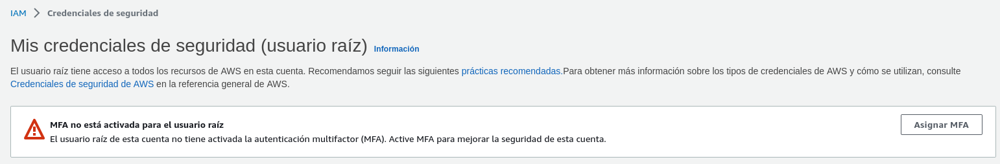

En mi caso, como usuario de Android, tengo y recomiendo la app [Aegis](https://getaegis.app) ya que es de código abierto y me ha funcionado muy bien (además de sus múltiples opciones de configuración que no voy a detallar aquí). Para los usuarios de iOS existe [Raivo OTP](https://raivo-otp.com/) como alternativa.


Con MFA activado, lo siguiente será crear un usuario alternativo al usuario root de la cuenta de AWS.

### **Creación del usuario de IAM**

Crearemos un usuario con acceso programático. Accedemos como usuario root a la consola (web) de AWS y buscamos el servicio IAM:


Navegamos a la sección de usuarios y creamos un usuario:

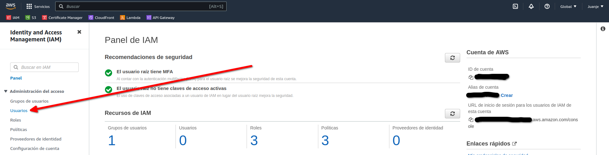

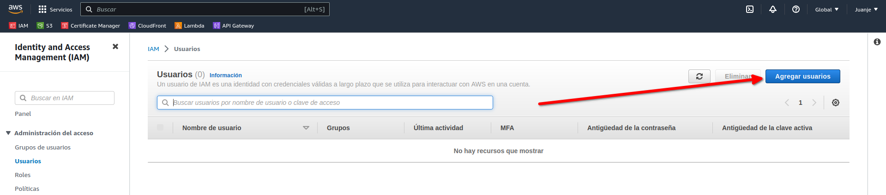

Le damos un nombre (*u.ProyectoIntegrado*):


En la siguiente pantalla, seleccionamos la opción *Adjuntar políticas directamente* y buscamos la política *AdministratorAccess*:

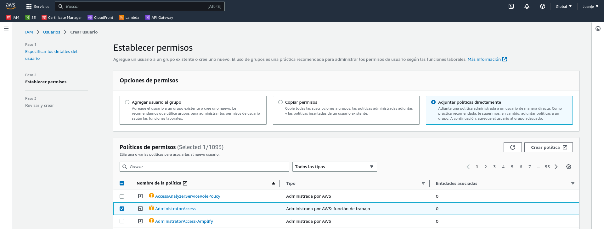

Hacemos click en *Siguiente*, asignamos etiquetas si lo vemos oportuno, revisamos que todo esté correcto y creamos el usuario:

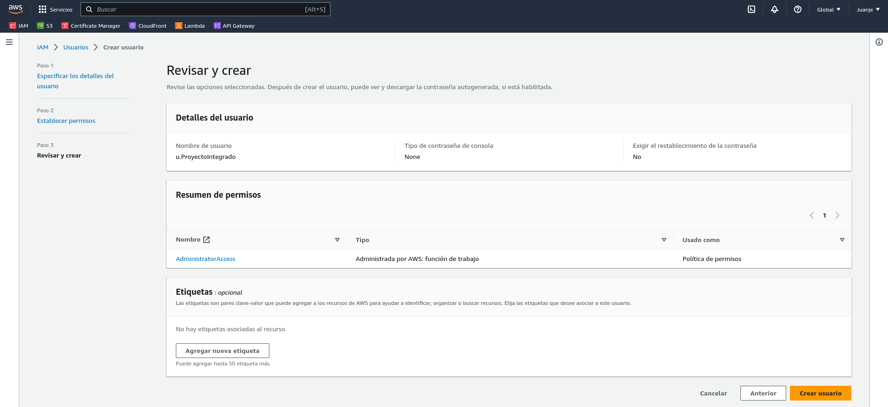

Con el usuario creado, debemos generar unas credenciales de acceso. Para ello, hacemos click en el usuario:

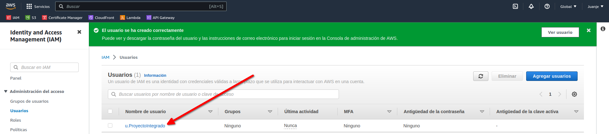

Y seleccionamos *Credenciales de seguridad*:


Bajamos hasta la sección *Claves de acceso* y elegimos *Crear clave de acceso*:

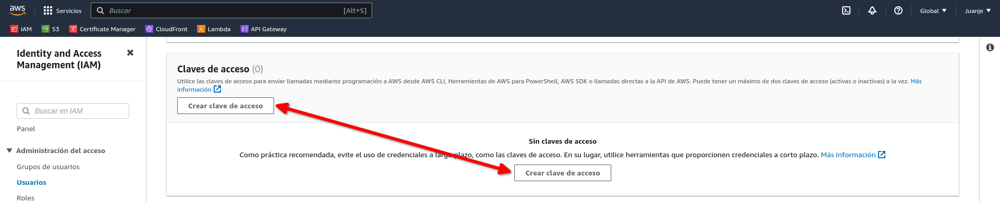

Seleccionamos el caso de uso:


En la siguiente pantalla podremos asignar una descripción a la clave si lo vemos necesario. Tras hacerlo habremos terminado de crear la clave:


> **IMPORTANTE**: En este punto se nos mostrará la clave de acceso y la clave secreta. Debemos guardarlas en un lugar seguro ya que no volveremos a tener acceso a la clave secreta.

### **Creación del certificado SSL**

Para poder utilizar HTTPS en nuestra web, necesitamos un certificado SSL. Para conseguir uno de forma gratuita y sencilla, usaré AWS Certificate Manager (ACM).

Accedemos a la consola (web) de AWS y buscamos el servicio ACM:


Seleccionamos *Solicitar un certificado* y elegimos que sea de tipo *Público*:

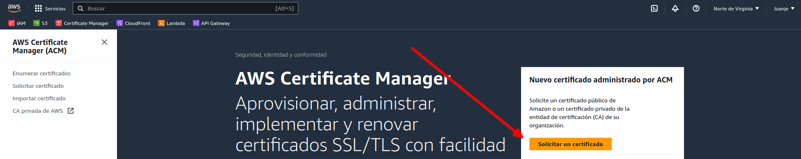


En la siguiente pantalla introducimos nuestro dominio (en mi caso `juanje.eu` y `www.juanje.eu`), el resto de opciones podemos dejarlas por defecto (Validación DNS y RSA 2048):


Al acabar, veremos el certificado y un aviso de que está pendiente de validación:

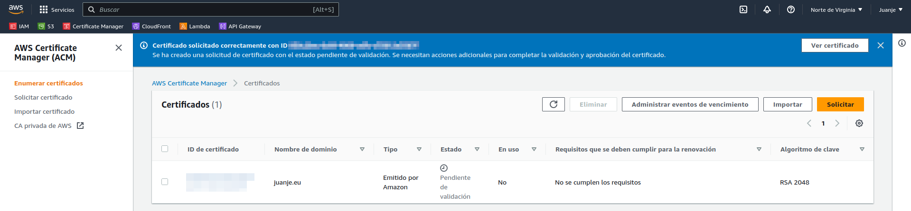

Para validarlo, debemos crear un registro DNS, los datos a usar podremos verlos si abrimos el certificado:


Copiamos los datos y accedemos a nuestro proveedor de dominio, agregamos los registros DNS correspondientes y esperamos a que se validen:


Después de unos minutos (el tiempo de espera puede variar), el certificado estará validado:

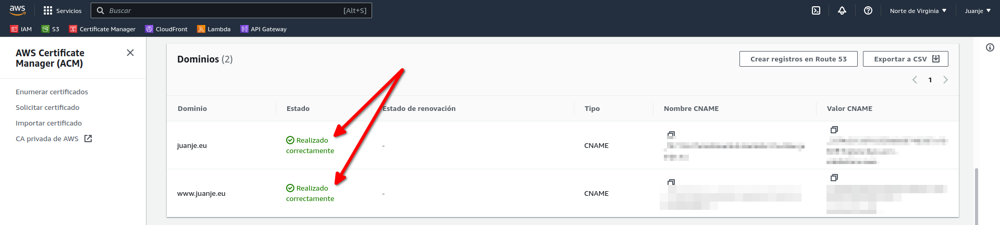

Ahora que ya tenemos nuestro certificado SSL, podemos pasar a crear el repositorio para subir todo el código que a continuación vamos a crear.

### **Creación del repositorio de GitHub**

Para la gestión del código, usaré Git y GitHub. Primero creo un repositorio en GitHub llamado `Proyecto-Integrado-ASIR`:

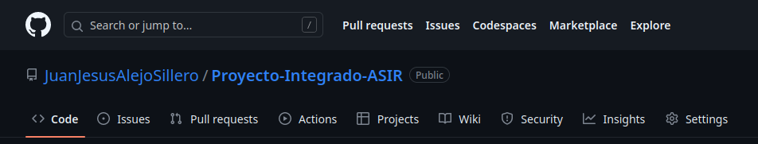

A continuación creo una carpeta local, en la que iré guardando todo el código que vaya creando, y la conecto a mi repositorio remoto:

```bash
mkdir Proyecto-Integrado-ASIR

cd Proyecto-Integrado-ASIR

echo "# Proyecto-Integrado-ASIR" >> README.md

git init

git add README.md

git commit -m "first commit"

git branch -M main

git remote add origin https://github.com/JuanJesusAlejoSillero/Proyecto-Integrado-ASIR.git

git push -u origin main
```

Con esto ya tendremos nuestro repositorio creado y conectado a nuestra carpeta local, listo para almacenar código.

## **Terraform**

Para la configuración de la infraestructura, usaré Terraform, una herramienta de código abierto desarrollada por HashiCorp que nos permite crear, modificar y versionar la infraestructura de forma sencilla (**declarativa**).

Los archivos de configuración de Terraform se escriben con el lenguaje HCL (HashiCorp Configuration Language).

Su funcionamiento se divide en 3 fases que funcionan de la siguiente manera:

- **terraform init**: Inicializa el proyecto, descargando los plugins necesarios para los proveedores que hayamos declarado en su configuración (en nuestro caso, AWS).

  

- **terraform plan**: Muestra los cambios que se van a realizar en base a los archivos de configuración que hayamos escrito.

  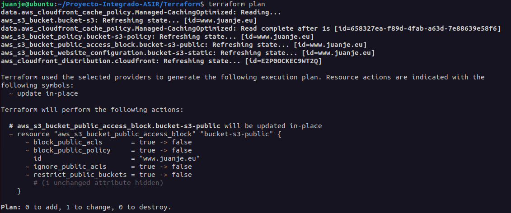

- **terraform apply**: Aplica los cambios que se han mostrado en la fase anterior.

  

Cada objeto gestionado por Terraform es conocido como un recurso, estos pueden ser una instancia, una base de datos, un certificado, etc.

El ciclo de vida de los recursos se gestiona de forma completa, es decir, desde que se crean hasta que se destruyen. Terraform será el encargado de crear, modificar y eliminar los recursos que hayamos definido en los archivos de configuración.

Si algún recurso es modificado de forma paralela mediante la consola web de AWS u otra herramienta, al ejecutar después un `terraform apply`, Terraform se encargará de volver a dejar el recurso en el estado que nosotros le definimos en los archivos de configuración, revirtiendo los cambios que se hayan realizado.

Terraform guarda los cambios de estado de la infraestructura en un archivo de estado. Este archivo se puede almacenar de forma local o en un backend remoto.

Debido a la naturaleza de este proyecto, el archivo de estado se almacenará en un bucket de S3 (backend remoto), por lo que debemos crearlo antes de empezar con la configuración de Terraform.

### **Creación del bucket de S3 para el estado remoto**

Accedemos a la consola (web) de AWS y buscamos el servicio S3:

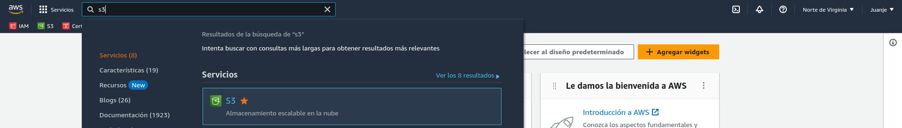

Creamos un bucket:


Le damos un nombre que debe ser único (`juanje-terraform-state`) y seleccionamos la región en la que queremos que se cree el bucket (`us-east-1`), no necesitaremos tocar las demás opciones por defecto:


Con el bucket para el estado remoto creado, podemos pasar a la configuración de Terraform.

### **Configuración de Terraform**

Para configurar Terraform, en el repositorio que creamos anteriormente, crearé una carpeta llamada *Terraform*. Ahora tenemos dos opciones, crear un archivo de configuración para cada recurso o crear un archivo de configuración general para todos los recursos. Por facilitar la organización, usaré la primera opción, de este modo, crearé los siguientes archivos (sus nombres no son importantes, pero la extensión y contenido sí):

- **remote-state.tf**: Archivo de configuración del estado remoto.

- **provider.tf**: Archivo con la configuración de los providers de Terraform. Un provider es un plugin que nos permite interactuar con un proveedor de infraestructura (en nuestro caso, AWS).

- **variables.tf**: Archivo con las variables que usaremos en los archivos de configuración de los recursos.

- **bucket-s3.tf**: Archivo de configuración del bucket de S3.

- **cloudfront.tf**: Archivo de configuración para la distribución de CloudFront.

El primer archivo a crear será el de estado remoto:

```terraform
/*
  remote-state.tf
  Archivo de configuración de remote state para el proyecto con Terraform + AWS
*/

terraform {
  backend "s3" {
    bucket = "juanje-terraform-state"
    key    = "terraform.tfstate"
    region = "us-east-1"
  }
}
```

Primero, indicamos que el backend que usaremos será S3 y le pasamos el nombre del bucket que creamos anteriormente para este propósito, el nombre del archivo de estado (podemos pasarle una ruta también como `estado/fichero.tfstate`) y la región en la que se encuentra el bucket, es bastante sencillo.

Contenido del *provider.tf*:

```terraform
/*
  providers.tf
  Archivo de providers para el proyecto con Terraform + AWS
*/

terraform {
  required_providers {
    aws = {
      source  = "hashicorp/aws"
      version = "~> 5.0.0"
    }
  }
}

provider "aws" {
  region = var.aws_region
}
```

En este archivo, indicamos que requerimos el provider de AWS (`hashicorp/aws`) con una versión igual o superior a la 5.0.0 (pero permitiendo solo cambios de versión menores para evitar problemas de compatibilidad futuros) y le pasamos la región que usaremos, que será una variable que definiremos en el archivo *variables.tf*.

El archivo *variables.tf*:

```terraform
/*
  variables.tf
  Archivo de variables para el proyecto con Terraform + AWS

  Variables en uso en los ficheros:
    - providers.tf
    - bucket-s3.tf
    - cloudfront.tf
*/

variable "aws_region" {
  type = string
  default = "us-east-1"
}

variable "domain" {
  type = string
  default = "www.juanje.eu"
}

variable "aws_arn_certificado" {
  type = string
  default = "arn:aws:acm:us-east-1:540012000352:certificate/958c20ac-8c69-4809-adfc-c75812e3587f"
}
```

Aquí, definimos la región de AWS que usaremos, dándole el valor por defecto de `us-east-1` (Norte de Virginia), el dominio de nuestra web, que lo usaremos para dar nombre al bucket de S3 que tendrá los ficheros estáticos y el ARN (Amazon Resource Name) del certificado SSL que creamos anteriormente.

El archivo *bucket-s3.tf*:

```terraform
/*
  bucket-s3.tf
  Archivo de configuración del bucket de S3 que tendrá los ficheros de la web estática para el proyecto con Terraform + AWS
*/

// Creación del bucket de S3 con el nombre de la variable "domain":
resource "aws_s3_bucket" "bucket-s3" {
  bucket = var.domain
  force_destroy = true
}

// Configuración para habilitar el almacenamiento de sitios web estáticos en el bucket de S3:
resource "aws_s3_bucket_website_configuration" "bucket-s3-static" {
  bucket = aws_s3_bucket.bucket-s3.id
  index_document {
    suffix = "index.html"
  }
  error_document {
    key = "404.html"
  }
}

// Configuraciones para habilitar el acceso público al bucket de S3:
resource "aws_s3_bucket_public_access_block" "bucket-s3-public" {
  bucket = aws_s3_bucket.bucket-s3.id
  block_public_acls       = false
  block_public_policy     = false
  ignore_public_acls      = false
  restrict_public_buckets = false
}

resource "aws_s3_bucket_policy" "bucket-s3-policy" {
  bucket = aws_s3_bucket.bucket-s3.id
  policy = jsonencode({
    Version = "2012-10-17"
    Statement = [
      {
        Sid = "PublicReadGetObject"
        Effect = "Allow"
        Principal = "*"
        Action = [
          "s3:GetObject"
        ]
        Resource = [
          "${aws_s3_bucket.bucket-s3.arn}/*"
        ]
      }
    ]
  })
}
```

Este es un poco más denso que los anteriores, pero no es muy complicado:

1. Primero, creamos el bucket de S3 con el nombre de la variable `domain` y le indicamos que se destruya forzosamente si se elimina el recurso, en caso de no hacerlo, no se podría eliminar el bucket si tiene contenido.

2. Luego, configuramos el bucket para que pueda almacenar sitios web estáticos, indicándole el nombre del bucket y el nombre de los ficheros que serán la página principal y la página de error.

3. Por último, configuramos el bucket para que sea público y le añadimos una política para que se puedan leer los ficheros.

El último archivo, *cloudfront.tf*:

```terraform
/*
  cloudfront.tf
  Archivo de configuración de la distribución de CloudFront para el proyecto con Terraform + AWS
*/

// Política de caché para la distribución de CloudFront:
data "aws_cloudfront_cache_policy" "Managed-CachingOptimized" {
  id = "658327ea-f89d-4fab-a63d-7e88639e58f6"
}

// Creación de la distribución de CloudFront:
resource "aws_cloudfront_distribution" "cloudfront" {
  enabled             = true
  is_ipv6_enabled     = false
  aliases = [var.domain]
  default_root_object = "index.html"

  origin {
    domain_name = aws_s3_bucket_website_configuration.bucket-s3-static.website_endpoint
    origin_id   = aws_s3_bucket_website_configuration.bucket-s3-static.website_endpoint
    custom_origin_config {
      http_port              = 80
      https_port             = 443
      origin_protocol_policy = "http-only"
      origin_ssl_protocols   = ["TLSv1.2"]
    }
  }

  default_cache_behavior {
    compress               = true
    viewer_protocol_policy = "redirect-to-https"
    allowed_methods  = ["GET", "HEAD"]
    cached_methods   = ["GET", "HEAD"]
    target_origin_id = aws_s3_bucket_website_configuration.bucket-s3-static.website_endpoint
    cache_policy_id = data.aws_cloudfront_cache_policy.Managed-CachingOptimized.id
  }

  price_class = "PriceClass_100"

  viewer_certificate {
    acm_certificate_arn = var.aws_arn_certificado
    ssl_support_method  = "sni-only"
    minimum_protocol_version = "TLSv1.2_2021"
  }

  restrictions {
    geo_restriction {
      restriction_type = "none"
    }
  }
}
```

En su sintaxis se especifica que:

1. Definimos la política de caché que usaremos mediante su ID, es la que recomienda AWS para webs estáticas.

2. Después, creamos la distribución de CloudFront, indicándole que esté habilitada, que no use IPv6, que el nombre del dominio es el de la variable `domain` y que el fichero por defecto es el `index.html`.

3. En la segunda mitad, indicamos que el origen de la distribución será el bucket de S3 que definimos anteriormente, que puede comprimir los ficheros, redireccionar todas las conexiones HTTP a HTTPS, la clase de precio (ubicaciones geográficas del CDN de CloudFront), el certificado SSL que usará y que no imponga restricciones geográficas.

Y con estos 5 archivos quedaría toda nuestra infraestructura definida:


Los subimos a GitHub:

```bash
git add .

git commit -m "Archivos Terraform"

git push
```

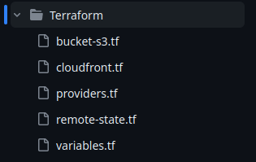

## **Hugo**

Para crear la web estática, usaré Hugo (extended). En Ubuntu 22.04 lo he instalado de la siguiente forma ([instrucciones para otros sistemas operativos](https://gohugo.io/installation/)):

```bash
sudo apt update

sudo apt install hugo
```

Creamos la carpeta del sitio nuevo:

```bash
hugo new site "Blog de Juanje"

cd "Blog de Juanje"
```

Instalamos el tema que queramos, en mi caso, [terminal](https://themes.gohugo.io/hugo-theme-terminal/):

```bash
git init

git submodule add -f https://github.com/panr/hugo-theme-terminal.git themes/terminal
```

Para configurarlo, edito el fichero `config.toml` con el contenido que aparece en la [documentación](https://themes.gohugo.io/themes/hugo-theme-terminal/#how-to-configure) y lo dejo a mi gusto.

> **IMPORTANTE**: Para evitar fallos, como se menciona en [esta issue de GitHub](https://github.com/gohugoio/hugo/issues/8587#issuecomment-851018525), debemos eliminar el parámetro `baseURL` del fichero `config.toml`. En mi caso, si lo tenía, no funcionaba correctamente la web tras subirla a AWS.

Para crear una nueva entrada, ejecutamos:

```bash
hugo new posts/mi-entrada.md
```

Tras redactarla, podemos ver el resultado con:

```bash
hugo server -D
```

Y accediendo a la dirección que nos indique (normalmente [http://localhost:1313/](http://localhost:1313/)).


Tras confirmar que funciona correctamente, eliminamos la carpeta `resources` que se ha creado al ejecutar el comando anterior:

```bash
rm -rf resources
```

Quedaría así:

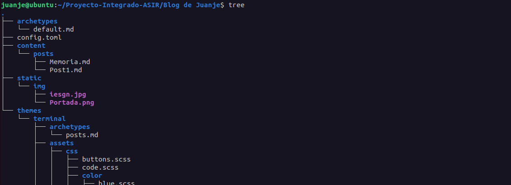

Y subimos el contenido a GitHub:

```bash
git add .

git commit -m "Archivos Hugo"

git push
```


## **GitHub**

### **GitHub Actions**

Para automatizar el proceso de creación de la web estática y su subida a S3, usaré un *workflow* de GitHub Actions. Los *workflows* son archivos de configuración escritos en YAML que permiten automatizar procesos en GitHub. En mi caso, crearé uno que se ejecute cada vez que se haga un *push* a los directorios que contienen los archivos de Terraform o de Hugo.

El archivo se llamará `workflow.yaml` y estará en la carpeta `.github/workflows`:

```bash
mkdir -p .github/workflows

touch .github/workflows/workflow.yaml
```

El contenido del archivo será el siguiente:

```yaml
#
# hugo-deploy.yaml
# Archivo de configuración de GitHub Actions para:
# 1. Verificar y desplegar la infraestructura con Terraform cuando se haga push a alguno de los directorios "Terraform" o "Blog de Juanje"
# 2. Construir el sitio web con Hugo y desplegarlo en S3 cuando se haga push al directorio "Blog de Juanje"
#

name: "Workflow"

on:
  push:
    branches:
      - main
    paths:
      - "Terraform/**"
      - "Blog de Juanje/**"

env:
  AWS_REGION: "us-east-1"
  AWS_ACCESS_KEY_ID: ${{ secrets.AWS_ACCESS_KEY_ID }}
  AWS_SECRET_ACCESS_KEY: ${{ secrets.AWS_SECRET_ACCESS_KEY }}

jobs:
  terraform:
    name: "Terraform"
    runs-on: ubuntu-latest
    defaults:
      run:
        working-directory: "Terraform"
    steps:
      - name: "Clonar repositorio"
        uses: actions/checkout@v3
      - name: "Setup Terraform"
        uses: hashicorp/setup-terraform@v2.0.3
      - name: "Terraform Init"
        timeout-minutes: 2
        run: terraform init -input=false
      - name: "Terraform Apply"
        run: terraform apply -auto-approve
  hugo-deploy:
    needs: terraform
    name: "Hugo + Deploy"
    runs-on: ubuntu-latest
    steps:
      - name: "Clonar repositorio incluyendo submódulos (para el tema)"
        uses: actions/checkout@v3
        with:
          submodules: recursive
      - name: "Configurar credenciales AWS CLI"
        uses: aws-actions/configure-aws-credentials@v1
        with:
          aws-access-key-id: ${{ secrets.AWS_ACCESS_KEY_ID }}
          aws-secret-access-key: ${{ secrets.AWS_SECRET_ACCESS_KEY }}
          aws-region: ${{ env.AWS_REGION }}
      - name: "Setup Hugo"
        uses: peaceiris/actions-hugo@v2.6.0
        with:
          hugo-version: "latest"
          extended: true
      - name: "Build"
        run: |
          cd "Blog de Juanje"
          hugo --minify
      - name: "Deploy to S3"
        run: |
          cd "Blog de Juanje/public"
          aws s3 sync \
            --delete \
            . s3://www.juanje.eu
      - name: "CloudFront Invalidation"
        run: |
          aws cloudfront create-invalidation \
            --distribution-id ${{ secrets.CLOUDFRONT_DISTRIBUTION_ID }} \
            --paths "/*"
```

Es un archivo bastante sencillo de comprender, pero voy a detallar algunas partes:

1. Primero se indica el nombre del *workflow* y cuándo se ejecutará. En este caso, se ejecutará cuando se haga un *push* a la rama `main` y se modifique algún archivo de los directorios `Terraform` o `Blog de Juanje`.

2. A continuación, se definen las variables de entorno que se usarán en el *workflow*. En este caso, las credenciales de AWS y la región.

3. Después, se definen los *jobs* que se ejecutarán. En este caso, dos:

   - `terraform`: Se ejecutará en una máquina virtual de Ubuntu y se encargará de verificar y desplegar la infraestructura con Terraform si hiciera falta. Para ello, primero se clonará el repositorio, se instalará Terraform, se inicializará y se aplicará el plan.

   - `hugo-deploy`: Se ejecutará en otra máquina virtual de Ubuntu y se encargará de construir el sitio web con Hugo y desplegarlo en S3, pero solo se ejecutará si el *job* de *terraform* termina satisfactoriamente, evitando así intentar subir los ficheros de la web si la infraestructura no está lista. Para ello, primero se clonará el repositorio incluyendo el submódulo del tema, se configurarán las credenciales de AWS CLI, se instalará Hugo, se crearán los archivos de la web y se sincronizarán con nuestro bucket de S3, además, se invalidará la caché de CloudFront para tener los cambios disponibles de forma inmediata.

### **Secrets**

Para que el *workflow* funcione, necesitamos crear algunos *secrets* en nuestro repositorio, para ello en la web de GitHub vamos a `Settings > Secrets and variables > Actions > New repository secret` y creamos los siguientes, con sus respectivos valores:

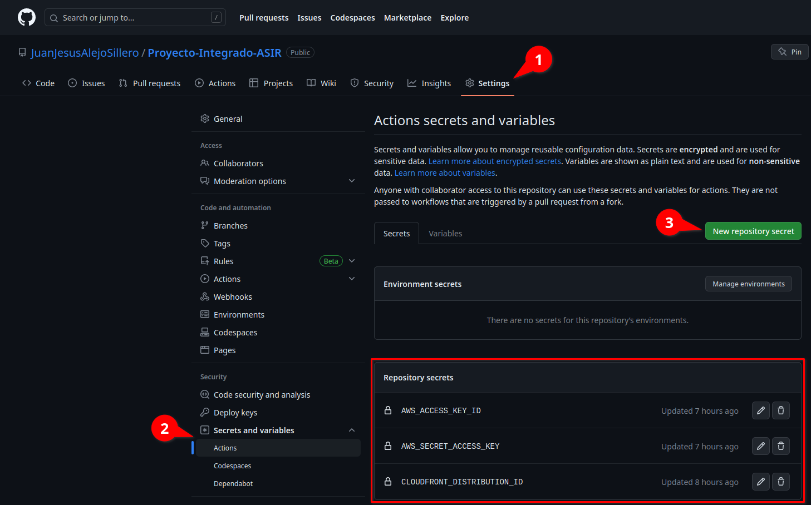

## **Comprobación**

Llegados a este punto, ya podemos hacer un *push* a alguno de los directorios que hemos indicado en el *workflow* (`Terraform` o `Blog de Juanje`) y comprobar que todo se ejecuta correctamente:



Como podemos ver, todo el flujo de CI/CD se ha ejecutado correctamente y ya tenemos nuestra web estática desplegada, sin servidor y sin preocuparnos por gestionar la infraestructura o el código html/css/js.

## **Enlaces de interés**

Además de la bibliografía que se encuentra a continuación, es importante mencionar que todo el código tanto de Terraform como de Hugo y GitHub Actions se encuentra en [el repositorio de GitHub de este proyecto](https://github.com/JuanJesusAlejoSillero/Proyecto-Integrado-ASIR), en los directorios `Terraform`, `Blog de Juanje` y `.github/workflows` respectivamente.

La memoria completa del proyecto es este mismo post que estás leyendo.

## **Bibliografía**

Para la realización de este proyecto he ido recopilando y utilizando partes de muchas, muchísimas fuentes, ya que no he conseguido hallar una que pudiera seguir de principio a fin sin encontrar obstáculos en el proceso (configuraciones desfasadas, errores en la documentación, falta de claridad en las explicaciones, infraestructuras demasiado complejas o incompatibles con mi proyecto, etc.). Las clasifico a continuación para intentar facilitar la búsqueda de información.

### **Documentaciones oficiales**

#### **Amazon Web Services**

- [Interfaz de la línea de comandos - AWS CLI - AWS](https://aws.amazon.com/es/cli/)

- [Choosing the price class for a CloudFront distribution - Amazon CloudFront](https://docs.aws.amazon.com/AmazonCloudFront/latest/DeveloperGuide/PriceClass.html?icmpid=docs_cf_help_panel)

- [Setting permissions for website access - Amazon Simple Storage Service](https://docs.aws.amazon.com/AmazonS3/latest/userguide/WebsiteAccessPermissionsReqd.html)

- [Hosting a static website using Amazon S3 - Amazon Simple Storage Service](https://docs.aws.amazon.com/AmazonS3/latest/userguide/WebsiteHosting.html)

- [Regiones y zonas de disponibilidad de la infraestructura global](https://aws.amazon.com/es/about-aws/global-infrastructure/regions_az/)

- [Regions, Availability Zones, and Local Zones - Amazon Relational Database Service](https://docs.aws.amazon.com/AmazonRDS/latest/UserGuide/Concepts.RegionsAndAvailabilityZones.html)

- [Regions and Zones - Amazon Elastic Compute Cloud](https://docs.aws.amazon.com/AWSEC2/latest/UserGuide/using-regions-availability-zones.html)

- [Installing or updating the latest version of the AWS CLI - AWS Command Line Interface](https://docs.aws.amazon.com/cli/latest/userguide/getting-started-install.html#cliv2-linux-install)

- [Uso de la capa gratuita de AWS - Facturación de AWS](https://docs.aws.amazon.com/es_es/awsaccountbilling/latest/aboutv2/billing-free-tier.html#avoid-charges-after-free-tier)

- [Automate static website deployment to Amazon S3 - AWS Prescriptive Guidance](https://docs.aws.amazon.com/prescriptive-guidance/latest/patterns/automate-static-website-deployment-to-amazon-s3.html)

#### **Terraform**

- [Terraform CLI: Commands - Terraform by HashiCorp](https://developer.hashicorp.com/terraform/cli/commands/init)

- [Terraform CLI: Meta-arguments - Terraform by HashiCorp](https://developer.hashicorp.com/terraform/language/meta-arguments/depends_on)

- [Provider Configuration - Configuration Language | Terraform | HashiCorp Developer](https://developer.hashicorp.com/terraform/language/providers/configuration)

- [Syntax - Configuration Language | Terraform | HashiCorp Developer](https://developer.hashicorp.com/terraform/language/syntax/configuration)

- [Variables - Configuration Language | Terraform | HashiCorp Developer](https://developer.hashicorp.com/terraform/language/values/variables)

- [Command: init | Terraform | HashiCorp Developer](https://developer.hashicorp.com/terraform/cli/commands/init)

- [The depends_on Meta-Argument - Configuration Language | Terraform | HashiCorp Developer](https://developer.hashicorp.com/terraform/language/meta-arguments/depends_on)

- [Backend Type: s3 | Terraform | HashiCorp Developer](https://developer.hashicorp.com/terraform/language/settings/backends/s3)

- [Input Variables - Configuration Language | Terraform | HashiCorp Developer](https://developer.hashicorp.com/terraform/language/values/variables)

- [Host a Static Website with S3 and Cloudflare | Terraform | HashiCorp Developer](https://developer.hashicorp.com/terraform/tutorials/applications/cloudflare-static-website)

- [Automate Terraform with GitHub Actions | Terraform | HashiCorp Developer](https://developer.hashicorp.com/terraform/tutorials/automation/github-actions)

- [Build Infrastructure | Terraform | HashiCorp Developer](https://developer.hashicorp.com/terraform/tutorials/aws-get-started/aws-build)

- [Docs overview | hashicorp/aws | Terraform Registry](https://registry.terraform.io/providers/hashicorp/aws/latest/docs)

- [aws_cloudfront_cache_policy | Data Sources | hashicorp/aws | Terraform Registry](https://registry.terraform.io/providers/hashicorp/aws/latest/docs/data-sources/cloudfront_cache_policy)

- [aws_iam_policy_document | Data Sources | hashicorp/aws | Terraform Registry](https://registry.terraform.io/providers/hashicorp/aws/latest/docs/data-sources/iam_policy_document)

- [aws_cloudfront_distribution | Resources | hashicorp/aws | Terraform Registry](https://registry.terraform.io/providers/hashicorp/aws/latest/docs/resources/cloudfront_distribution)

- [aws_cloudfront_origin_access_identity | Resources | hashicorp/aws | Terraform Registry](https://registry.terraform.io/providers/hashicorp/aws/latest/docs/resources/cloudfront_origin_access_identity)

- [aws_s3_bucket | Resources | hashicorp/aws | Terraform Registry](https://registry.terraform.io/providers/hashicorp/aws/latest/docs/resources/s3_bucket)

- [aws_s3_bucket_policy | Resources | hashicorp/aws | Terraform Registry](https://registry.terraform.io/providers/hashicorp/aws/latest/docs/resources/s3_bucket_policy)

- [aws_s3_bucket_public_access_block | Resources | hashicorp/aws | Terraform Registry](https://registry.terraform.io/providers/hashicorp/aws/latest/docs/resources/s3_bucket_public_access_block.html)

- [aws_cloudfront_distribution | Resources | hashicorp/aws | Terraform Registry](https://registry.terraform.io/providers/hashicorp/aws/latest/docs/resources/cloudfront_distribution#price_class)

- [aws_s3_bucket_website_configuration | Resources | hashicorp/aws | Terraform Registry](https://registry.terraform.io/providers/hashicorp/aws/latest/docs/resources/s3_bucket_website_configuration)

- [Automate Terraform with GitHub Actions | Terraform - HashiCorp Developer](https://developer.hashicorp.com/terraform/tutorials/automation/github-actions)

#### **Hugo**

- [Shortcodes | Hugo](https://gohugo.io/content-management/shortcodes/)

- [Quick Start | Hugo](https://gohugo.io/getting-started/quick-start/)

- [Basic usage | Hugo](https://gohugo.io/getting-started/usage/)

- [gohugoio/hugoBasicExample: Example site to use with Hugo & Hugo Themes](https://github.com/gohugoio/hugoBasicExample)

- [terminal | Hugo Themes](https://themes.gohugo.io/themes/hugo-theme-terminal/)

#### **Git, GitHub y GitHub Actions**

- [Contexts - GitHub Docs](https://docs.github.com/en/actions/learn-github-actions/contexts#context-availability)

- [Workflow syntax for GitHub Actions - GitHub Docs](https://docs.github.com/en/actions/using-workflows/workflow-syntax-for-github-actions#jobsjob_iddefaultsrun)

- [Workflow syntax for GitHub Actions - GitHub Docs](https://docs.github.com/en/actions/using-workflows/workflow-syntax-for-github-actions#jobsjob_idneeds)

- [Ignoring files - GitHub Docs](https://docs.github.com/en/get-started/getting-started-with-git/ignoring-files)

- [Set up Git - GitHub Docs](https://docs.github.com/en/get-started/quickstart/set-up-git)

- [Conectar a GitHub con SSH - Documentación de GitHub](https://docs.github.com/es/authentication/connecting-to-github-with-ssh)

- [Hugo setup · Actions · GitHub Marketplace](https://github.com/marketplace/actions/hugo-setup)

- [HashiCorp - Setup Terraform · Actions · GitHub Marketplace](https://github.com/marketplace/actions/hashicorp-setup-terraform)

### **Blogs, foros, discusiones y webs de texto**

- [AWS Breaking (Change) News: New S3 Buckets Blocked For Public Access | by Adam Fisher / fisher king (@therightstuff) | Apr, 2023 | AWS Tip](https://awstip.com/aws-breaking-change-news-new-s3-buckets-blocked-for-public-access-ad83d626afb4)

- [How was this "Hello there!" section done on the official website? · Issue #187 · panr/hugo-theme-terminal](https://github.com/panr/hugo-theme-terminal/issues/187)

- [Blogging With Hugo | Justin James](https://digitaldrummerj.me/series/blogging-with-hugo/)

- [foo-dogsquared/hugo-theme-arch-terminal-demo: Demo of the Hugo Terminal Plus-Minus theme](https://github.com/foo-dogsquared/hugo-theme-arch-terminal-demo)

- [Multi Host support - Allow BaseURL to generate dynamically at runtime - window.location.hostname · Issue #8587 · gohugoio/hugo](https://github.com/gohugoio/hugo/issues/8587#issuecomment-851018525)

- [How to Set Up a Remote Backend for Terraform State File with Amazon S3](https://sumanprasad.hashnode.dev/how-to-set-up-a-remote-backend-for-terraform-state-file-with-amazon-s3#heading-step-1-create-an-s3-bucket)

- [How To Upload File to S3 with the AWS CLI](https://adamtheautomator.com/upload-file-to-s3/)

- [What happened to github.event.head_commit.modified? · community · Discussion #25597](https://github.com/orgs/community/discussions/25597)

- [How to Host a Website on S3 Without Getting Lost in the Sea | by Kyle Galbraith | Medium](https://medium.com/@kyle.galbraith/how-to-host-a-website-on-s3-without-getting-lost-in-the-sea-e2b82aa6cd38)

- [amazon web services - Missing Authentication Token while accessing API Gateway? - Stack Overflow](https://stackoverflow.com/questions/39655048/missing-authentication-token-while-accessing-api-gateway)

- [github - Running actions in another directory - Stack Overflow](https://stackoverflow.com/questions/58139175/running-actions-in-another-directory/63122434#63122434)

- [continuous integration - Dependencies Between Workflows on Github Actions - Stack Overflow](https://stackoverflow.com/questions/58457140/dependencies-between-workflows-on-github-actions)

- [How Caching and Invalidations in AWS CloudFront works - Knoldus Blogs](https://blog.knoldus.com/how-caching-and-invalidations-in-aws-cloudfront-works/)

- [How to manually invalidate AWS CloudFront | by Christina Hastenrath | Medium](https://christinavhastenrath.medium.com/how-to-manually-invalidate-aws-cloudfront-b36a2ab4e1be)

- [How to use Cloudfront for Secure Delivery of Static Websites Around the World | by Kyle Galbraith | Medium](https://medium.com/@kyle.galbraith/how-to-make-use-of-cloudfront-for-secure-delivery-of-static-websites-to-the-world-d2f54e8b096)

- [docker - How can I make a GitHub Workflow depend on the success of another workflow? - Stack Overflow](https://stackoverflow.com/questions/62367778/how-can-i-make-a-github-workflow-depend-on-the-success-of-another-workflow)

- [Running GitHub Actions Sequentially | Steven M. Mortimer](https://stevenmortimer.com/running-github-actions-sequentially/)

- [Amazon S3 to apply security best practices for all new buckets - Help Net Security](https://www.helpnetsecurity.com/2023/02/07/amazon-s3-bucket-security/)

- [AWS S3 Sync Examples - Sync S3 buckets AWS CLI | Devops Junction](https://www.middlewareinventory.com/blog/aws-s3-sync-example/)

- [How to create programmatic access user in AWS](https://www.simplified.guide/aws/iam/create-programmatic-access-user)

- [permissions - Amazon Cloudfront with S3. Access Denied - Server Fault](https://serverfault.com/questions/581268/amazon-cloudfront-with-s3-access-denied)

- [amazon web services - How to delete an aws cloudfront Origin Access Identity - Stack Overflow](https://stackoverflow.com/questions/34546835/how-to-delete-an-aws-cloudfront-origin-access-identity)

- [amazon web services - AWS CLI CloudFront Invalidate All Files - Stack Overflow](https://stackoverflow.com/questions/37759949/aws-cli-cloudfront-invalidate-all-files)

- [amazon web services - AWS CloudFront access denied to S3 bucket - Stack Overflow](https://stackoverflow.com/questions/42251745/aws-cloudfront-access-denied-to-s3-bucket)

- [amazon web services - Cloudfront with S3 static site hosting responds with 504 error - Stack Overflow](https://stackoverflow.com/questions/68506497/cloudfront-with-s3-static-site-hosting-responds-with-504-error)

- [Need help with Cloudfront, S3 https redirection error 504 : r/aws](https://www.reddit.com/r/aws/comments/es7bw6/need_help_with_cloudfront_s3_https_redirection/)

- [Building a site with Hugo, using GitHub, Amazon S3 and CloudFront with HTTPS and extensionless URLs · The Angry Dev](https://bizzeh.com/hugo-github-aws-s3-cloudfront-ssl-extensionless/)

- [Create your own blog with hugo and S3 - Cibermanchego](http://cibermanchego.com/en/post/2022-01-12-create-your-own-blog-with-hugo-and-s3/)

- [How to deploy an S3 Bucket in AWS- using Terraform - Knoldus Blogs](https://blog.knoldus.com/how-to-deploy-an-s3-bucket-in-aws-using-terraform/)

- [How to Create an S3 Bucket with Terraform | Pure Storage Blog](https://blog.purestorage.com/purely-informational/how-to-create-an-s3-bucket-with-terraform/)

- [How to Create S3 Bucket Policy using Terraform - CloudKatha](https://cloudkatha.com/how-to-create-s3-bucket-policy-using-terraform/)

- [Terraform Remote State with AWS S3 and DynamoDB](https://dangibbs.uk/blog/terraform-remote-state-aws-s3-dynamodb/)

- [Host a static website locally using Simple Storage Service (S3) and Terraform with LocalStack | Docs](https://docs.localstack.cloud/tutorials/s3-static-website-terraform/)

- [Terraform doesn't understand that website_endpoint will change value · Issue #13393 · hashicorp/terraform-provider-aws](https://github.com/hashicorp/terraform-provider-aws/issues/13393)

- [CloudFront Terraform Examples - Easy AWS Automation 2023](https://hands-on.cloud/cloudfront-terraform-examples/)

- [Terraforming a S3 Website with ACM Certificates, Cloudfront, & Route53 | by Garrett Sweeney | Cloud Tidbits | Medium](https://medium.com/cloud-tidbits/terraforming-an-s3-react-website-with-acm-certificates-cloudfront-route53-150936350074)

- [Terraform Remote States in S3. A simple way to use S3 backend to store… | by Allan Denot | DNX Labs | Medium](https://medium.com/dnx-labs/terraform-remote-states-in-s3-d74edd24a2c4)

- [Create An AWS S3 Website Using Terraform And Github Actions](https://openupthecloud.com/terraform-github-actions/)

- [Hosting a Static Website on AWS S3 using Terraform | by Shashwot Risal | Medium](https://shashwotrisal.medium.com/hostin-a-static-website-on-aws-s3-using-terraform-d27f81246e82)

- [amazon web services - Terraform - AWS IAM user with Programmatic access - Stack Overflow](https://stackoverflow.com/questions/58853125/terraform-aws-iam-user-with-programmatic-access)

- [amazon web services - How to use the the newly introduced aws_cloudfront_cache_policy resource in terraform - Stack Overflow](https://stackoverflow.com/questions/66570259/how-to-use-the-the-newly-introduced-aws-cloudfront-cache-policy-resource-in-terr)

- [Terraform Remote State Storage with AWS S3 & DynamoDB - STACKSIMPLIFY](https://terraformguru.com/terraform-real-world-on-aws-ec2/20-Remote-State-Storage-with-AWS-S3-and-DynamoDB/)

- [Hosting a Secure Static Website on AWS S3 using Terraform (Step By Step Guide) | Alex Hyett](https://www.alexhyett.com/terraform-s3-static-website-hosting/)

- [Deploy Hugo Sites With Terraform and Github Actions (Part 1) | Dennis Martinez](https://dennmart.com/articles/deploy-hugo-sites-with-terraform-and-github-actions-part-1/)

- [Deploy Hugo Sites With Terraform and Github Actions (Part 2) | Dennis Martinez](https://dennmart.com/articles/deploy-hugo-sites-with-terraform-and-github-actions-part-2/)

- [Build a static website using S3 & Route 53 with Terraform - DEV Community](https://dev.to/aws-builders/build-a-static-website-using-s3-route-53-with-terraform-1ele)

- [Guide to Create Github Actions Workflow for Terraform and AWS - DEV Community](https://dev.to/aws-builders/guide-to-create-github-actions-workflow-for-terraform-and-aws-5de2)

- [Github Actions + Hugo + Terraform + S3 | Jérôme Decoster](https://jeromedecoster.github.io/aws/github-actions-hugo-terraform-s3/)

- [Deploy static website to S3 using Github actions - DEV Community](https://dev.to/johnkevinlosito/deploy-static-website-to-s3-using-github-actions-4a0e)

- [github - pull using git including submodule - Stack Overflow](https://stackoverflow.com/questions/8090761/pull-using-git-including-submodule)

- [How to Perform Git Submodule Checkout | phoenixNAP KB](https://phoenixnap.com/kb/git-checkout-submodule)

- [git - How do I remove a submodule? - Stack Overflow](https://stackoverflow.com/questions/1260748/how-do-i-remove-a-submodule)

- [Limpiar caché  |  Public DNS  |  Google for Developers](https://developers.google.com/speed/public-dns/cache?hl=es-419)

### **Tutoriales en vídeo**

- [AWS Hands-On: Automate AWS Infra Deployment using Terraform and GitHub Actions - YouTube](https://www.youtube.com/watch?t=598&v=scecLqTeP3k&feature=youtu.be)

- [Getting Started With Terraform | Terraform Tutorial | #3 - YouTube](https://www.youtube.com/watch?v=t7XUh0xyhTI&list=PL8HowI-L-3_9bkocmR3JahQ4Y-Pbqs2Nt&t=608s)

- [Data Sources | Terraform Tutorial | #10 - YouTube](https://www.youtube.com/watch?v=9cDDZzl7zow&list=PL8HowI-L-3_9bkocmR3JahQ4Y-Pbqs2Nt&index=10)

- [AWS Tutorial - Website hosting with S3, Route 53 & Cloudfront using Namecheap domain - YouTube](https://www.youtube.com/watch?v=Bmuoqo_JY4g)

- [Creating an IAM User and Generating Access Key on Amazon Web Services AWS - YouTube](https://www.youtube.com/watch?v=HuE-QhrmE1c)

- [Deploy Static Website to AWS S3 with HTTPS using CloudFront - YouTube](https://www.youtube.com/watch?v=o2HTkVxzivA)

- [Static website hosting on Amazon S3 (with CloudFront) without enabling public access. - YouTube](https://www.youtube.com/watch?v=qsJSv7J4s7k)

- [Backends and Remote State | Terraform Tutorial | #17 - YouTube](https://www.youtube.com/watch?v=RBW253A4SvY)

- [AWS Hands-On: Automate AWS Infra Deployment using Terraform and GitHub Actions - YouTube](https://www.youtube.com/watch?v=scecLqTeP3k&t=598s)

- [Terraform Tutorial for Beginners + Labs: Complete Step by Step Guide! - YouTube](https://www.youtube.com/watch?v=YcJ9IeukJL8)

---

✒️ **Documentación realizada por Juan Jesús Alejo Sillero.**
