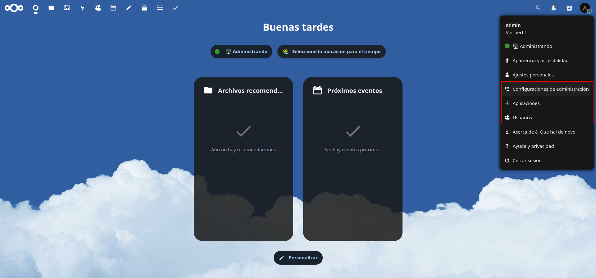

Nextcloud is an open-source application that allows us to store and synchronize files and data across devices.

It is an alternative to services like Google Drive, Dropbox, or OneDrive, but with the advantage that we control our data and do not depend on third parties.

In this post, I will explain how to set up your own private cloud with Nextcloud AIO and Docker, using NGINX as a reverse proxy.

<!--more-->

> **⚠️ DISCLAIMER: Please note that this article is a manual translation of the Spanish version. The screenshots may have been originally taken in Spanish, and some words/names may not match completely. If you find any errors, please [report them to the author](#profile). ⚠️**

## **Requirements**

- A Linux server to install Nextcloud on. It can be a physical server, a virtual machine, or a VPS.
- Have `docker` and `docker compose` installed on your system. If you don't have them, you can follow [this post](https://blog.juanje.net/en/posts/docker-rootless/).
- Own a domain or subdomain to use with your Nextcloud instance.
- An SSL certificate for the subdomain you will use with Nextcloud. Personally, I use [Let's Encrypt](https://letsencrypt.org/) to obtain free SSL certificates.
- NGINX as a reverse proxy to redirect traffic to Nextcloud container.
- Being able to run commands as `root` (either as `root` user directly, or with `sudo` or `doas`). In my case I will do it as `root` (using `su`). This will be necessary to set up NGINX.

## **Things to keep in mind**

1. Nextcloud All-in-One (AIO) is designed to be used with a subdomain and SSL certificate. If you do not meet these requirements, you will encounter issues in the process.

2. This post covers the installation following my use case (Nextcloud on Docker and NGINX as a reverse proxy on the same machine). If you need a different or more advanced configuration, I recommend reading the official *readme* on [Nextcloud AIO's GitHub](https://github.com/nextcloud/all-in-one). It is quite extensive and detailed.

## **The docker-compose.yml file**

We will start by creating a directory to better organize the stacks created using `docker-compose`:

```bash
mkdir -p ~/docker-compose-files/nextcloud-aio
```

We will also need to create the `ncdata` and `ncbackup` directories to store Nextcloud's data and backups. We can name them as we like, but we must ensure that the directory names match those defined in the `docker-compose.yml` file:

```bash
mkdir -p ~/docker-compose-files/nextcloud-aio/{ncdata,ncbackup}
```

Next, we will create the `docker-compose.yml` file:

```bash
nano ~/docker-compose-files/nextcloud-aio/docker-compose.yml
```

We will fill this file by modifying the content of the [compose.yaml](https://github.com/nextcloud/all-in-one/blob/main/compose.yaml) from the official Nextcloud AIO repository to our liking.

For example, in my case, I modified the following fields:

1. Path to the `docker` socket. I modified it because I use `docker` in rootless mode as explained in [this post](https://blog.juanje.net/en/posts/docker-rootless/):

    Replace:

    ```yaml
    - /var/run/docker.sock:/var/run/docker.sock:ro
    ```

    With:

    ```yaml
    - /run/user/1000/docker.sock:/var/run/docker.sock:ro
    ```

2. Comment out ports `80` and `8443` since I will use a reverse proxy:

    Add a hash symbol `#` at the beginning of the lines for ports `80` and `8443`:

    ```yaml
    ports:
    # - 80:80
    - 8080:8080
    # - 8443:8443
    ```

    I will not disable port `8080` as it is necessary for the Nextcloud AIO admin interface.

3. Uncomment the `environment` section to configure options such as the internal web server port for Nextcloud AIO, the data directory, etc.

    To enable the `environment` section, remove the hash symbol `#` and space at the beginning of its line:

    ```yaml
    # environment:
    ```

    Becomes:

    ```yaml
    environment:
    ```

4. Configure the options in the `environment` section:

    - `APACHE_PORT` and `APACHE_IP_BINDING`: These need to be configured when running Nextcloud AIO behind a web server or reverse proxy.
    - `NEXTCLOUD_DATADIR`: Allows setting the host directory to be used for Nextcloud's data directory. It is extremely important not to modify this parameter after configuring Nextcloud AIO. If we need to change it, we must first consult this section of the [readme.md - How to change the default location of Nextcloud's Datadir?](https://github.com/nextcloud/all-in-one#how-to-change-the-default-location-of-nextclouds-datadir).
    - `WATCHTOWER_DOCKER_SOCKET_PATH`: Path to the `docker` socket so that `watchtower` can update the containers that make up the entire Nextcloud AIO stack.

    For example, in my case, I configured it as follows, don't forget that the `NEXTCLOUD_DATADIR` parameter must match the `ncdata` directory we created earlier:

    ```yaml
    environment:
      APACHE_PORT: 11000
      APACHE_IP_BINDING: 127.0.0.1
      NEXTCLOUD_DATADIR: /home/juanje/docker-compose-files/nextcloud-aio/ncdata
      WATCHTOWER_DOCKER_SOCKET_PATH: /run/user/1000/docker.sock
    ```

5. Although it is common in other services, in this case, we should not modify the `volumes` section. If we want to store the data on another drive, we must follow the instructions in the [readme.md - How to store the files/installation on a separate drive?](https://github.com/nextcloud/all-in-one#how-to-store-the-filesinstallation-on-a-separate-drive).

## **NGINX as a Reverse Proxy**

> **💡 If you are not familiar with NGINX, you can opt for alternatives like Traefik and NGINX Proxy Manager (NPM), which provide an easy and user-friendly way to set up a reverse proxy. 💡**

Once we are done with the `docker-compose.yml` file, we need to configure our reverse proxy to redirect traffic to the Nextcloud AIO container.

```bash
su -

nano -cl /etc/nginx/sites-available/nextcloud.example.com
```

I will not explain the exact configuration I use in NGINX, as it will depend on individual preferences, but I will highlight the key settings you need to watch out for and where to find a complete and updated example:

1. The `server_name` should match the domain or subdomain you want to use to access Nextcloud AIO.

2. The `proxy_pass` directive should point to `http://127.0.0.1:11000$request_uri`. The port `11000` is the one we configured as `APACHE_PORT` in the `docker-compose.yml` file. If you have changed it, you will need to modify it here as well.

3. Path to the SSL certificates. You must correctly configure the `ssl_certificate` and `ssl_certificate_key` directives so that NGINX can use your SSL certificate.

```nginx
map $http_upgrade $connection_upgrade {
    default upgrade;
    '' close;
}

server {
    listen 80;

    # ...

    server_name nextcloud.example.com;

    location / {
        proxy_pass http://127.0.0.1:11000$request_uri;
        # ...
    }

    ssl_certificate /etc/letsencrypt/live/nextcloud.example.com/fullchain.pem;
    ssl_certificate_key /etc/letsencrypt/live/nextcloud.example.com/privkey.pem;

    # ...
}
```

The rest of the options are up to you, but you can see a complete example for NGINX in [reverse-proxy.md - Nginx, Freenginx, Openresty](https://github.com/nextcloud/all-in-one/blob/main/reverse-proxy.md#nginx-freenginx-openresty).

That link will take you to a file that shows functional configuration examples for a multitude of reverse proxies, not just NGINX. I recommend checking it out even if you know how to configure NGINX.

Once we finish the NGINX configuration, we can proceed restarting the service for the changes to take effect:

```bash
su -

systemctl restart nginx
```

> **⚠️ If we haven't done so already, we must remember to add the subdomain we will use with Nextcloud to the DNS records of our domain provider. ⚠️**

## **Nextcloud AIO first boot configuration**

After setting up the NGINX server block, we start the Nextcloud AIO stack with `docker compose`, from our non-root user since we are using `docker` in rootless mode:

```bash
cd ~/docker-compose-files/nextcloud-aio

docker compose up -d
```

We will wait for the images to download and the containers to start.

Once the `docker compose` command finishes executing, we will access the IP of our server followed by port `8080` (or the port we mapped to `8080` of the container in the `docker-compose.yml` file). We must do this using `https`, meaning we need to access `https://SERVER_IP:8080`.

This will take us to the Nextcloud AIO's first boot page.

We will be given the password to log in to the administration interface:


> **⚠️ Do not worry about the password for login into the AIO interface, as we can change it later. Additionally, after configuring Nextcloud AIO, it will no longer be displayed: ⚠️**
>
> 

Once logged in, we can configure Nextcloud AIO.

For now, the only thing we need to do is set the subdomain we will use for Nextcloud:


If we click on `Submit domain`, Nextcloud will check if our DNS record is correctly configured and if the reverse proxy is working properly. May something fails, it will let us know with a message at the top of the screen.

If everything has gone well, we can continue configuring the optional containers that are part of Nextcloud AIO (`ClamAV`, `Collabora`, `Fulltextsearch`, etc.) and the timezone of our server:


Select the containers you are interested in and click on `Save changes` located under the list of containers.

Enter your timezone and click `Submit timezone`:


After modifying both sections to our liking, go back to the top of the page and click on `Download and start containers`.

Then, we wait patiently, as the process of downloading and starting the containers can take several minutes.

Once the containers are up and running, we will see something similar to this:


Now, it's time to set the backup path we created earlier as `ncbackup`, as well as change the password for accessing the AIO interface.

First, set the backup by entering the full path to the `ncbackup` directory created on the host. Considering that we previously created the directory at `/home/juanje/docker-compose-files/nextcloud-aio/ncbackup`, this will be the path we must write in the `Backup and restore` text field:


To change the password for accessing the AIO interface, we need to expand the `AIO passphrase change` section and first enter the current password, followed by the new password. Finally, click on `Submit passphrase change`. This can be seen in the screenshot above.

## **Login into Nextcloud and creating users**

Once we have finished configuring Nextcloud AIO, we have to go to the top of the page and click on `Open your Nextcloud`. To log in as an administrator, we will use the credentials shown as `Initial Nextcloud username` and `Initial Nextcloud password`:


We should reach the Nextcloud login page, where we log in with the credentials provided earlier:


Logged as the `admin` user, we can create more users, manage groups, install applications, etc.:



## **Wrapping up**

From now on, you will be able to store and synchronize your files securely and privately, without third parties interfering and trafficking with your data.

Nextcloud is a top-notch solution, and I encourage you to explore all the possibilities it offers through its app store, and thoroughly configure the security and privacy options of your instance.

Finally, don't forget that Nextcloud has desktop and mobile applications available to access your files from anywhere.

If you have any questions, issues, or improvements, do not hesitate to contact me. You can find my contact details at <https://hub.juanje.net>.

---

✒️ **Documentation written by Juan Jesús Alejo Sillero.**
