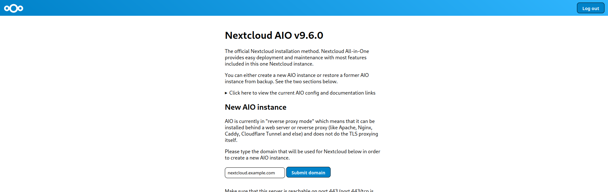
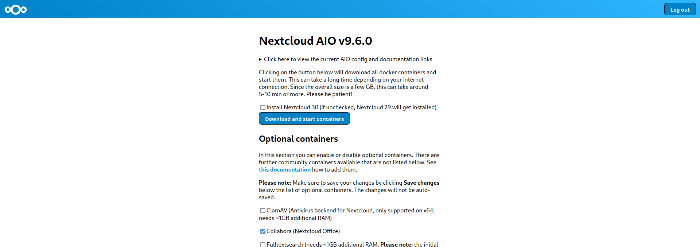
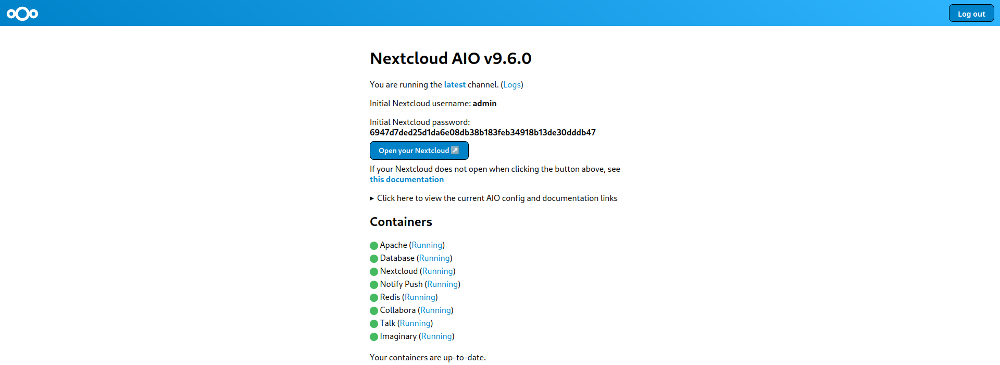
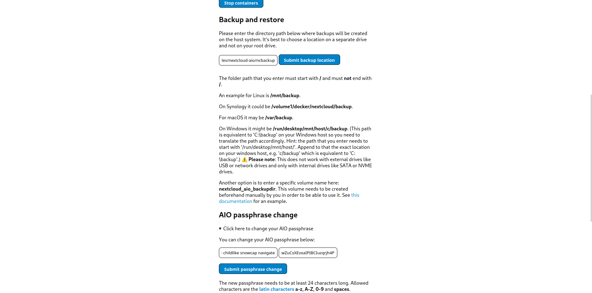
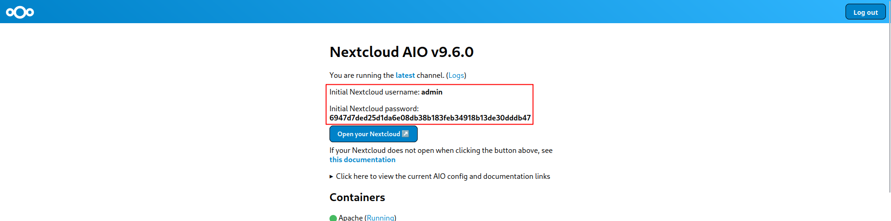
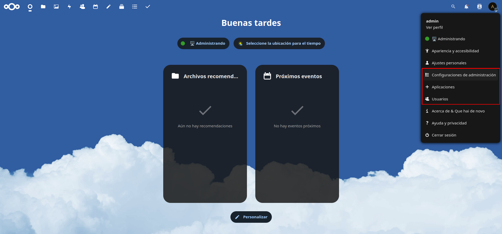

Nextcloud es una aplicación de código abierto que nos permitirá almacenar y sincronizar archivos y datos entre dispositivos.

Es una alternativa a servicios como Google Drive, Dropbox o OneDrive, pero con la ventaja de que nosotros controlamos nuestros datos y no dependemos de terceros.

En este post, explicaré cómo montar tu propia nube privada con Nextcloud AIO y Docker, usando NGINX como proxy inverso.

<!--more-->

## **Requisitos**

- Tener un servidor con Linux en el que instalar Nextcloud. Puede ser un servidor físico, una máquina virtual o un VPS.
- Contar con `docker` y `docker compose` instalados en tu sistema. Si no los tienes, puedes seguir [este post](https://blog.juanje.net/posts/docker-rootless/).
- Ser propietario de un dominio o subdominio para usar con tu instancia de Nextcloud.
- Tener un certificado SSL para el subdominio que usaremos con Nextcloud. Personalmente, yo uso [Let's Encrypt](https://letsencrypt.org/) para obtener certificados SSL gratuitos.
- NGINX como proxy inverso para redirigir el tráfico al contenedor de Nextcloud.
- Poder ejecutar comandos como `root` (ya sea como usuario `root` directamente, o con `sudo` o `doas`). En mi caso lo haré como `root` (mediante `su`). Esto será necesario para configurar NGINX.

## **Consideraciones a tener en cuenta**

1. Nextcloud All-in-One (AIO) está pensado para ser usado con un subdominio y certificado SSL. Si no cumples estos requisitos, te encontrarás con problemas en el proceso.

2. Este post cubre la instalación siguiendo mi caso de uso (Nextcloud sobre Docker y NGINX como proxy inverso en el mismo equipo), si necesitas una configuración diferente o más avanzada, te recomiendo consultar el *readme* oficial de [Nextcloud AIO en su GitHub](https://github.com/nextcloud/all-in-one). Es bastante extenso y detallado.

## **Fichero docker-compose.yml**

Comenzaremos creando un directorio para organizar mejor los stacks creados mediante `docker-compose`:

```bash
mkdir -p ~/docker-compose-files/nextcloud-aio
```

También tendremos que crear los directorios `ncdata` y `ncbackup` para almacenar los datos y las copias de seguridad de Nextcloud, podemos llamarlos como queramos, pero deberemos tener en cuenta que los nombres de los directorios deben coincidir con los que definamos en el fichero `docker-compose.yml`:

```bash
mkdir -p ~/docker-compose-files/nextcloud-aio/{ncdata,ncbackup}
```

A continuación, crearemos el fichero `docker-compose.yml`:

```bash
nano ~/docker-compose-files/nextcloud-aio/docker-compose.yml
```

Este fichero lo rellenaremos modificando el contenido del [compose.yaml](https://github.com/nextcloud/all-in-one/blob/main/compose.yaml) del repositorio oficial de Nextcloud AIO a nuestro gusto.

Por ejemplo, en mi caso he modificado los siguientes campos:

1. Ruta al socket de `docker`. Lo he modificado ya que uso `docker` en modo *rootless* como expliqué en [este post](https://blog.juanje.net/posts/docker-rootless/):

    Sustituir:

    ```yaml
    - /var/run/docker.sock:/var/run/docker.sock:ro
    ```

    Por:

    ```yaml
    - /run/user/1000/docker.sock:/var/run/docker.sock:ro
    ```

2. Comentar el puerto `80` y `8443` ya que usaré un proxy inverso:

    Agregamos las almohadillas `#` al principio de las líneas de los puertos `80` y `8443`:

    ```yaml
    ports:
    # - 80:80
    - 8080:8080
    # - 8443:8443
    ```

    El puerto `8080` no lo desactivaré ya que es necesario para la interfaz de administración de Nextcloud AIO.

3. Descomentar el apartado `environment` para configurar opciones como el puerto del servidor web interno de Nextcloud AIO, el directorio de datos, etc.

    Para habilitar el apartado `environment`, eliminamos la almohadilla `#` y el espacio al principio de su línea:

    ```yaml
    # environment:
    ```

    Pasa a ser:

    ```yaml
    environment:
    ```

4. Configurar las opciones del apartado `environment`:

    - `APACHE_PORT` y `APACHE_IP_BINDING`: Es necesario configurarlas cuando se ejecuta Nextcloud AIO detrás de un servidor web o proxy inverso.
    - `NEXTCLOUD_DATADIR`: Permite establecer el directorio del host que se utilizará para el directorio de datos de Nextcloud. Es extremadamente importante no modificar este parámetro después de la configuración de Nextcloud AIO, si necesitamos cambiarlo, debemos consultar primero este apartado del [readme.md - How to change the default location of Nextcloud's Datadir?](https://github.com/nextcloud/all-in-one#how-to-change-the-default-location-of-nextclouds-datadir).
    - `WATCHTOWER_DOCKER_SOCKET_PATH`: Ruta al socket de `docker` para que `watchtower` pueda actualizar los contenedores que forman todo el stack de Nextcloud AIO.

    Por ejemplo, en mi caso lo configuré de la siguiente manera, sin olvidarnos de que el parámetro `NEXTCLOUD_DATADIR` debe coincidir con el directorio `ncdata` que hemos creado anteriormente:

    ```yaml
    environment:
      APACHE_PORT: 11000
      APACHE_IP_BINDING: 127.0.0.1
      NEXTCLOUD_DATADIR: /home/juanje/docker-compose-files/nextcloud-aio/ncdata
      WATCHTOWER_DOCKER_SOCKET_PATH: /run/user/1000/docker.sock
    ```

5. Aunque es lo normal en otros servicios, en este caso no debemos modificar el apartado `volumes`. Si quisiéramos alojar los datos en otro disco, debemos seguir las instrucciones del [readme.md - How to store the files/installation on a separate drive?](https://github.com/nextcloud/all-in-one#how-to-store-the-filesinstallation-on-a-separate-drive).

## **NGINX como proxy inverso**

> **💡 Si no sabes cómo utilizar NGINX, puedes optar por utilizar alternativas como Traefik y NGINX Proxy Manager (NPM), que proporcionan una forma sencilla y amigable de poner en funcionamiento un proxy inverso. 💡**

Una vez hemos preparado el fichero `docker-compose.yml` tendremos que configurar nuestro proxy inverso para que redirija el tráfico al contenedor de Nextcloud AIO.

```bash
su -

nano -cl /etc/nginx/sites-available/nextcloud.example.com
```

No explicaré la configuración exacta que utilizo en NGINX, ya que dependerá de cada uno usar unas opciones u otras, pero sí que os diré cuáles debéis vigilar y dónde encontrar un ejemplo completo y actualizado:

1. El `server_name` debe coincidir con el dominio o subdominio que queramos usar para acceder a Nextcloud AIO.

2. La directiva `proxy_pass` debe apuntar a `http://127.0.0.1:11000$request_uri`. El puerto `11000` es el que hemos configurado como `APACHE_PORT` del fichero `docker-compose.yml`. Si lo has cambiado, deberás modificarlo aquí también.

3. Ruta a los certificados SSL. Deberás configurar correctamente las directivas `ssl_certificate` y `ssl_certificate_key` para que NGINX pueda utilizar tu certificado SSL.

```nginx
map $http_upgrade $connection_upgrade {
    default upgrade;
    '' close;
}

server {
    listen 80;

    # ...

    server_name nextcloud.example.com;

    location / {
        proxy_pass http://127.0.0.1:11000$request_uri;
        # ...
    }

    ssl_certificate /etc/letsencrypt/live/nextcloud.example.com/fullchain.pem;
    ssl_certificate_key /etc/letsencrypt/live/nextcloud.example.com/privkey.pem;

    # ...
}
```

El resto de opciones son cosa tuya, pero puedes ver un ejemplo completo para NGINX en [reverse-proxy.md - Nginx, Freenginx, Openresty](https://github.com/nextcloud/all-in-one/blob/main/reverse-proxy.md#nginx-freenginx-openresty).

Ese enlace te llevará a un fichero en el que se muestran ejemplos funcionales de configuración para multitud de proxies inversos, no solo NGINX. Te recomiendo revisarlo aunque tengas conocimientos para configurar NGINX.

Cuando terminemos de configurar NGINX, reiniciamos el servicio para que los cambios surtan efecto:

```bash
su -

systemctl restart nginx
```

> **⚠️ Si aún no lo hemos hecho, no debemos olvidarnos de añadir el subdominio que usaremos con Nextcloud a los registros DNS de nuestro proveedor de dominios. ⚠️**

## **Configuración inicial de Nextcloud AIO**

Después de poner en funcionamiento el *server block* de NGINX, levantamos el stack de Nextcloud AIO con `docker compose`, desde nuestro usuario no root ya que estamos usando `docker` en modo *rootless*:

```bash
cd ~/docker-compose-files/nextcloud-aio

docker compose up -d
```

Esperaremos a que se descarguen las imágenes y se levanten los contenedores.

Cuando finalice la ejecución del comando `docker compose`, accederemos a la IP de nuestro servidor seguida del puerto `8080` (o el que hayamos mapeado al puerto `8080` del contenedor en el fichero `docker-compose.yml`). Debemos hacerlo usando `https`, es decir, tendremos que acceder a `https://IP_DEL_SERVIDOR:8080`.

Esto nos llevará a la pantalla de configuración inicial de Nextcloud AIO.

Se nos dará la contraseña para iniciar sesión en la interfaz de administración:


> **⚠️ No debemos preocuparnos por la contraseña de acceso a la interfaz AIO, ya que podremos cambiarla, además de que tras configurar Nextcloud AIO dejará de ser mostrada: ⚠️**
>
> 

Una vez iniciada la sesión, podremos configurar Nextcloud AIO.

De momento, lo único que tendremos que hacer será configurar el subdominio que usaremos para Nextcloud:



Cuando hagamos click en `Submit domain`, Nextcloud comprobará si tenemos correctamente configurado nuestro registro DNS y si el proxy inverso está funcionando correctamente, en caso de que algo falle, nos lo indicará en la parte superior de la pantalla.

Si todo ha ido bien, podremos continuar configurando los contenedores opcionales que forman parte de Nextcloud AIO (`ClamAV`, `Collabora`, `Fulltextsearch`, etc.) y la zona horaria de nuestro servidor:



Seleccionamos los contenedores que nos interesen y hacemos click en `Save changes` ubicado bajo la lista de contenedores.

Escribimos nuestra zona horaria y seleccionamos `Submit timezone`:


Tras modificar a nuestro gusto ambas secciones, volvemos a la parte superior de la página y hacemos click en `Download and start containers`.

Debemos tener paciencia, el proceso de descarga e inicio de los contenedores puede tardar varios minutos.

Después de que los contenedores estén en funcionamiento veremos algo similar a esto:



Ahora, será el momento de configurar la ruta de backup que creamos antes como `ncbackup`, además de cambiar la contraseña de acceso a la interfaz AIO.

Primero, configuramos la ruta de backup, tendremos que introducir la ruta completa al directorio `ncbackup` creado en el host, es decir, teniendo en cuenta que antes creamos el directorio en `/home/juanje/docker-compose-files/nextcloud-aio/ncbackup`, será esta la ruta que debemos introducir en el campo `Backup and restore`:



Para cambiar la contraseña de acceso a la interfaz AIO tendremos que desplegar la sección de `AIO passphrase change` y escribir primero la contraseña actual y después la nueva contraseña. Finalmente, hacemos click en `Submit passphrase change`. Podemos verlo en la captura superior.

## **Acceder a Nextcloud y crear usuarios**

Cuando hayamos terminado de configurar Nextcloud AIO, debemos ir a la parte superior de la página y hacer click en `Open your Nextcloud`. Para iniciar sesión como administrador utilizaremos las credenciales que se nos muestran como `Initial Nextcloud username` e `Initial Nextcloud password`:



Deberíamos llegar al login de Nextcloud, iniciamos sesión con las credenciales que se nos han proporcionado antes:


Con la sesión de administrador iniciada, podremos crear nuevos usuarios, gestionar los grupos, instalar aplicaciones, etc:



## **Cierre**

A partir de ahora podrás almacenar y sincronizar tus archivos de forma segura y privada, sin terceros entrometiéndose y traficando con tus datos.

Nextcloud es una solución muy completa, te animo a que explores todas las opciones que ofrece mediante su tienda de aplicaciones, y que configures las opciones de seguridad y privacidad de tu instancia de forma minuciosa.

Para finalizar, no olvides Nextcloud tiene disponibles aplicaciones de escritorio y móviles para acceder a tus archivos desde cualquier lugar.

Si tienes alguna duda, problema o mejora, no dudes en contactarme, puedes encontrar mis datos de contacto en <https://hub.juanje.net>.

---

✒️ **Documentación realizada por Juan Jesús Alejo Sillero.**
